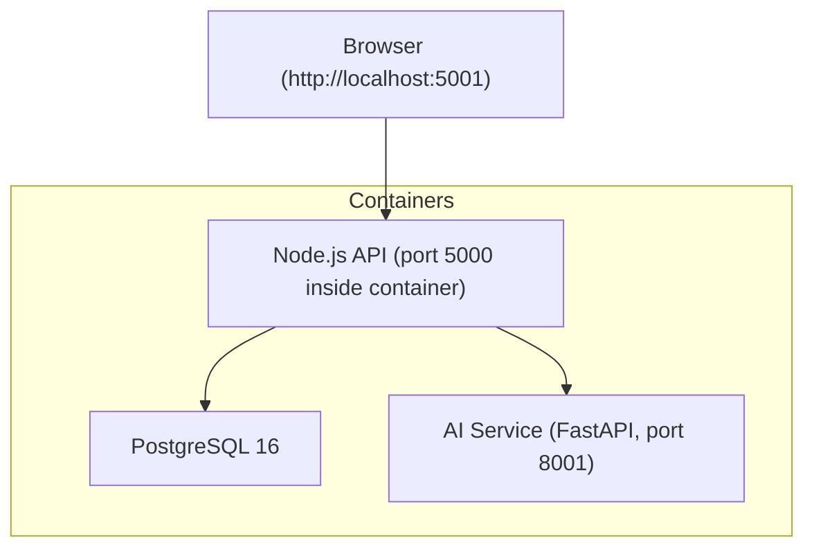
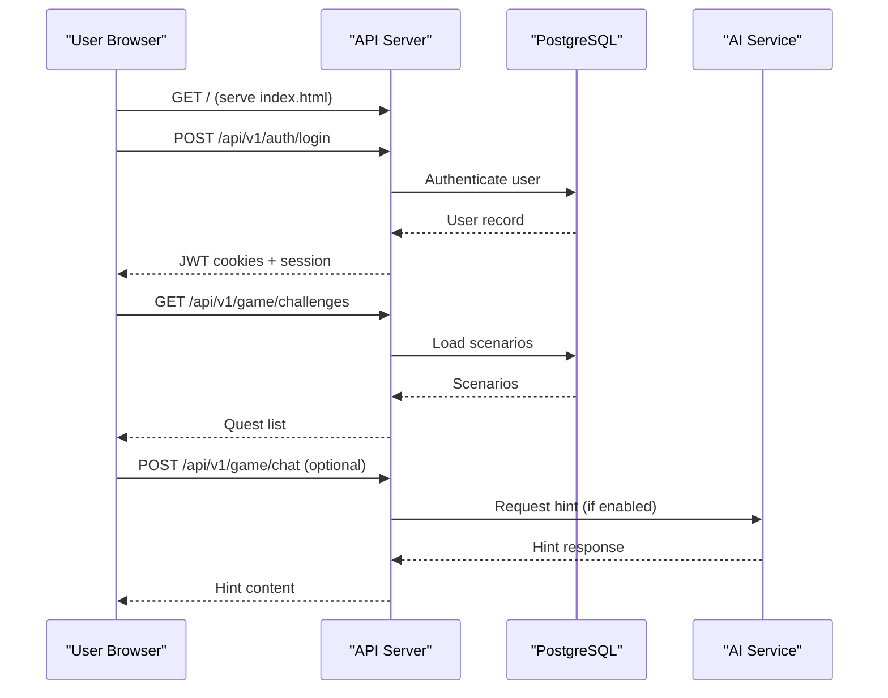
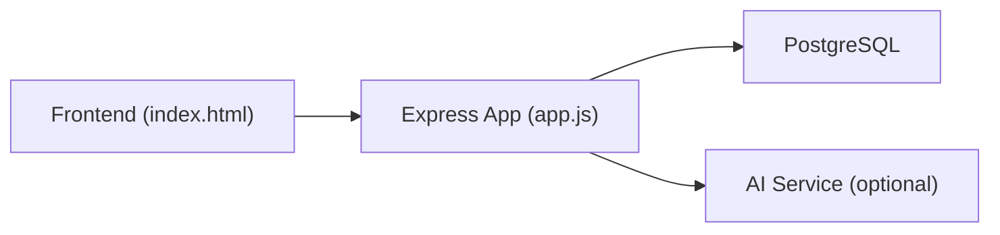

# Getting Started

<cite>
**Referenced Files in This Document**
- [README_GAME.md](file://README_GAME.md)
- [docker-compose.yml](file://docker-compose.yml)
- [backend/package.json](file://backend/package.json)
- [backend/server.js](file://backend/server.js)
- [backend/app.js](file://backend/app.js)
- [backend/config/env.js](file://backend/config/env.js)
- [backend/config/db.js](file://backend/config/db.js)
- [backend/scripts/seed-scenarios.js](file://backend/scripts/seed-scenarios.js)
- [backend/Dockerfile](file://backend/Dockerfile)
- [DEPLOYMENT.md](file://DEPLOYMENT.md)
- [backend/public/index.html](file://backend/public/index.html)
</cite>

## Table of Contents
1. Introduction
2. Project Structure
3. Core Components
4. Architecture Overview
5. Detailed Component Analysis
6. Dependency Analysis
7. Performance Considerations
8. Troubleshooting Guide
9. Conclusion
10. Appendices

## Introduction
Life Skills Adventure is a 3D skill-based investigation game with a Node.js backend, PostgreSQL database, and an optional AI microservice. You can run the entire stack with Docker or set up the backend manually. The quick start runs the API and serves the game UI so you can play at http://localhost:5001.

## Project Structure
The repository includes:
- Backend (Node.js/Express): REST API, WebSocket server, static game UI, configuration, models, routes, middleware, scripts, and tests.
- AI Service (Python/FastAPI): Optional AI assistant for hints and guidance.
- Docker Compose: Orchestrates PostgreSQL, AI service, and the API container.

**Diagram sources**
- [docker-compose.yml:1-66](file://docker-compose.yml#L1-L66)
- [backend/server.js:1-47](file://backend/server.js#L1-L47)
- [backend/app.js:1-55](file://backend/app.js#L1-L55)

**Section sources**
- [docker-compose.yml:1-66](file://docker-compose.yml#L1-L66)
- [backend/package.json:1-43](file://backend/package.json#L1-L43)
- [backend/Dockerfile:1-14](file://backend/Dockerfile#L1-L14)

## Core Components
- API Server: Express app with security middleware, CORS, JSON parsing, health endpoints, and route mounting. Serves the game UI from the public folder.
- Database: PostgreSQL via Sequelize; supports migrations and optional auto-sync for development.
- Environment Configuration: Strictly validated environment variables for DB, JWT, CORS, logging, AI integration, and email.
- Seed Data: Script to populate five missions/scenarios into the database.
- AI Service: Optional FastAPI service for intelligent hints; can be disabled or run without an external API key using deterministic fallback.

Key system requirements:
- Node.js version: >= 20.0.0
- PostgreSQL: 16 (via Docker or local instance)
- Ports: API 5000 (mapped to 5001 on host), AI 8001, DB 5432

**Section sources**
- [backend/package.json:17-20](file://backend/package.json#L17-L20)
- [docker-compose.yml:3-18](file://docker-compose.yml#L3-L18)
- [docker-compose.yml:20-30](file://docker-compose.yml#L20-L30)
- [docker-compose.yml:31-62](file://docker-compose.yml#L31-L62)
- [backend/config/env.js:6-31](file://backend/config/env.js#L6-L31)
- [backend/config/db.js:7-29](file://backend/config/db.js#L7-L29)
- [backend/scripts/seed-scenarios.js:1-255](file://backend/scripts/seed-scenarios.js#L1-L255)

## Architecture Overview
The runtime consists of three services orchestrated by Docker Compose:
- PostgreSQL stores users, sessions, progress, scenarios, resources, and audit data.
- The Node.js API provides REST endpoints, WebSocket support, and serves the game UI.
- The AI service provides optional hinting and guidance when enabled.

**Diagram sources**
- [backend/app.js:34-51](file://backend/app.js#L34-L51)
- [backend/server.js:9-25](file://backend/server.js#L9-L25)
- [docker-compose.yml:31-62](file://docker-compose.yml#L31-L62)

## Detailed Component Analysis

### Installation: Docker Quick Start
- Build and start all services:
  - docker compose up -d --build
- Seed the database with missions:
  - docker exec life_skills_api node scripts/seed-scenarios.js
- Open the game:
  - http://localhost:5001

Notes:
- The API listens on port 5000 inside the container and is mapped to 5001 on the host.
- PostgreSQL is provided by the postgres container.
- The AI service is included but optional; it can run without an external API key using built-in fallback logic.

**Section sources**
- [README_GAME.md:3-10](file://README_GAME.md#L3-L10)
- [docker-compose.yml:31-62](file://docker-compose.yml#L31-L62)
- [backend/scripts/seed-scenarios.js:234-249](file://backend/scripts/seed-scenarios.js#L234-L249)

### Installation: Manual Setup
Prerequisites:
- Node.js >= 20.0.0
- PostgreSQL 16 (running locally or remotely)
- Ports: 5000 (API), 5432 (DB), 8001 (AI, optional)

Steps:
1. Install dependencies:
   - cd backend && npm install
2. Configure environment:
   - Create .env in backend/ with required variables:
     - NODE_ENV, PORT, DATABASE_URL, JWT_ACCESS_SECRET, JWT_REFRESH_SECRET, CORS_ORIGINS, LOG_LEVEL, AUTO_SYNC (development only), AI_ENABLED, AI_SERVICE_URL, AI_SERVICE_TOKEN (if AI enabled), SMTP_* (optional), EMAIL_FROM, GUEST_PLAY_ENABLED
   - Example values are defined in the environment schema and Docker Compose.
3. Initialize database:
   - If AUTO_SYNC=true (development only), the app will sync schema on startup.
   - For production, run migrations: npm run migrate
4. Seed scenarios:
   - npm run seed
5. Start the server:
   - npm start
6. Access the game:
   - http://localhost:5000 (or your configured PORT)

Verification:
- Health check: curl http://localhost:5000/health
- Readiness (DB connected): curl http://localhost:5000/health/ready

**Section sources**
- [backend/package.json:7-16](file://backend/package.json#L7-L16)
- [backend/config/env.js:6-31](file://backend/config/env.js#L6-L31)
- [backend/config/db.js:15-29](file://backend/config/db.js#L15-L29)
- [DEPLOYMENT.md:14-28](file://DEPLOYMENT.md#L14-L28)
- [DEPLOYMENT.md:31-43](file://DEPLOYMENT.md#L31-L43)
- [DEPLOYMENT.md:46-51](file://DEPLOYMENT.md#L46-L51)

### System Requirements
- Node.js: >= 20.0.0
- PostgreSQL: 16 (recommended via Docker or managed service)
- Browser compatibility: Modern browsers that support ES modules and WebGL (Three.js). The UI uses importmap for Three.js and standard HTML/CSS/JS features.
- Ports:
  - API: 5000 (container) / 5001 (host via Docker mapping)
  - PostgreSQL: 5432
  - AI Service: 8001 (optional)

**Section sources**
- [backend/package.json:17-20](file://backend/package.json#L17-L20)
- [docker-compose.yml:3-18](file://docker-compose.yml#L3-L18)
- [docker-compose.yml:20-30](file://docker-compose.yml#L20-L30)
- [docker-compose.yml:31-62](file://docker-compose.yml#L31-L62)
- [backend/public/index.html:11-17](file://backend/public/index.html#L11-L17)

### Environment Configuration
Required and recommended environment variables:
- NODE_ENV: development | test | production
- PORT: default 5000
- DATABASE_URL: PostgreSQL connection string
- DB_SSL: true/false (for secure connections)
- JWT_ACCESS_SECRET, JWT_REFRESH_SECRET: minimum 48 characters, must differ
- JWT_ACCESS_TTL, JWT_REFRESH_TTL: token lifetimes
- CORS_ORIGINS: comma-separated allowed origins
- TRUST_PROXY: integer (default 1)
- LOG_LEVEL: fatal|error|warn|info|debug|trace|silent
- AUTO_SYNC: boolean (development only; forbidden in production)
- AI_ENABLED: boolean
- AI_SERVICE_URL: HTTP(S) URL to AI service
- AI_SERVICE_TOKEN: min 32 chars when AI enabled
- SMTP_HOST, SMTP_PORT, SMTP_SECURE, SMTP_USER, SMTP_PASS, EMAIL_FROM: optional email settings
- GUEST_PLAY_ENABLED: boolean (forced false in production)

Validation and behavior:
- Invalid environment values cause startup failure with detailed messages.
- Production mode disables guest play automatically.

**Section sources**
- [backend/config/env.js:6-39](file://backend/config/env.js#L6-L39)

### Database Initialization and Migrations
- Connection and pool settings are configured in the database module.
- On startup, the app authenticates to PostgreSQL and optionally syncs schema when AUTO_SYNC is enabled (development only).
- Pending SQL migration files prefixed with migrations- are applied automatically during sync.
- In production, use Sequelize CLI migrations instead of AUTO_SYNC.

**Section sources**
- [backend/config/db.js:7-29](file://backend/config/db.js#L7-L29)
- [backend/config/db.js:31-42](file://backend/config/db.js#L31-L42)
- [DEPLOYMENT.md:46-51](file://DEPLOYMENT.md#L46-L51)

### Seed Data Loading
- The seed script inserts five published missions into the database using upsert on slug.
- It reports created vs updated counts and closes the connection after completion.

**Section sources**
- [backend/scripts/seed-scenarios.js:1-255](file://backend/scripts/seed-scenarios.js#L1-L255)

### Quick Start Commands
- Docker:
  - docker compose up -d --build
  - docker exec life_skills_api node scripts/seed-scenarios.js
  - Open http://localhost:5001
- Manual:
  - cd backend && npm install
  - Configure .env (see Environment Configuration)
  - npm run seed
  - npm start
  - Open http://localhost:5000 (or your configured PORT)

**Section sources**
- [README_GAME.md:3-21](file://README_GAME.md#L3-L21)
- [docker-compose.yml:31-62](file://docker-compose.yml#L31-L62)

### Development Workflow
- Hot reload:
  - Use npm run dev which starts Node with watch mode for rapid iteration.
- Debugging:
  - Run with Node debugger flags (e.g., node --inspect) if needed.
  - Logs are structured via Pino; adjust LOG_LEVEL for verbosity.
- Common tasks:
  - Migrate: npm run migrate
  - Undo last migration: npm run migrate:undo
  - Grant admin role: npm run grant-admin <username_or_email>
  - Lint: npm run lint
  - Test: npm run test

**Section sources**
- [backend/package.json:7-16](file://backend/package.json#L7-L16)
- [backend/config/env.js:17-19](file://backend/config/env.js#L17-L19)
- [DEPLOYMENT.md:55-61](file://DEPLOYMENT.md#L55-L61)

### Verification Steps
- Container health:
  - docker ps to ensure postgres, ai-service, and api are running.
- API readiness:
  - curl http://localhost:5000/health
  - curl http://localhost:5000/health/ready
- Game UI:
  - Visit http://localhost:5001 (Docker) or http://localhost:5000 (manual)
- AI service (optional):
  - curl http://localhost:8001/health

**Section sources**
- [DEPLOYMENT.md:31-43](file://DEPLOYMENT.md#L31-L43)
- [backend/app.js:34-38](file://backend/app.js#L34-L38)

## Dependency Analysis
High-level runtime dependencies:
- API depends on PostgreSQL and optionally the AI service.
- The frontend loads Three.js via importmap and communicates with the API over HTTP/WebSocket.

**Diagram sources**
- [backend/public/index.html:11-17](file://backend/public/index.html#L11-L17)
- [backend/app.js:1-55](file://backend/app.js#L1-L55)
- [docker-compose.yml:31-62](file://docker-compose.yml#L31-L62)

**Section sources**
- [backend/app.js:1-55](file://backend/app.js#L1-L55)
- [backend/server.js:1-47](file://backend/server.js#L1-L47)
- [docker-compose.yml:1-66](file://docker-compose.yml#L1-L66)

## Performance Considerations
- Database pool size and timeouts are tuned in the database configuration.
- Use production-grade secrets and disable AUTO_SYNC in production.
- Enable HTTPS and configure CORS precisely for your domains before deployment.
- Consider enabling rate limiting and caching strategies based on traffic patterns.

[No sources needed since this section provides general guidance]

## Troubleshooting Guide
Common issues and resolutions:
- Port conflicts:
  - Ensure ports 5000/5001, 5432, and 8001 are free. Docker maps API 5000 to host 5001.
- Database connection problems:
  - Verify DATABASE_URL format and credentials.
  - Check DB_SSL setting matches your provider.
  - Confirm AUTO_SYNC is disabled in production; use migrations instead.
- CORS errors:
  - Set CORS_ORIGINS to include your browser origin(s).
  - The API enforces an allowlist; requests from disallowed origins are rejected.
- AI service not reachable:
  - Ensure AI_ENABLED is true only when AI_SERVICE_URL and AI_SERVICE_TOKEN are configured.
  - Without an external API key, the AI service still runs with deterministic fallback.
- Seeding failures:
  - Ensure the database is accessible and migrations/sync have completed before seeding.
- Health checks:
  - Use /health and /health/ready to verify API and DB status.

**Section sources**
- [docker-compose.yml:3-18](file://docker-compose.yml#L3-L18)
- [docker-compose.yml:20-30](file://docker-compose.yml#L20-L30)
- [docker-compose.yml:31-62](file://docker-compose.yml#L31-L62)
- [backend/config/env.js:6-39](file://backend/config/env.js#L6-L39)
- [backend/config/db.js:15-29](file://backend/config/db.js#L15-L29)
- [backend/app.js:21-29](file://backend/app.js#L21-L29)
- [DEPLOYMENT.md:14-28](file://DEPLOYMENT.md#L14-L28)

## Conclusion
You can quickly get Life Skills Adventure running with Docker or manually. After setup, seed the scenarios and open the game in your browser. Follow the troubleshooting tips if you encounter common issues, and use the verification steps to confirm everything is working.

[No sources needed since this section summarizes without analyzing specific files]

## Appendices

### Appendix A: Environment Variables Reference
- NODE_ENV: development | test | production
- PORT: default 5000
- DATABASE_URL: PostgreSQL URI
- DB_SSL: true | false
- JWT_ACCESS_SECRET: min 48 chars
- JWT_REFRESH_SECRET: min 48 chars, different from access secret
- JWT_ACCESS_TTL: e.g., 15m
- JWT_REFRESH_TTL: e.g., 7d
- COOKIE_DOMAIN: optional
- CORS_ORIGINS: comma-separated origins
- TRUST_PROXY: integer
- LOG_LEVEL: fatal|error|warn|info|debug|trace|silent
- AUTO_SYNC: boolean (development only)
- AI_ENABLED: boolean
- AI_SERVICE_URL: HTTP(S) URL
- AI_SERVICE_TOKEN: min 32 chars when AI enabled
- SMTP_HOST, SMTP_PORT, SMTP_SECURE, SMTP_USER, SMTP_PASS, EMAIL_FROM: optional
- GUEST_PLAY_ENABLED: boolean (false in production)

**Section sources**
- [backend/config/env.js:6-31](file://backend/config/env.js#L6-L31)
- [DEPLOYMENT.md:14-28](file://DEPLOYMENT.md#L14-L28)