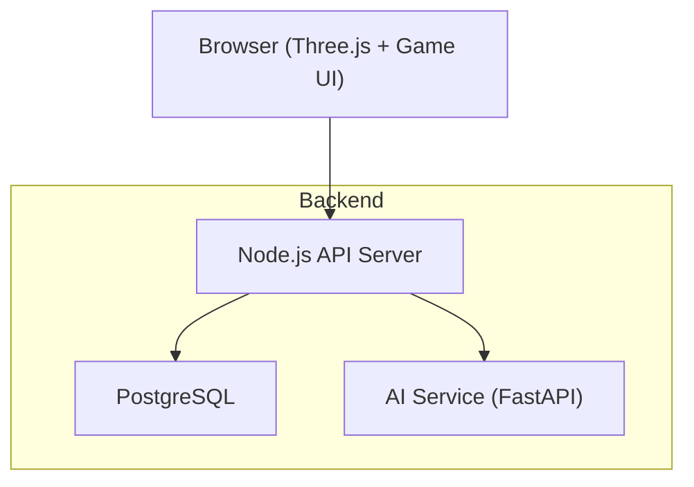
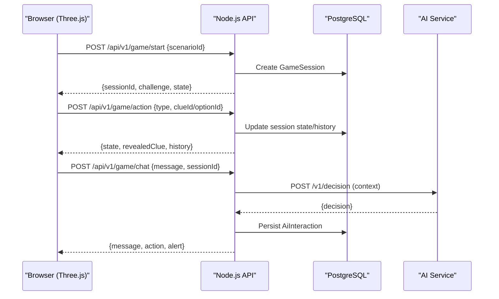
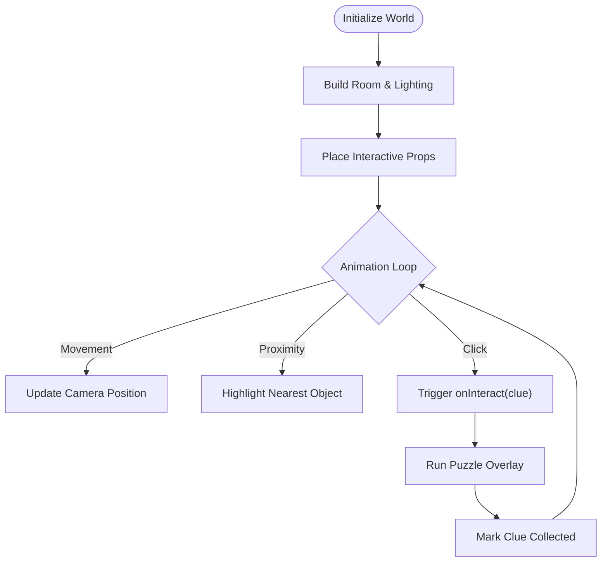
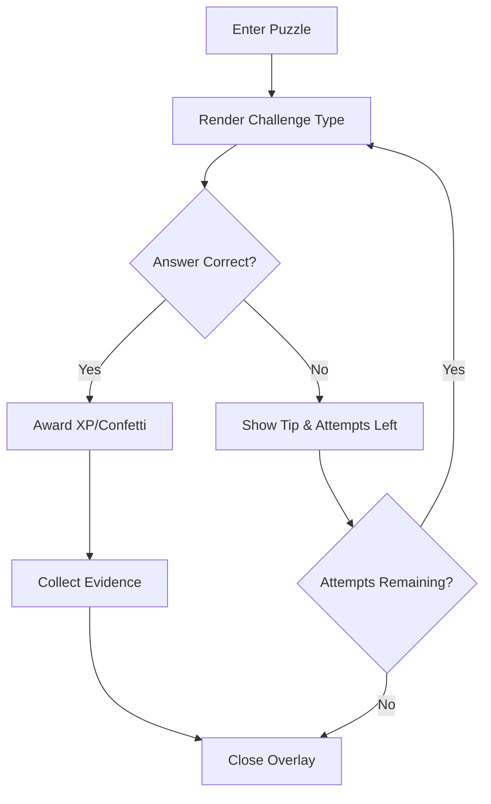
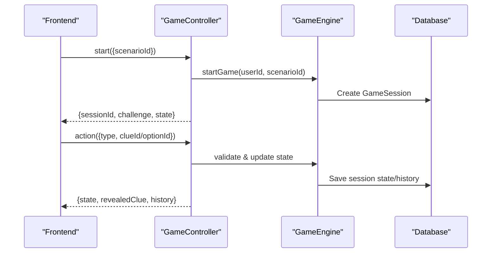
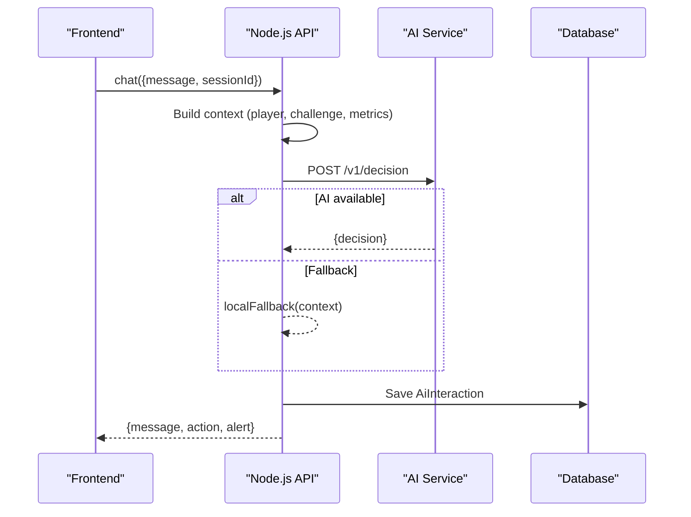
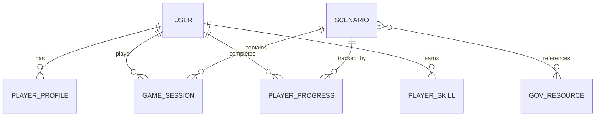
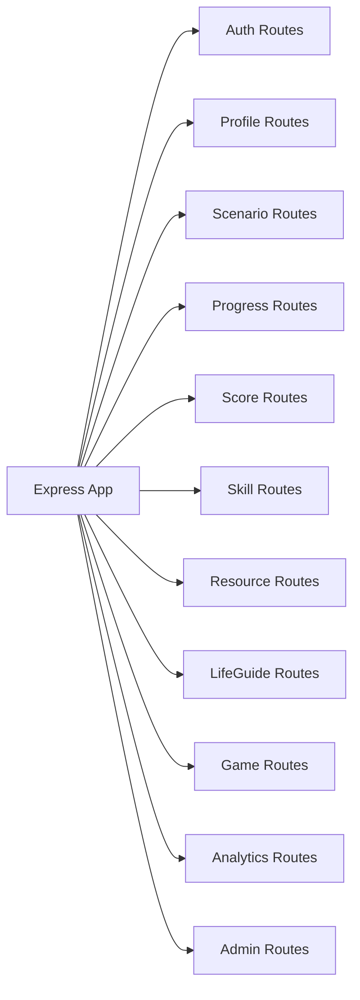

# Project Overview

<cite>
**Referenced Files in This Document**
- [README_GAME.md](file://README_GAME.md)
- [PRD.md](file://PRD.md)
- [backend/package.json](file://backend/package.json)
- [backend/app.js](file://backend/app.js)
- [backend/server.js](file://backend/server.js)
- [backend/services/game-engine.js](file://backend/services/game-engine.js)
- [backend/services/ai-service.js](file://backend/services/ai-service.js)
- [backend/controllers/game-controller.js](file://backend/controllers/game-controller.js)
- [backend/models/index.js](file://backend/models/index.js)
- [backend/models/Scenario.js](file://backend/models/Scenario.js)
- [backend/config/env.js](file://backend/config/env.js)
- [backend/public/js/world3d.js](file://backend/public/js/world3d.js)
- [backend/public/js/puzzles.js](file://backend/public/js/puzzles.js)
- [backend/ai-service/app/main.py](file://backend/ai-service/app/main.py)
</cite>

## Table of Contents
1. Introduction
2. Project Structure
3. Core Components
4. Architecture Overview
5. Detailed Component Analysis
6. Dependency Analysis
7. Performance Considerations
8. Troubleshooting Guide
9. Conclusion

## Introduction
Life Skills Adventure is an educational 3D investigation game that teaches essential life skills through immersive, scenario-based gameplay. Instead of traditional quizzes, players explore realistic 3D environments (like a home desk or classroom), interact with glowing objects, and solve skill-based puzzles to uncover evidence and make safe, informed decisions. The game focuses on digital safety, career smarts, money skills, empathy and safety, and education guard topics. It targets students and young adults who need practical awareness of modern digital threats and official resources.

The project’s unique value lies in combining Three.js-powered 3D exploration with curated puzzles and optional AI guidance to build real-world decision-making skills, rather than testing recall via multiple-choice questions.

**Section sources**
- [README_GAME.md:23-67](file://README_GAME.md#L23-L67)
- [PRD.md:3-21](file://PRD.md#L3-L21)

## Project Structure
At a high level, the application consists of:
- Frontend 3D engine and UI served by the Node backend
- Backend API for authentication, game sessions, progress, scoring, resources, and analytics
- Optional AI service for intelligent hints and guidance
- PostgreSQL database for users, scenarios, progress, and audit data

**Diagram sources**
- [backend/app.js:39-49](file://backend/app.js#L39-L49)
- [backend/server.js:9-25](file://backend/server.js#L9-L25)
- [backend/ai-service/app/main.py:18-32](file://backend/ai-service/app/main.py#L18-L32)

**Section sources**
- [backend/package.json:1-43](file://backend/package.json#L1-L43)
- [backend/app.js:1-55](file://backend/app.js#L1-L55)
- [backend/server.js:1-47](file://backend/server.js#L1-L47)

## Core Components
- 3D World Engine: A Three.js-based first-person environment where players move with WASD, look around, and interact with clues.
- Puzzle System: Mini-games embedded per clue to teach concepts like spotting pressure tactics, verifying official portals, and recognizing fake job offers.
- Game Flow Controller: Manages session lifecycle, state transitions, clue collection, option selection, and completion.
- AI Life Guide: Optional Gemini-backed assistant providing contextual hints and alerts; falls back to deterministic logic when disabled or unavailable.
- Data Models: Users, profiles, scenarios, progress, skills, sessions, resources, and audit/analytics logs.

**Section sources**
- [backend/public/js/world3d.js:7-29](file://backend/public/js/world3d.js#L7-L29)
- [backend/public/js/puzzles.js:76-542](file://backend/public/js/puzzles.js#L76-L542)
- [backend/controllers/game-controller.js:18-120](file://backend/controllers/game-controller.js#L18-L120)
- [backend/services/ai-service.js:18-48](file://backend/services/ai-service.js#L18-L48)
- [backend/models/index.js:1-32](file://backend/models/index.js#L1-L32)

## Architecture Overview
The system integrates a browser-based 3D frontend with a secure Node.js API and an optional AI service. The API handles authentication, game sessions, scenario content, progress tracking, and resource access. The AI service provides contextual hints and safety alerts based on player context and scenario content.

**Diagram sources**
- [backend/controllers/game-controller.js:18-120](file://backend/controllers/game-controller.js#L18-L120)
- [backend/services/game-engine.js:51-123](file://backend/services/game-engine.js#L51-L123)
- [backend/services/ai-service.js:18-48](file://backend/services/ai-service.js#L18-L48)
- [backend/ai-service/app/main.py:18-32](file://backend/ai-service/app/main.py#L18-L32)

## Detailed Component Analysis

### 3D World Engine (Three.js)
- First-person camera with pointer lock and WASD movement.
- Scene built from configurable room and props; interactive objects glow and float until collected.
- Emits interaction hints and triggers puzzle overlays when near collectible clues.

**Diagram sources**
- [backend/public/js/world3d.js:63-148](file://backend/public/js/world3d.js#L63-L148)
- [backend/public/js/world3d.js:189-272](file://backend/public/js/world3d.js#L189-L272)
- [backend/public/js/world3d.js:274-334](file://backend/public/js/world3d.js#L274-L334)

**Section sources**
- [backend/public/js/world3d.js:7-363](file://backend/public/js/world3d.js#L7-L363)

### Puzzle System
- Each clue unlocks a mini-challenge (pick-one, pick-many, match-pairs, plus timed challenges).
- Puzzles include skill tips and sometimes links to official resources.
- Success reveals evidence and advances the quest toward final decision-making.

**Diagram sources**
- [backend/public/js/puzzles.js:547-647](file://backend/public/js/puzzles.js#L547-L647)
- [backend/public/js/puzzles.js:674-771](file://backend/public/js/puzzles.js#L674-L771)

**Section sources**
- [backend/public/js/puzzles.js:76-542](file://backend/public/js/puzzles.js#L76-L542)
- [backend/public/js/puzzles.js:547-771](file://backend/public/js/puzzles.js#L547-L771)

### Game Flow Controller
- Starts a session for a published scenario, tracks state (phase, collected clues, selected option, score, stars).
- Enforces rules such as collecting all clues before choosing an option.
- Persists actions and history, supports chat integration.

**Diagram sources**
- [backend/controllers/game-controller.js:18-120](file://backend/controllers/game-controller.js#L18-L120)
- [backend/services/game-engine.js:51-64](file://backend/services/game-engine.js#L51-L64)

**Section sources**
- [backend/controllers/game-controller.js:1-128](file://backend/controllers/game-controller.js#L1-L128)
- [backend/services/game-engine.js:1-124](file://backend/services/game-engine.js#L1-L124)

### AI Life Guide
- Sends contextual decision requests including player metrics, scenario content, and allowed actions.
- Uses Gemini provider if enabled; otherwise falls back to deterministic logic.
- Persists interactions for later review.

**Diagram sources**
- [backend/services/game-engine.js:66-123](file://backend/services/game-engine.js#L66-L123)
- [backend/services/ai-service.js:18-48](file://backend/services/ai-service.js#L18-L48)
- [backend/ai-service/app/main.py:18-32](file://backend/ai-service/app/main.py#L18-L32)

**Section sources**
- [backend/services/ai-service.js:1-51](file://backend/services/ai-service.js#L1-L51)
- [backend/ai-service/app/main.py:1-33](file://backend/ai-service/app/main.py#L1-L33)

### Data Models
- Scenario defines quests with JSONB content, skill tags, difficulty, and publication status.
- Relationships connect users, progress, sessions, skills, resources, and audit events.

**Diagram sources**
- [backend/models/index.js:14-29](file://backend/models/index.js#L14-L29)
- [backend/models/Scenario.js:4-15](file://backend/models/Scenario.js#L4-L15)

**Section sources**
- [backend/models/index.js:1-32](file://backend/models/index.js#L1-L32)
- [backend/models/Scenario.js:1-18](file://backend/models/Scenario.js#L1-L18)

## Dependency Analysis
- Express app mounts routes for auth, profile, scenarios, progress, scores, skills, resources, lifeguide, game, analytics, and admin.
- Security middleware enforces CORS, input validation, rate limiting, and request IDs.
- Environment configuration controls feature toggles (e.g., AI_ENABLED), ports, and security settings.

**Diagram sources**
- [backend/app.js:39-49](file://backend/app.js#L39-L49)

**Section sources**
- [backend/app.js:1-55](file://backend/app.js#L1-L55)
- [backend/config/env.js:6-39](file://backend/config/env.js#L6-L39)

## Performance Considerations
- Use HTTPS and configure CORS for production domains.
- Enable PostgreSQL migrations and set AUTO_SYNC appropriately.
- Tune AI request timeouts and consider caching frequent scenario content.
- Optimize Three.js rendering by limiting shadow map sizes and particle counts during peak loads.
- Monitor server health endpoints and log levels for observability.

[No sources needed since this section provides general guidance]

## Troubleshooting Guide
- Health checks:
  - GET /health returns service status.
  - GET /health/ready verifies database connectivity.
- Common errors:
  - SESSION_NOT_FOUND: No active session or expired.
  - CLUES_REQUIRED: Must collect all clues before choosing an option.
  - ALREADY_DECIDED: Cannot change decision after selection.
  - INVALID_CLUE / INVALID_OPTION: Requested item not part of scenario.
- AI fallback:
  - If AI_ENABLED is false or the AI service is unreachable, deterministic fallback provides hints and alerts.

**Section sources**
- [backend/app.js:34-38](file://backend/app.js#L34-L38)
- [backend/controllers/game-controller.js:8-12](file://backend/controllers/game-controller.js#L8-L12)
- [backend/controllers/game-controller.js:63-100](file://backend/controllers/game-controller.js#L63-L100)
- [backend/services/ai-service.js:18-48](file://backend/services/ai-service.js#L18-L48)

## Conclusion
Life Skills Adventure combines immersive 3D exploration with targeted puzzles and optional AI guidance to teach practical life skills. Its five core quests—OTP scams, fake jobs, UPI fraud, cyberbullying, and scholarship portals—map directly to real-world situations, helping players recognize red flags, verify official channels, and make safer choices. The architecture cleanly separates the 3D frontend, backend API, AI service, and database, enabling scalable, maintainable growth and future enhancements like multiplayer modes and advanced analytics.

[No sources needed since this section summarizes without analyzing specific files]

## Appendices

### Five Main Quests and Real-World Mapping
- OTP Scams: Teaches how scammers create urgency and misuse OTPs; players learn to verify via official apps and numbers.
- Fake Job Offers: Highlights upfront fees and no-interview traps; emphasizes checking official government portals.
- UPI Fraud: Focuses on fake screenshots and emotional manipulation; reinforces using bank/UPI apps for disputes.
- Cyberbullying: Encourages evidence preservation, private support, and reporting via trusted adults and official channels.
- Scholarship Portals: Reinforces verification of .gov.in domains and zero-fee official portals.

**Section sources**
- [README_GAME.md:53-61](file://README_GAME.md#L53-L61)
- [PRD.md:13-21](file://PRD.md#L13-L21)