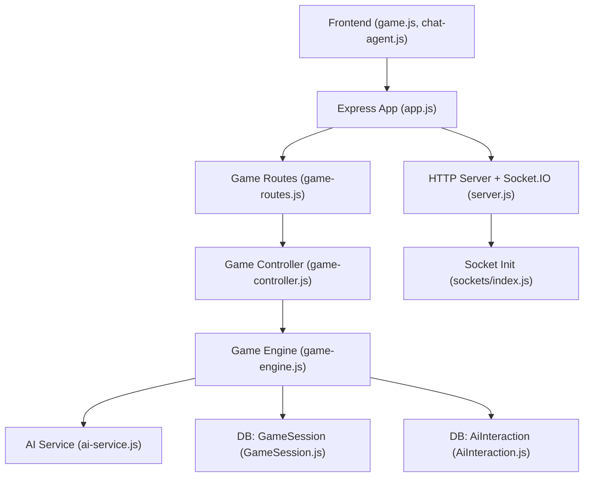
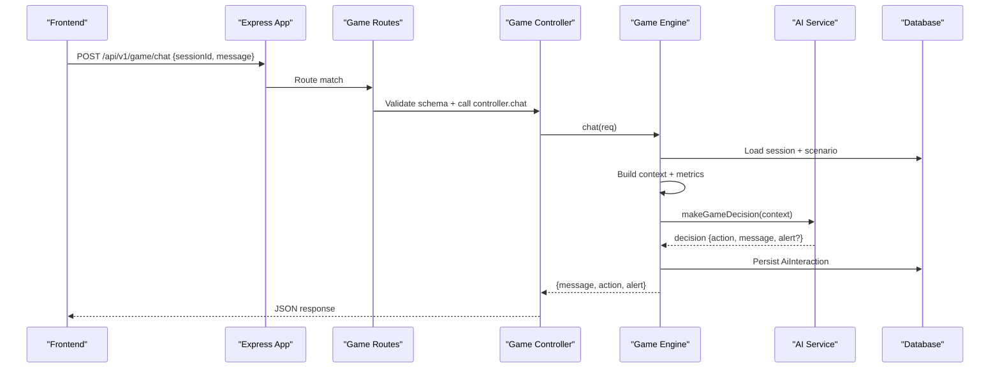
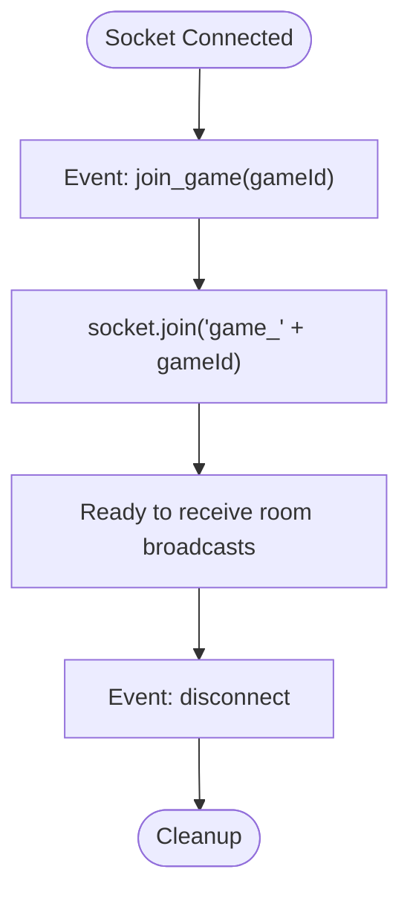
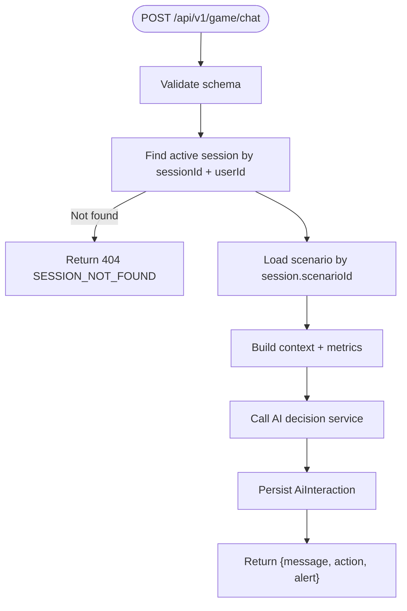
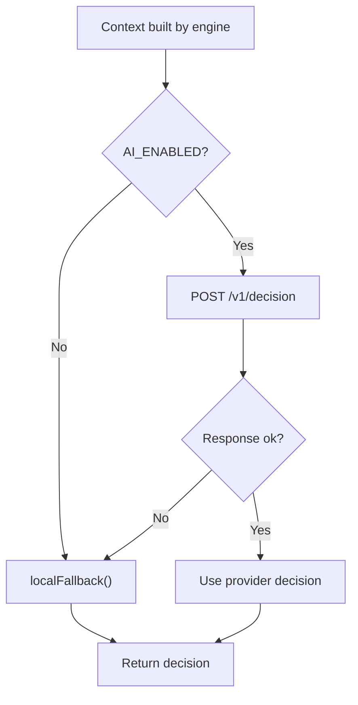
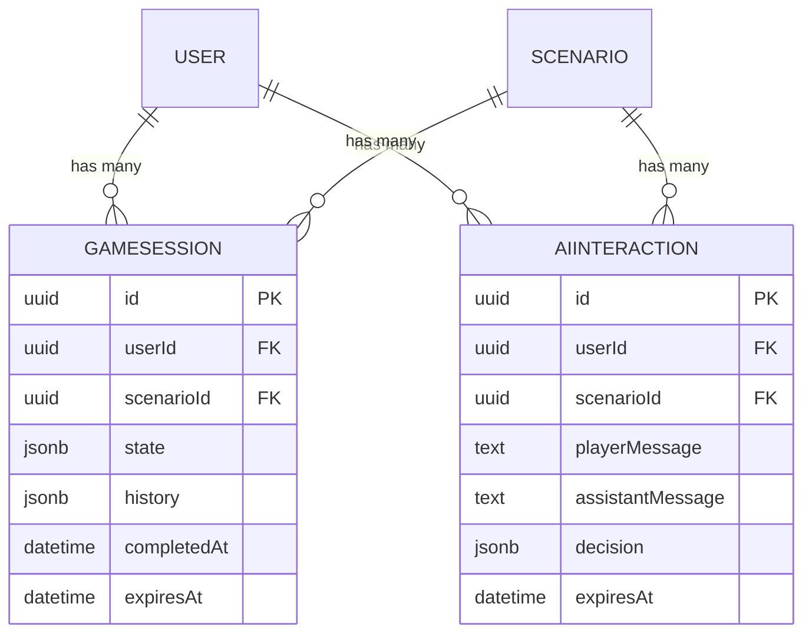
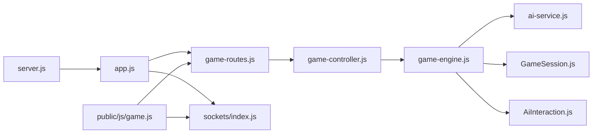

# Chat Functionality & Real-time Messaging

<cite>
**Referenced Files in This Document**
- [server.js](file://backend/server.js)
- [app.js](file://backend/app.js)
- [sockets/index.js](file://backend/sockets/index.js)
- [routes/game-routes.js](file://backend/routes/game-routes.js)
- [controllers/game-controller.js](file://backend/controllers/game-controller.js)
- [services/game-engine.js](file://backend/services/game-engine.js)
- [services/ai-service.js](file://backend/services/ai-service.js)
- [validators/game-schemas.js](file://backend/validators/game-schemas.js)
- [models/GameSession.js](file://backend/models/GameSession.js)
- [models/AiInteraction.js](file://backend/models/AiInteraction.js)
- [public/js/game.js](file://backend/public/js/game.js)
- [public/js/chat-agent.js](file://backend/public/js/chat-agent.js)
</cite>

## Table of Contents
1. [Introduction](#introduction)
2. [Project Structure](#project-structure)
3. [Core Components](#core-components)
4. [Architecture Overview](#architecture-overview)
5. [Detailed Component Analysis](#detailed-component-analysis)
6. [Dependency Analysis](#dependency-analysis)
7. [Performance Considerations](#performance-considerations)
8. [Troubleshooting Guide](#troubleshooting-guide)
9. [Conclusion](#conclusion)
10. [Appendices](#appendices)

## Introduction
This document explains the real-time chat system implemented in the SIHProject. It covers how messages are sent, received, and processed; how the frontend chat interface integrates with backend handlers; message formatting, validation, and broadcasting; user presence tracking via rooms; chat history management and persistence; and moderation capabilities. It also provides guidance for extending features, handling edge cases, and optimizing performance at scale.

## Project Structure
The chat functionality spans both HTTP-based game chat and a Socket.IO layer for room-based connectivity:

- HTTP chat flow:
  - Frontend sends chat messages to a REST endpoint under the game routes.
  - The controller delegates to the game engine, which validates context, calls AI decision logic, persists interactions, and returns a response.
- Socket.IO layer:
  - A server is initialized alongside the Express app.
  - Sockets support joining game rooms and logging connection events.

**Diagram sources**
- [server.js:1-47](file://backend/server.js#L1-L47)
- [app.js:1-55](file://backend/app.js#L1-L55)
- [routes/game-routes.js:1-15](file://backend/routes/game-routes.js#L1-L15)
- [controllers/game-controller.js:1-128](file://backend/controllers/game-controller.js#L1-L128)
- [services/game-engine.js:1-124](file://backend/services/game-engine.js#L1-L124)
- [services/ai-service.js:1-51](file://backend/services/ai-service.js#L1-L51)
- [models/GameSession.js:1-14](file://backend/models/GameSession.js#L1-L14)
- [models/AiInteraction.js:1-14](file://backend/models/AiInteraction.js#L1-L14)
- [sockets/index.js:1-19](file://backend/sockets/index.js#L1-L19)

**Section sources**
- [server.js:1-47](file://backend/server.js#L1-L47)
- [app.js:1-55](file://backend/app.js#L1-L55)
- [sockets/index.js:1-19](file://backend/sockets/index.js#L1-L19)

## Core Components
- Socket.IO initialization and room management:
  - Establishes connections, logs join/disconnect events, and supports joining per-game rooms.
- HTTP chat endpoint:
  - Validates input, ensures an active session, builds context, invokes AI decision service, persists interaction, and returns a structured response.
- AI decision service:
  - Calls external AI service when enabled; otherwise uses deterministic fallback rules to produce replies, hints, or alerts.
- Models and persistence:
  - Game sessions store state and history; AI interactions persist player and assistant messages along with decisions.
- Frontend integration:
  - UI sends messages, renders responses, handles alerts, and optionally uses a local scripted/NPC chat agent.

**Section sources**
- [sockets/index.js:1-19](file://backend/sockets/index.js#L1-L19)
- [routes/game-routes.js:1-15](file://backend/routes/game-routes.js#L1-L15)
- [controllers/game-controller.js:118-120](file://backend/controllers/game-controller.js#L118-L120)
- [services/game-engine.js:66-121](file://backend/services/game-engine.js#L66-L121)
- [services/ai-service.js:1-51](file://backend/services/ai-service.js#L1-L51)
- [models/GameSession.js:1-14](file://backend/models/GameSession.js#L1-L14)
- [models/AiInteraction.js:1-14](file://backend/models/AiInteraction.js#L1-L14)
- [public/js/game.js:707-738](file://backend/public/js/game.js#L707-L738)
- [public/js/chat-agent.js:1-175](file://backend/public/js/chat-agent.js#L1-L175)

## Architecture Overview
The chat architecture combines two layers:

- HTTP chat:
  - Client submits a message to the game chat route.
  - Controller delegates to the engine, which validates session/scenario, constructs context, calls AI service, persists the interaction, and returns a response including optional alerts.
- Socket.IO rooms:
  - Clients can join rooms by game ID to receive real-time broadcasts within that room.

**Diagram sources**
- [routes/game-routes.js:8-12](file://backend/routes/game-routes.js#L8-L12)
- [controllers/game-controller.js:118-120](file://backend/controllers/game-controller.js#L118-L120)
- [services/game-engine.js:66-121](file://backend/services/game-engine.js#L66-L121)
- [services/ai-service.js:18-48](file://backend/services/ai-service.js#L18-L48)
- [models/AiInteraction.js:1-14](file://backend/models/AiInteraction.js#L1-L14)

## Detailed Component Analysis

### Socket.IO Room Management
- Connection lifecycle:
  - Logs new connections and disconnects.
- Rooms:
  - Supports joining a room identified by game ID using a standard event.
- Broadcasting:
  - The current implementation joins rooms but does not yet broadcast chat messages to them. This is the extension point for real-time multi-user chat.

**Diagram sources**
- [sockets/index.js:3-16](file://backend/sockets/index.js#L3-L16)

**Section sources**
- [sockets/index.js:1-19](file://backend/sockets/index.js#L1-L19)

### HTTP Chat Endpoint and Validation
- Input validation:
  - Ensures sessionId is a valid UUID and message is trimmed, non-empty, and bounded in length.
- Session and scenario checks:
  - Verifies an active session exists for the authenticated user and that the associated scenario is available.
- Context building:
  - Includes player metrics, scenario content, and allowed actions to guide AI decisions.
- Persistence:
  - Stores each interaction with player message, assistant message, decision metadata, and expiration.

**Diagram sources**
- [validators/game-schemas.js:14-17](file://backend/validators/game-schemas.js#L14-L17)
- [services/game-engine.js:66-121](file://backend/services/game-engine.js#L66-L121)

**Section sources**
- [routes/game-routes.js:8-12](file://backend/routes/game-routes.js#L8-L12)
- [validators/game-schemas.js:1-27](file://backend/validators/game-schemas.js#L1-L27)
- [controllers/game-controller.js:118-120](file://backend/controllers/game-controller.js#L118-L120)
- [services/game-engine.js:66-121](file://backend/services/game-engine.js#L66-L121)

### AI Decision Flow and Fallbacks
- Deterministic fallback:
  - If AI is disabled or unavailable, uses rule-based logic to decide between NPC reply, hint, or safety alert based on player intent and mistake rate.
- External AI:
  - When enabled, forwards context to an internal AI service with timeout and error handling; falls back to deterministic logic on failure.

**Diagram sources**
- [services/ai-service.js:4-16](file://backend/services/ai-service.js#L4-L16)
- [services/ai-service.js:18-48](file://backend/services/ai-service.js#L18-L48)

**Section sources**
- [services/ai-service.js:1-51](file://backend/services/ai-service.js#L1-L51)

### Message Formatting and Alerts
- Response structure:
  - Always includes a message string.
  - Optional action field indicates intended behavior (e.g., NPC_REPLY, GIVE_HINT, SHOW_ALERT).
  - Optional alert object carries type and priority for UI highlighting.
- UI handling:
  - Frontend displays alerts distinctly and shows assistant messages in the chat thread.

**Section sources**
- [services/game-engine.js:103-120](file://backend/services/game-engine.js#L103-L120)
- [public/js/game.js:717-726](file://backend/public/js/game.js#L717-L726)

### Frontend Chat Integration
- Sending messages:
  - Captures form submission, prevents default, trims input, and posts to the chat endpoint.
- Rendering:
  - Adds user messages immediately, then appends assistant messages and any alerts returned from the server.
- Local NPC agent:
  - Provides scripted and optional AI-powered NPC responses locally for story mode scenarios.

**Section sources**
- [public/js/game.js:707-738](file://backend/public/js/game.js#L707-L738)
- [public/js/chat-agent.js:1-175](file://backend/public/js/chat-agent.js#L1-L175)

### Chat History and Persistence
- Game session history:
  - Stores game actions and timestamps in a JSONB history array.
- AI interactions:
  - Persists each chat exchange with player message, assistant message, decision metadata, and expiration date.

**Diagram sources**
- [models/GameSession.js:1-14](file://backend/models/GameSession.js#L1-L14)
- [models/AiInteraction.js:1-14](file://backend/models/AiInteraction.js#L1-L14)

**Section sources**
- [models/GameSession.js:1-14](file://backend/models/GameSession.js#L1-L14)
- [models/AiInteraction.js:1-14](file://backend/models/AiInteraction.js#L1-L14)
- [services/game-engine.js:107-114](file://backend/services/game-engine.js#L107-L114)

### Moderation Capabilities
- Input validation:
  - Enforces message length and format via schema validation.
- Safety reinforcement:
  - Deterministic fallback can trigger high-priority alerts when mistakes exceed thresholds.
- Extensibility:
  - Additional moderation rules can be added in the AI decision service or deterministic fallback to sanitize or block unsafe inputs.

**Section sources**
- [validators/game-schemas.js:14-17](file://backend/validators/game-schemas.js#L14-L17)
- [services/ai-service.js:4-16](file://backend/services/ai-service.js#L4-L16)

## Dependency Analysis
Key dependencies and relationships:

- Server bootstraps Express and Socket.IO together.
- Game routes depend on auth and validation middleware before invoking controllers.
- Controllers delegate business logic to the game engine.
- Game engine depends on models for persistence and on AI service for decision-making.
- Frontend depends on API client methods and optional local chat agent.

**Diagram sources**
- [server.js:1-47](file://backend/server.js#L1-L47)
- [app.js:1-55](file://backend/app.js#L1-L55)
- [routes/game-routes.js:1-15](file://backend/routes/game-routes.js#L1-L15)
- [controllers/game-controller.js:1-128](file://backend/controllers/game-controller.js#L1-L128)
- [services/game-engine.js:1-124](file://backend/services/game-engine.js#L1-L124)
- [services/ai-service.js:1-51](file://backend/services/ai-service.js#L1-L51)
- [models/GameSession.js:1-14](file://backend/models/GameSession.js#L1-L14)
- [models/AiInteraction.js:1-14](file://backend/models/AiInteraction.js#L1-L14)
- [sockets/index.js:1-19](file://backend/sockets/index.js#L1-L19)
- [public/js/game.js:707-738](file://backend/public/js/game.js#L707-L738)

**Section sources**
- [server.js:1-47](file://backend/server.js#L1-L47)
- [app.js:1-55](file://backend/app.js#L1-L55)
- [routes/game-routes.js:1-15](file://backend/routes/game-routes.js#L1-L15)
- [controllers/game-controller.js:1-128](file://backend/controllers/game-controller.js#L1-L128)
- [services/game-engine.js:1-124](file://backend/services/game-engine.js#L1-L124)
- [services/ai-service.js:1-51](file://backend/services/ai-service.js#L1-L51)
- [sockets/index.js:1-19](file://backend/sockets/index.js#L1-L19)
- [public/js/game.js:707-738](file://backend/public/js/game.js#L707-L738)

## Performance Considerations
- Database writes:
  - Each chat request persists an AI interaction record. For high-volume messaging, consider batching writes or using a write-ahead log if needed.
- AI service latency:
  - Requests include timeouts and fallbacks to ensure responsiveness. Tune timeout values and cache frequent prompts if applicable.
- Socket.IO scaling:
  - Rooms are used for grouping users. For horizontal scaling, use a Socket.IO adapter backed by Redis or another pub/sub store to share rooms across processes.
- Payload size:
  - Messages are validated to bounded lengths to prevent abuse and reduce payload sizes.

[No sources needed since this section provides general guidance]

## Troubleshooting Guide
Common issues and resolutions:

- No active session:
  - Ensure the sessionId belongs to the authenticated user and has not expired or been completed.
- Scenario not found:
  - Verify the scenario referenced by the session exists and is published.
- AI service errors:
  - On failures, the system falls back to deterministic logic. Check environment configuration for AI service URL and token.
- Socket room not receiving messages:
  - Confirm clients emit join_game with the correct gameId and that the server emits broadcasts to the same room namespace.

**Section sources**
- [services/game-engine.js:70-75](file://backend/services/game-engine.js#L70-L75)
- [services/ai-service.js:18-48](file://backend/services/ai-service.js#L18-L48)
- [sockets/index.js:7-10](file://backend/sockets/index.js#L7-L10)

## Conclusion
The SIHProject implements a robust chat system combining HTTP-based game chat with Socket.IO room support. Messages are validated, contextualized, persisted, and enhanced by AI-driven decisions with safe fallbacks. The frontend integrates seamlessly, rendering messages and alerts while supporting local NPC interactions. To extend the system, add socket broadcasts for real-time multiplayer chat, implement typing indicators and presence tracking, and enhance moderation and scalability patterns as needed.

[No sources needed since this section summarizes without analyzing specific files]

## Appendices

### Adding New Chat Features
- Real-time multiplayer chat:
  - Emit a chat event to the appropriate room after processing the message in the engine or controller.
  - Subscribe clients to the same room to receive broadcasts.
- Typing indicators:
  - Emit a typing event when the user starts composing and stop typing when they pause or send.
  - Display a “typing” indicator in the UI for other participants in the same room.
- Presence tracking:
  - Track joined rooms and maintain a lightweight presence map keyed by roomId and userId.
  - Update presence on join and disconnect events.

[No sources needed since this section provides conceptual guidance]

### Customizing Message Formats
- Extend the response shape:
  - Add fields such as speaker, timestamp, or media attachments in the engine’s return value.
- Update frontend rendering:
  - Adapt the UI to display new fields appropriately.

[No sources needed since this section provides conceptual guidance]

### Handling Edge Cases
- Offline messages:
  - Queue messages when a user reconnects and replay them upon rejoin.
- Connection drops:
  - Rejoin rooms automatically on reconnect and resume presence updates.
- Rate limiting:
  - Apply per-user or per-room rate limits to protect against spam.

[No sources needed since this section provides conceptual guidance]