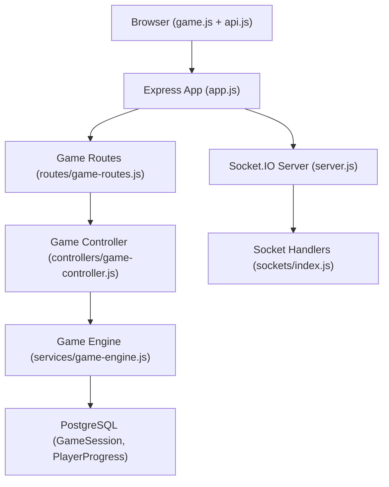
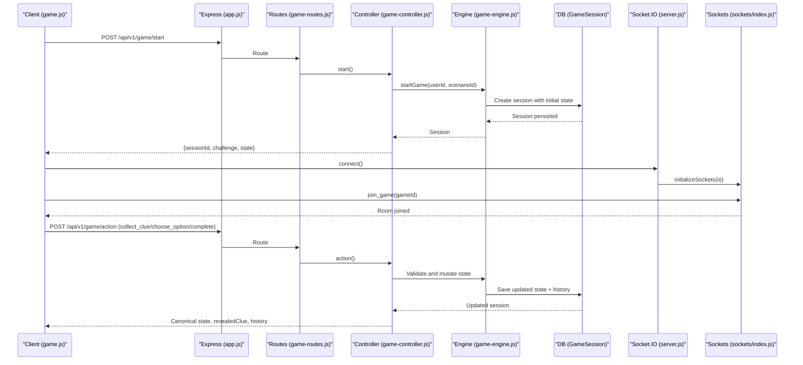
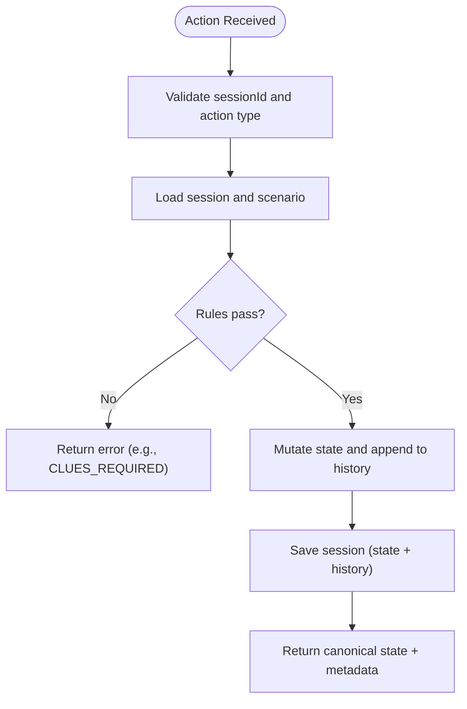
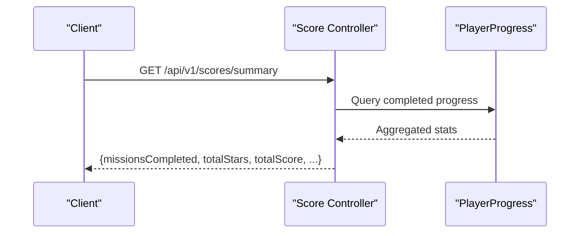
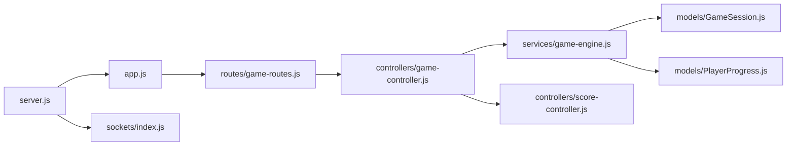

# Game State Synchronization & Multiplayer Features

<cite>
**Referenced Files in This Document**
- [server.js](file://backend/server.js)
- [app.js](file://backend/app.js)
- [sockets/index.js](file://backend/sockets/index.js)
- [routes/game-routes.js](file://backend/routes/game-routes.js)
- [controllers/game-controller.js](file://backend/controllers/game-controller.js)
- [services/game-engine.js](file://backend/services/game-engine.js)
- [models/GameSession.js](file://backend/models/GameSession.js)
- [models/PlayerProgress.js](file://backend/models/PlayerProgress.js)
- [controllers/score-controller.js](file://backend/controllers/score-controller.js)
- [public/js/api.js](file://backend/public/js/api.js)
- [public/js/game.js](file://backend/public/js/game.js)
- [config/env.js](file://backend/config/env.js)
</cite>

## Table of Contents
1. Introduction
2. Project Structure
3. Core Components
4. Architecture Overview
5. Detailed Component Analysis
6. Dependency Analysis
7. Performance Considerations
8. Troubleshooting Guide
9. Conclusion
10. Appendices

## Introduction
This document explains how game state is synchronized and how multiplayer-ready features are structured in the project. It focuses on real-time state management, event-driven flows for actions and chat, session consistency, leaderboards and live scoring, serialization and versioning strategies, rollback considerations, and guidelines to implement new multiplayer features with bandwidth optimization and fair play.

The system currently uses HTTP endpoints for authoritative game state transitions and a Socket.IO server initialized for room-based communication. The client performs optimistic UI updates and reconciles with the server’s authoritative state after each action.

## Project Structure
The backend exposes REST routes for game sessions and progress, persists state in a JSONB column with an action history, and initializes Socket.IO for future real-time broadcasting. The frontend orchestrates the user flow, calls APIs, and updates the UI optimistically before applying server responses.

**Diagram sources**
- [server.js:1-47](file://backend/server.js#L1-L47)
- [app.js:1-55](file://backend/app.js#L1-L55)
- [routes/game-routes.js:1-15](file://backend/routes/game-routes.js#L1-L15)
- [controllers/game-controller.js:1-128](file://backend/controllers/game-controller.js#L1-L128)
- [services/game-engine.js:1-124](file://backend/services/game-engine.js#L1-L124)
- [models/GameSession.js:1-15](file://backend/models/GameSession.js#L1-L15)
- [models/PlayerProgress.js:1-17](file://backend/models/PlayerProgress.js#L1-L17)
- [sockets/index.js:1-19](file://backend/sockets/index.js#L1-L19)

**Section sources**
- [server.js:1-47](file://backend/server.js#L1-L47)
- [app.js:1-55](file://backend/app.js#L1-L55)
- [routes/game-routes.js:1-15](file://backend/routes/game-routes.js#L1-L15)
- [controllers/game-controller.js:1-128](file://backend/controllers/game-controller.js#L1-L128)
- [services/game-engine.js:1-124](file://backend/services/game-engine.js#L1-L124)
- [models/GameSession.js:1-15](file://backend/models/GameSession.js#L1-L15)
- [models/PlayerProgress.js:1-17](file://backend/models/PlayerProgress.js#L1-L17)
- [sockets/index.js:1-19](file://backend/sockets/index.js#L1-L19)

## Core Components
- Socket.IO initialization and rooms: A minimal handler joins sockets into per-game rooms and logs connections/disconnections.
- Game session lifecycle: Start a session, read state, apply validated actions, persist state and history, return canonical state to clients.
- Scenario engine: Enforces rules (clues required, decision gating), computes scores/stars, and integrates AI-assisted chat when enabled.
- Persistence: GameSession stores current state and action history; PlayerProgress tracks completion and best stars; Score controller aggregates summaries.
- Frontend orchestration: Starts missions, collects clues, chooses options, completes missions, and updates UI optimistically.

Key responsibilities:
- Authoritative state: The server validates all actions and returns the canonical state.
- Event-driven hooks: Room join events exist; additional broadcast events can be added for multi-client synchronization.
- Leaderboards and scoring: Summary endpoint aggregates completed missions, stars, and scores.

**Section sources**
- [sockets/index.js:1-19](file://backend/sockets/index.js#L1-L19)
- [controllers/game-controller.js:18-116](file://backend/controllers/game-controller.js#L18-L116)
- [services/game-engine.js:51-123](file://backend/services/game-engine.js#L51-L123)
- [models/GameSession.js:1-15](file://backend/models/GameSession.js#L1-L15)
- [models/PlayerProgress.js:1-17](file://backend/models/PlayerProgress.js#L1-L17)
- [controllers/score-controller.js:1-24](file://backend/controllers/score-controller.js#L1-L24)
- [public/js/game.js:465-705](file://backend/public/js/game.js#L465-L705)

## Architecture Overview
The architecture combines REST-based authoritative state transitions with a Socket.IO layer ready for real-time broadcasting. Clients perform optimistic updates and reconcile with server responses. Rooms enable targeting specific game sessions for future multiplayer broadcasts.

**Diagram sources**
- [server.js:1-47](file://backend/server.js#L1-L47)
- [sockets/index.js:1-19](file://backend/sockets/index.js#L1-L19)
- [routes/game-routes.js:1-15](file://backend/routes/game-routes.js#L1-L15)
- [controllers/game-controller.js:18-116](file://backend/controllers/game-controller.js#L18-L116)
- [services/game-engine.js:51-123](file://backend/services/game-engine.js#L51-L123)
- [models/GameSession.js:1-15](file://backend/models/GameSession.js#L1-L15)

## Detailed Component Analysis

### Real-Time Game State Management
- State storage: GameSession.state holds phase, collected clues, selected option, score, stars, outcome, and timestamps. History records each action with type and timestamp.
- Action validation: The controller enforces business rules such as collecting all clues before choosing an option and preventing duplicate decisions or clue collection.
- Response model: Each action returns the canonical state, optional revealed clue, full history, and completion timestamp.

**Diagram sources**
- [controllers/game-controller.js:52-116](file://backend/controllers/game-controller.js#L52-L116)
- [services/game-engine.js:51-123](file://backend/services/game-engine.js#L51-L123)
- [models/GameSession.js:1-15](file://backend/models/GameSession.js#L1-L15)

**Section sources**
- [controllers/game-controller.js:52-116](file://backend/controllers/game-controller.js#L52-L116)
- [services/game-engine.js:51-123](file://backend/services/game-engine.js#L51-L123)
- [models/GameSession.js:1-15](file://backend/models/GameSession.js#L1-L15)

### State Broadcasting and Conflict Resolution
- Current behavior: The server is authoritative. Clients must not assume local state is final; they reconcile with server responses after each action.
- Conflict prevention: Duplicate actions are rejected (e.g., already decided, clue already collected). This avoids conflicts at the source.
- Future broadcasting: Socket.IO rooms are available to broadcast state changes to multiple players in the same game once multiplayer logic is added.

Guidelines for conflict resolution:
- Use server-side locks per session during action processing.
- Return explicit errors for invalid concurrent attempts.
- On reconnect, fetch canonical state via the state endpoint and replay any missing history if needed.

**Section sources**
- [sockets/index.js:1-19](file://backend/sockets/index.js#L1-L19)
- [controllers/game-controller.js:52-116](file://backend/controllers/game-controller.js#L52-L116)

### Optimistic Updates
- Client pattern: The UI updates immediately upon user interaction and then applies the server’s canonical state. If the server rejects the action, the UI should revert to the last known good state.
- Reconciliation: After each action, replace local state with the server response to ensure consistency.

Implementation references:
- Collect clue and choose option trigger optimistic UI changes, then await API responses and update state accordingly.

**Section sources**
- [public/js/game.js:623-641](file://backend/public/js/game.js#L623-L641)
- [public/js/game.js:465-482](file://backend/public/js/game.js#L465-L482)

### Event-Driven Architecture for Game Events
- Socket.IO setup: Connection logging, room joining by gameId, and disconnect logging are implemented.
- Extensibility points: Add server-side handlers to emit events like state_update, player_joined, turn_changed, and leaderboard_updated to all sockets in a room.

Recommended events:
- state_update: Full or delta state after an action.
- player_action: Acknowledgement of another player’s action in collaborative modes.
- turn_changed: When it becomes another player’s turn in turn-based games.
- leaderboard_updated: Live score changes for shared leaderboards.

**Section sources**
- [sockets/index.js:1-19](file://backend/sockets/index.js#L1-L19)
- [server.js:1-47](file://backend/server.js#L1-L47)

### Turn Management and Collaborative Gameplay
- Current state machine: Single-player phases (presentation → exploration → reveal → completed).
- Multiplayer extension: Introduce a turn queue per session, validate whose turn it is, and broadcast turn changes via Socket.IO rooms.
- Collaboration: Allow multiple players to collect clues or contribute hints; enforce ordering and deduplication server-side.

**Section sources**
- [controllers/game-controller.js:63-101](file://backend/controllers/game-controller.js#L63-L101)
- [sockets/index.js:1-19](file://backend/sockets/index.js#L1-L19)

### Real-Time Leaderboards and Live Scoring
- Leaderboard data: Score summary aggregates completed missions, total stars, total score, perfect runs, and win readiness.
- Live updates: Once Socket.IO broadcasting is used for actions, emit leaderboard deltas to relevant rooms or global channels.

**Diagram sources**
- [controllers/score-controller.js:1-24](file://backend/controllers/score-controller.js#L1-L24)
- [models/PlayerProgress.js:1-17](file://backend/models/PlayerProgress.js#L1-L17)

**Section sources**
- [controllers/score-controller.js:1-24](file://backend/controllers/score-controller.js#L1-L24)
- [models/PlayerProgress.js:1-17](file://backend/models/PlayerProgress.js#L1-L17)

### Shared Game Resources
- Resources endpoint: Fetch verified resources linked to a scenario for display in the game UI.
- Multiplayer sharing: Broadcast resource availability or updates via Socket.IO rooms when content changes.

**Section sources**
- [public/js/game.js:515-537](file://backend/public/js/game.js#L515-L537)

### State Serialization and Versioning Strategies
- Serialization: State is stored as JSONB with a stable shape including phase, collectedClueIds, selectedOptionId, score, stars, outcome, and timestamps.
- Versioning strategy:
  - Maintain an explicit schema version field in state when evolving structures.
  - On migration, transform legacy states to the latest format on load.
  - Keep history entries immutable and timestamped for auditability and potential rollbacks.

**Section sources**
- [models/GameSession.js:1-15](file://backend/models/GameSession.js#L1-L15)
- [controllers/game-controller.js:14-16](file://backend/controllers/game-controller.js#L14-L16)

### Rollback Mechanisms for Network Issues
- History-backed recovery: The session.history array records each action with type and timestamp. On reconnect or inconsistency, replay history from a known-good checkpoint to reconstruct state.
- Checkpointing: Optionally store periodic snapshots in state to reduce replay cost.
- Idempotency: Ensure actions are idempotent so reprocessing does not alter outcomes.

**Section sources**
- [models/GameSession.js:1-15](file://backend/models/GameSession.js#L1-L15)
- [controllers/game-controller.js:103-115](file://backend/controllers/game-controller.js#L103-L115)

### Guidelines for Implementing New Multiplayer Features
- Use rooms: Join sockets to game-specific rooms for targeted broadcasts.
- Authoritative server: All state mutations must go through the controller/engine; never trust client input.
- Delta updates: Emit only changed fields to reduce bandwidth.
- Concurrency control: Lock sessions during action processing; reject conflicting requests.
- Fair play: Enforce deterministic rules server-side; avoid client-side advantage.

**Section sources**
- [sockets/index.js:1-19](file://backend/sockets/index.js#L1-L19)
- [controllers/game-controller.js:52-116](file://backend/controllers/game-controller.js#L52-L116)

### Bandwidth Optimization
- Minimize payloads: Send only necessary fields; avoid sending full scenarios repeatedly.
- Batch updates: Group multiple small state changes into a single broadcast when appropriate.
- Compression: Enable transport-level compression where supported.
- Throttling: Rate-limit frequent events like XP ticks or chat messages.

[No sources needed since this section provides general guidance]

### Ensuring Fair Play in Competitive Scenarios
- Deterministic rules: All scoring and progression computed server-side.
- Anti-cheat: Validate inputs against allowed actions and scenario constraints.
- Audit trail: Use history to detect anomalies and support disputes.

**Section sources**
- [controllers/game-controller.js:63-101](file://backend/controllers/game-controller.js#L63-L101)
- [models/GameSession.js:1-15](file://backend/models/GameSession.js#L1-L15)

## Dependency Analysis
The following diagram shows key runtime dependencies between modules involved in game state and real-time features.

**Diagram sources**
- [server.js:1-47](file://backend/server.js#L1-L47)
- [app.js:1-55](file://backend/app.js#L1-L55)
- [sockets/index.js:1-19](file://backend/sockets/index.js#L1-L19)
- [routes/game-routes.js:1-15](file://backend/routes/game-routes.js#L1-L15)
- [controllers/game-controller.js:1-128](file://backend/controllers/game-controller.js#L1-L128)
- [services/game-engine.js:1-124](file://backend/services/game-engine.js#L1-L124)
- [models/GameSession.js:1-15](file://backend/models/GameSession.js#L1-L15)
- [models/PlayerProgress.js:1-17](file://backend/models/PlayerProgress.js#L1-L17)
- [controllers/score-controller.js:1-24](file://backend/controllers/score-controller.js#L1-L24)

**Section sources**
- [server.js:1-47](file://backend/server.js#L1-L47)
- [app.js:1-55](file://backend/app.js#L1-L55)
- [routes/game-routes.js:1-15](file://backend/routes/game-routes.js#L1-L15)
- [controllers/game-controller.js:1-128](file://backend/controllers/game-controller.js#L1-L128)
- [services/game-engine.js:1-124](file://backend/services/game-engine.js#L1-L124)
- [models/GameSession.js:1-15](file://backend/models/GameSession.js#L1-L15)
- [models/PlayerProgress.js:1-17](file://backend/models/PlayerProgress.js#L1-L17)
- [controllers/score-controller.js:1-24](file://backend/controllers/score-controller.js#L1-L24)

## Performance Considerations
- Database writes: Batch or throttle writes for high-frequency actions; consider write-ahead logs for heavy replays.
- State size: Keep state compact; move large payloads (like full scenario content) out of frequent updates.
- Socket.IO tuning: Adjust ping interval and timeout based on network conditions; prefer WebSocket transport.
- Caching: Cache static scenario content on the client to reduce repeated fetches.

[No sources needed since this section provides general guidance]

## Troubleshooting Guide
Common issues and diagnostics:
- Session not found or expired: Ensure sessionId is valid and session has not completed or expired.
- Invalid actions: Errors indicate rule violations (e.g., clues required, already decided).
- Network errors: Client handles network failures and prompts retry; verify CORS and token validity.
- Socket connectivity: Confirm connection and room join events; check logs for socketId and gameId.

Debugging techniques:
- Inspect request/response payloads via browser dev tools.
- Review server logs for socket events and action processing.
- Use health endpoints to verify service readiness.

**Section sources**
- [controllers/game-controller.js:8-16](file://backend/controllers/game-controller.js#L8-L16)
- [sockets/index.js:1-19](file://backend/sockets/index.js#L1-L19)
- [public/js/api.js:30-61](file://backend/public/js/api.js#L30-L61)
- [app.js:34-38](file://backend/app.js#L34-L38)

## Conclusion
The system establishes a solid foundation for real-time multiplayer gameplay with an authoritative server, robust state persistence, and a Socket.IO layer ready for broadcasting. By leveraging rooms, enforcing strict validation, and using optimistic updates with reconciliation, the application ensures consistency and responsiveness. Extending to multiplayer involves adding server-side event handlers, concurrency controls, and live broadcasts while maintaining fairness and performance.

## Appendices

### API Endpoints for Game Flow
- Start session: POST /api/v1/game/start
- Get state: GET /api/v1/game/state
- Perform action: POST /api/v1/game/action
- Chat: POST /api/v1/game/chat
- Score summary: GET /api/v1/scores/summary

**Section sources**
- [routes/game-routes.js:1-15](file://backend/routes/game-routes.js#L1-L15)
- [controllers/game-controller.js:18-120](file://backend/controllers/game-controller.js#L18-L120)
- [controllers/score-controller.js:1-24](file://backend/controllers/score-controller.js#L1-L24)

### Environment Configuration
- CORS origins, ports, and feature flags are configured via environment variables.
- AI integration can be toggled and timed out appropriately.

**Section sources**
- [config/env.js:1-40](file://backend/config/env.js#L1-L40)