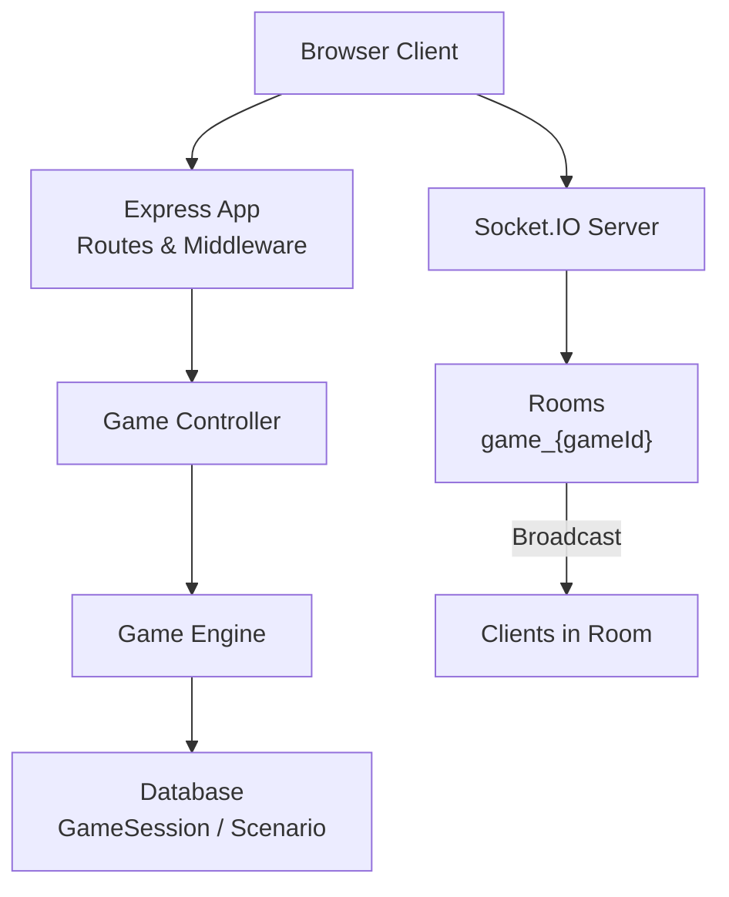
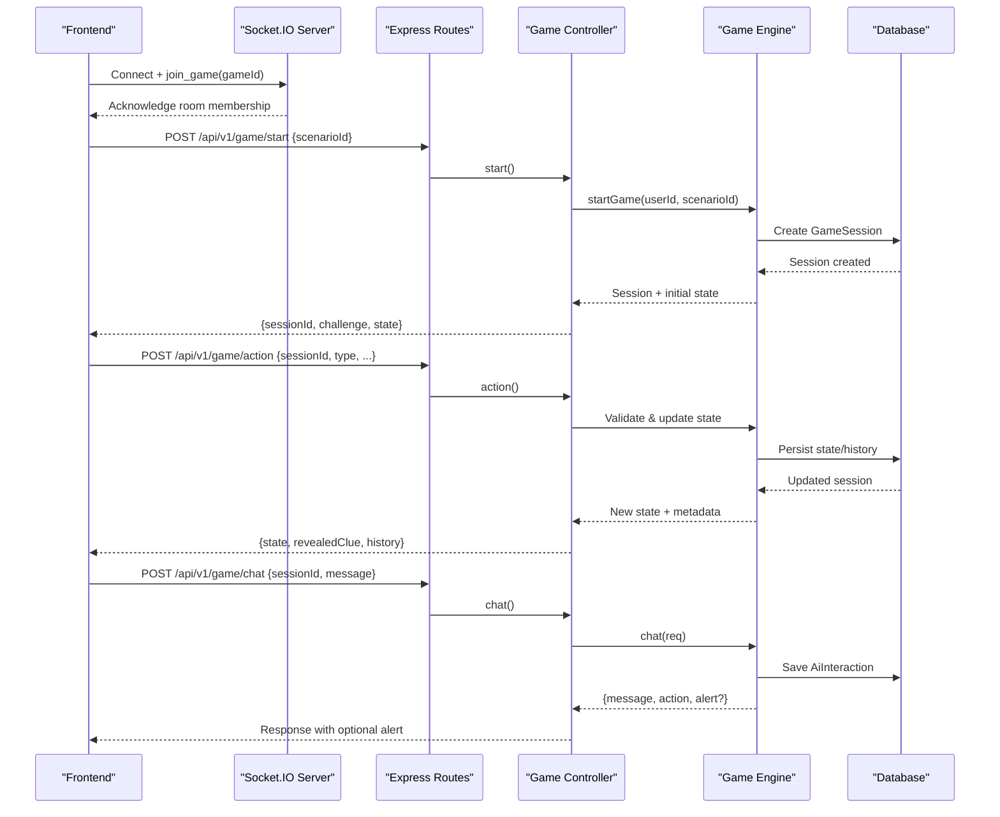
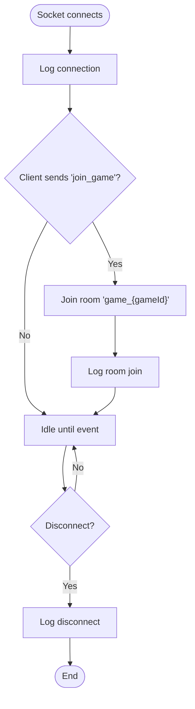
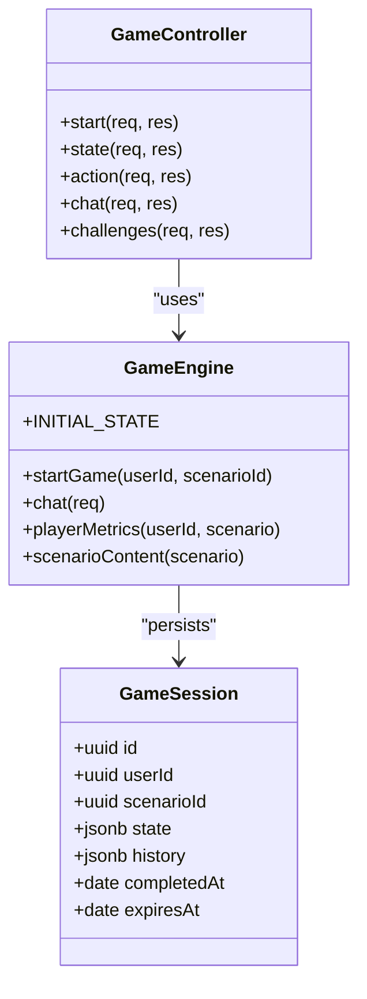
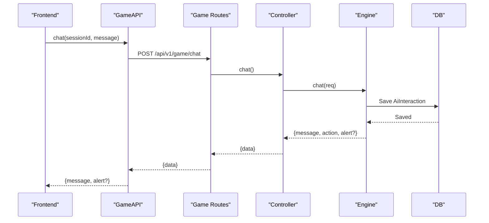
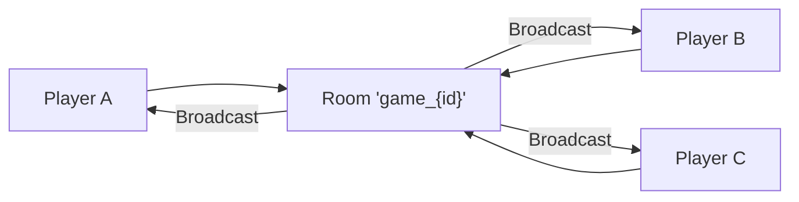
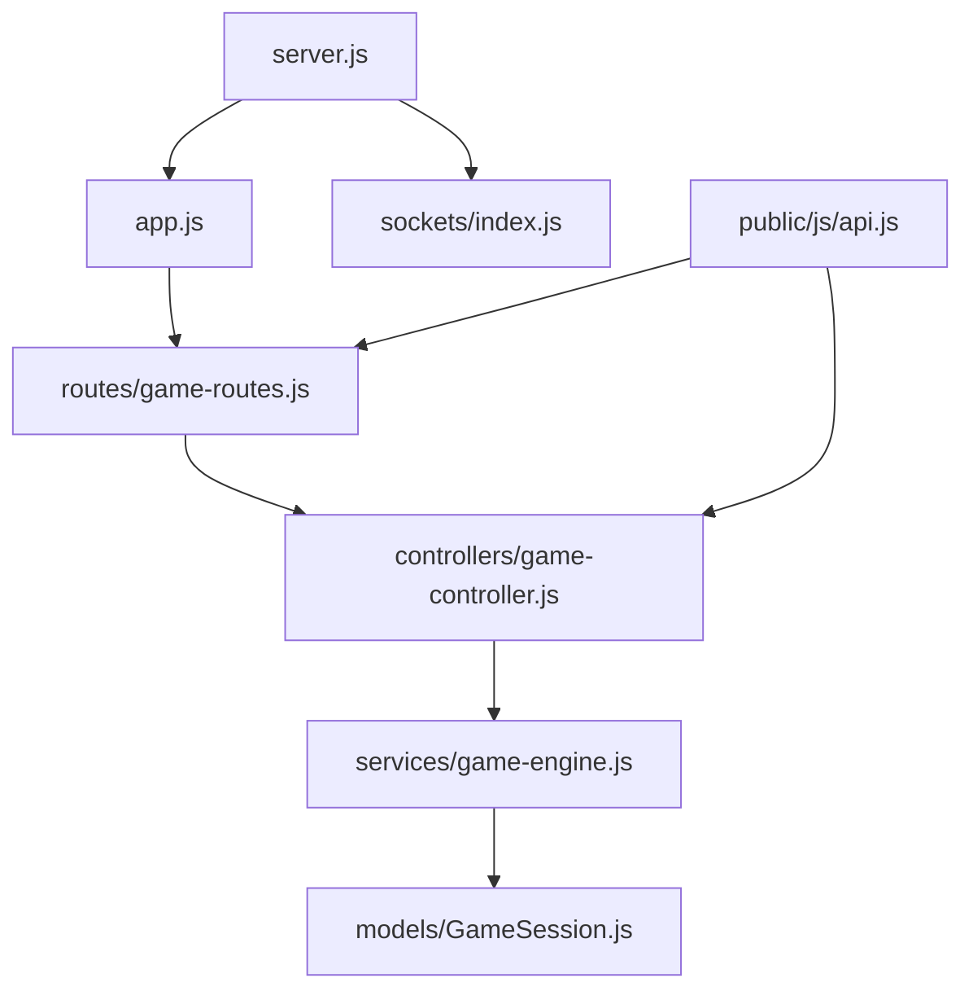

# Real-time Features & Socket.IO

<cite>
**Referenced Files in This Document**
- [server.js](file://backend/server.js)
- [app.js](file://backend/app.js)
- [sockets/index.js](file://backend/sockets/index.js)
- [routes/game-routes.js](file://backend/routes/game-routes.js)
- [controllers/game-controller.js](file://backend/controllers/game-controller.js)
- [services/game-engine.js](file://backend/services/game-engine.js)
- [models/GameSession.js](file://backend/models/GameSession.js)
- [config/env.js](file://backend/config/env.js)
- [public/js/api.js](file://backend/public/js/api.js)
- [public/js/game.js](file://backend/public/js/game.js)
- [public/js/chat-agent.js](file://backend/public/js/chat-agent.js)
</cite>

## Table of Contents
1. [Introduction](#introduction)
2. [Project Structure](#project-structure)
3. [Core Components](#core-components)
4. [Architecture Overview](#architecture-overview)
5. [Detailed Component Analysis](#detailed-component-analysis)
6. [Dependency Analysis](#dependency-analysis)
7. [Performance Considerations](#performance-considerations)
8. [Troubleshooting Guide](#troubleshooting-guide)
9. [Conclusion](#conclusion)
10. [Appendices](#appendices)

## Introduction
This document explains the real-time features implemented with Socket.IO and how they integrate with the HTTP-based game flow. It covers:
- WebSocket connection lifecycle and room management
- Event broadcasting patterns (current implementation supports joining rooms; broadcast endpoints are extensible)
- Chat functionality, including message handling, user presence logging, and real-time notifications via alerts
- Game state synchronization for multiplayer scenarios using persistent sessions and a deterministic engine
- Event types, message formats, and error handling strategies
- Performance considerations for high concurrency, scaling, and integration guidelines for new real-time features

## Project Structure
The real-time layer is initialized alongside the Express application on a shared HTTP server. Socket.IO is configured with CORS and transport options. The sockets module registers connection handlers and room joins. Game logic and chat are primarily handled over HTTP routes, while Socket.IO provides room-based communication primitives that can be extended for live multiplayer updates.

**Diagram sources**
- [server.js:1-47](file://backend/server.js#L1-L47)
- [sockets/index.js:1-19](file://backend/sockets/index.js#L1-L19)
- [routes/game-routes.js:1-14](file://backend/routes/game-routes.js#L1-L14)
- [controllers/game-controller.js:1-128](file://backend/controllers/game-controller.js#L1-L128)
- [services/game-engine.js:1-124](file://backend/services/game-engine.js#L1-L124)

**Section sources**
- [server.js:1-47](file://backend/server.js#L1-L47)
- [app.js:1-55](file://backend/app.js#L1-L55)
- [sockets/index.js:1-19](file://backend/sockets/index.js#L1-L19)

## Core Components
- Socket.IO initialization and connection handler: logs connections, supports joining game rooms, and logs disconnects.
- HTTP game routes: start session, query state, perform actions, and chat.
- Game engine: manages session lifecycle, scenario content, chat decisions, and metrics.
- Frontend API client: wraps HTTP calls for game actions and chat, with mock mode for local development.
- Frontend game UI: orchestrates flows, renders outcomes, and integrates with AI chat agent.

Key responsibilities:
- Connection lifecycle: server initializes Socket.IO, logs events, and supports room joins.
- Room-based communication: clients join rooms by gameId to receive targeted broadcasts.
- Chat: HTTP-driven chat with AI-assisted responses and optional alerts surfaced to the UI.
- State synchronization: persisted GameSession stores phase, clues, scores, and history; frontend refreshes state after actions.

**Section sources**
- [sockets/index.js:1-19](file://backend/sockets/index.js#L1-L19)
- [routes/game-routes.js:1-14](file://backend/routes/game-routes.js#L1-L14)
- [controllers/game-controller.js:1-128](file://backend/controllers/game-controller.js#L1-L128)
- [services/game-engine.js:1-124](file://backend/services/game-engine.js#L1-L124)
- [public/js/api.js:1-208](file://backend/public/js/api.js#L1-L208)
- [public/js/game.js:1-825](file://backend/public/js/game.js#L1-L825)

## Architecture Overview
The system combines HTTP and WebSocket layers:
- HTTP handles authentication, game session management, actions, and chat.
- Socket.IO provides room-based channels for future or current real-time features like presence and live updates.

**Diagram sources**
- [server.js:1-47](file://backend/server.js#L1-L47)
- [sockets/index.js:1-19](file://backend/sockets/index.js#L1-L19)
- [routes/game-routes.js:1-14](file://backend/routes/game-routes.js#L1-L14)
- [controllers/game-controller.js:1-128](file://backend/controllers/game-controller.js#L1-L128)
- [services/game-engine.js:1-124](file://backend/services/game-engine.js#L1-L124)

## Detailed Component Analysis

### Socket.IO Lifecycle and Rooms
- Connection: The server creates a Socket.IO instance sharing the HTTP server and logs each connection.
- Rooms: Clients join a room named game_{gameId}. This enables targeted broadcasts to all participants in a game.
- Disconnect: Disconnections are logged for observability.

**Diagram sources**
- [sockets/index.js:1-19](file://backend/sockets/index.js#L1-L19)
- [server.js:1-47](file://backend/server.js#L1-L47)

**Section sources**
- [sockets/index.js:1-19](file://backend/sockets/index.js#L1-L19)
- [server.js:1-47](file://backend/server.js#L1-L47)

### Game State Synchronization
- Session creation: Starting a game creates a GameSession with an initial state and expiration time.
- Actions: Collecting clues, choosing options, and completing a scenario update the session state and append to history.
- State retrieval: Clients can fetch full state, including revealed clues and history, to synchronize UI.

**Diagram sources**
- [models/GameSession.js:1-15](file://backend/models/GameSession.js#L1-L15)
- [services/game-engine.js:1-124](file://backend/services/game-engine.js#L1-L124)
- [controllers/game-controller.js:1-128](file://backend/controllers/game-controller.js#L1-L128)

**Section sources**
- [controllers/game-controller.js:1-128](file://backend/controllers/game-controller.js#L1-L128)
- [services/game-engine.js:1-124](file://backend/services/game-engine.js#L1-L124)
- [models/GameSession.js:1-15](file://backend/models/GameSession.js#L1-L15)

### Chat Functionality and Notifications
- Flow: The frontend sends a chat message with sessionId; the backend validates the active session, builds context, invokes AI decision-making, persists interaction, and returns a response with optional alert.
- Alerts: Responses may include an alert object with type and priority, which the UI surfaces as a notification.
- Fallback: If AI is unavailable, scripted replies provide consistent behavior.

**Diagram sources**
- [public/js/api.js:1-208](file://backend/public/js/api.js#L1-L208)
- [routes/game-routes.js:1-14](file://backend/routes/game-routes.js#L1-L14)
- [controllers/game-controller.js:1-128](file://backend/controllers/game-controller.js#L1-L128)
- [services/game-engine.js:1-124](file://backend/services/game-engine.js#L1-L124)

**Section sources**
- [controllers/game-controller.js:118-120](file://backend/controllers/game-controller.js#L118-L120)
- [services/game-engine.js:66-121](file://backend/services/game-engine.js#L66-L121)
- [public/js/game.js:707-728](file://backend/public/js/game.js#L707-L728)

### Multiplayer Collaboration Patterns
- Rooms: Clients join game-specific rooms to enable broadcasting to all participants in a session.
- Presence: Disconnection events are logged; presence tracking can be extended by maintaining a map of socket IDs per room.
- Broadcasting: While not currently used for game state, the room abstraction allows broadcasting updates (e.g., turn changes, leaderboards) to all members.

**Diagram sources**
- [sockets/index.js:1-19](file://backend/sockets/index.js#L1-L19)

**Section sources**
- [sockets/index.js:1-19](file://backend/sockets/index.js#L1-L19)

## Dependency Analysis
- Server bootstraps Express and Socket.IO on the same HTTP server, enabling both REST and WebSocket traffic.
- Game routes depend on controllers and validators; controllers delegate to the game engine for business logic.
- The engine depends on models for persistence and optionally on AI services for chat decisions.
- Frontend uses a unified API client to interact with game endpoints and optionally mocks requests locally.

**Diagram sources**
- [server.js:1-47](file://backend/server.js#L1-L47)
- [app.js:1-55](file://backend/app.js#L1-L55)
- [routes/game-routes.js:1-14](file://backend/routes/game-routes.js#L1-L14)
- [controllers/game-controller.js:1-128](file://backend/controllers/game-controller.js#L1-L128)
- [services/game-engine.js:1-124](file://backend/services/game-engine.js#L1-L124)
- [models/GameSession.js:1-15](file://backend/models/GameSession.js#L1-L15)
- [public/js/api.js:1-208](file://backend/public/js/api.js#L1-L208)

**Section sources**
- [server.js:1-47](file://backend/server.js#L1-L47)
- [routes/game-routes.js:1-14](file://backend/routes/game-routes.js#L1-L14)
- [controllers/game-controller.js:1-128](file://backend/controllers/game-controller.js#L1-L128)
- [services/game-engine.js:1-124](file://backend/services/game-engine.js#L1-L124)
- [models/GameSession.js:1-15](file://backend/models/GameSession.js#L1-L15)
- [public/js/api.js:1-208](file://backend/public/js/api.js#L1-L208)

## Performance Considerations
- Transports: Both WebSocket and polling transports are enabled; prefer WebSocket for low-latency interactions.
- Concurrency: Use rooms to limit broadcast scope and reduce fan-out overhead.
- Persistence: Keep frequent state writes minimal; batch updates where possible and rely on JSONB fields for compact storage.
- Scaling: For horizontal scaling, consider a Redis adapter for Socket.IO to share rooms across processes.
- Timeouts: Configure request timeouts for external AI calls to prevent blocking long-running operations.
- Monitoring: Leverage structured logging for connection events, errors, and performance metrics.

[No sources needed since this section provides general guidance]

## Troubleshooting Guide
- Connection issues: Verify CORS origins and credentials settings; ensure the server starts and listens on the expected port.
- Room membership: Confirm clients send join_game with a valid gameId; check logs for room join confirmations.
- Session validation: Ensure sessionId matches an active session; expired or completed sessions will fail action requests.
- Chat failures: Check AI service availability and token configuration; fallback scripted replies should still work.
- Error propagation: Frontend normalizes errors and displays messages; inspect status codes and error codes from the backend.

**Section sources**
- [config/env.js:1-40](file://backend/config/env.js#L1-L40)
- [server.js:1-47](file://backend/server.js#L1-L47)
- [controllers/game-controller.js:1-128](file://backend/controllers/game-controller.js#L1-L128)
- [services/game-engine.js:1-124](file://backend/services/game-engine.js#L1-L124)
- [public/js/api.js:1-208](file://backend/public/js/api.js#L1-L208)

## Conclusion
The application integrates Socket.IO for room-based real-time communication alongside a robust HTTP-based game engine. While current Socket.IO usage focuses on connection lifecycle and room joins, the architecture is ready for scalable multiplayer features such as live presence, collaborative gameplay, and real-time notifications. The chat system demonstrates a clear pattern for integrating AI-driven responses with persistent interactions and optional alerts. Following the provided guidelines ensures reliable, maintainable, and performant real-time features.

[No sources needed since this section summarizes without analyzing specific files]

## Appendices

### Event Types and Message Formats
- Socket.IO events:
  - join_game(gameId): Joins a room for a specific game session.
  - disconnect: Logged for observability; can be extended for presence cleanup.
- HTTP endpoints:
  - POST /api/v1/game/start: Creates a session and returns sessionId, challenge, and initial state.
  - GET /api/v1/game/state: Returns current state, revealed clues, history, and expiration.
  - POST /api/v1/game/action: Performs actions like collect_clue, choose_option, complete; returns updated state and metadata.
  - POST /api/v1/game/chat: Sends a message within an active session; returns assistant message and optional alert.

**Section sources**
- [sockets/index.js:1-19](file://backend/sockets/index.js#L1-L19)
- [routes/game-routes.js:1-14](file://backend/routes/game-routes.js#L1-L14)
- [controllers/game-controller.js:1-128](file://backend/controllers/game-controller.js#L1-L128)
- [services/game-engine.js:1-124](file://backend/services/game-engine.js#L1-L124)

### Integration Guidelines for New Real-Time Features
- Extend sockets/index.js to handle new events and broadcast to rooms as needed.
- Maintain room naming conventions (e.g., game_{gameId}) for consistency.
- Use structured logging for all real-time events to aid debugging and analytics.
- Coordinate with HTTP endpoints to keep state synchronized; avoid duplicating state between WebSocket and database unless necessary.
- Implement graceful shutdown to close sockets and persist final states.

**Section sources**
- [sockets/index.js:1-19](file://backend/sockets/index.js#L1-L19)
- [server.js:1-47](file://backend/server.js#L1-L47)