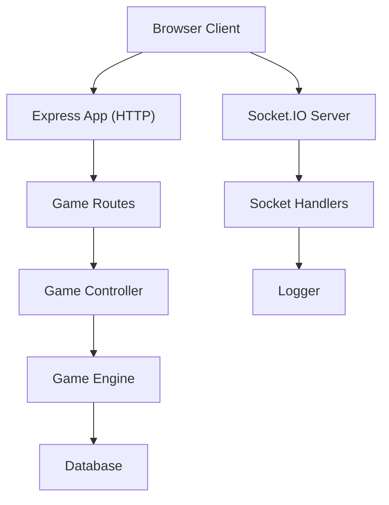
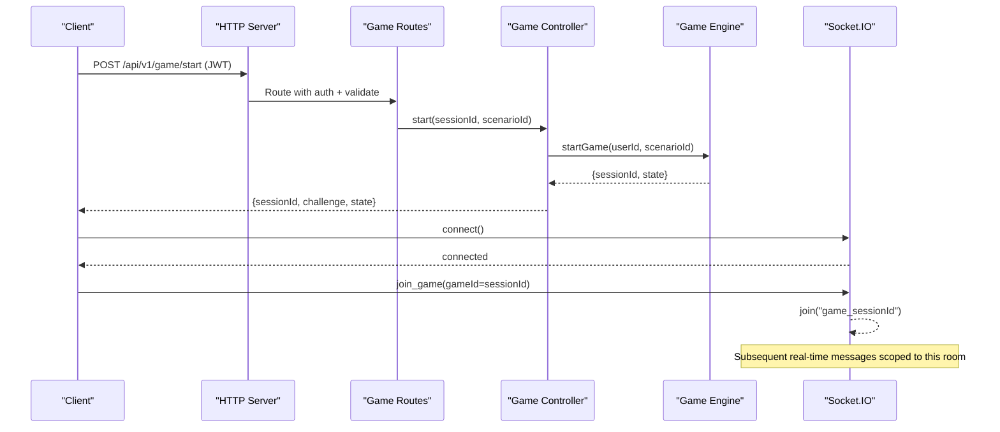
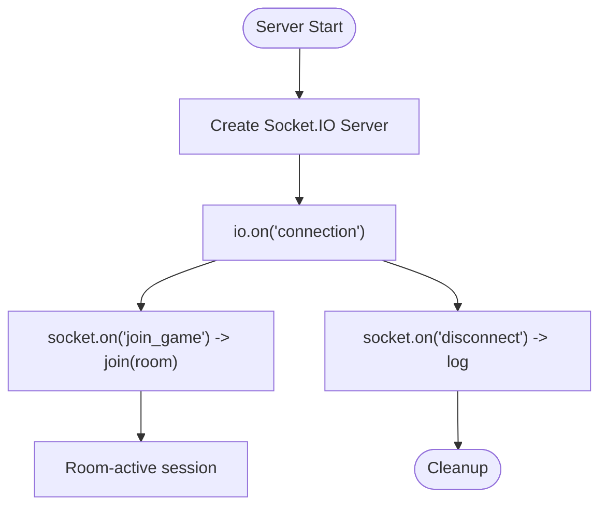
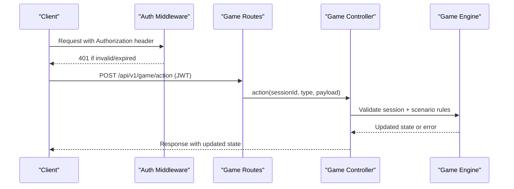
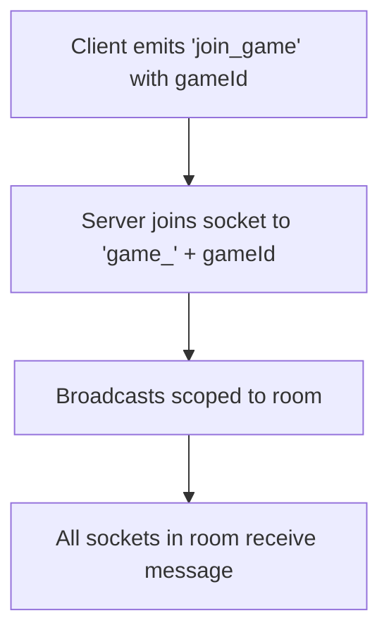
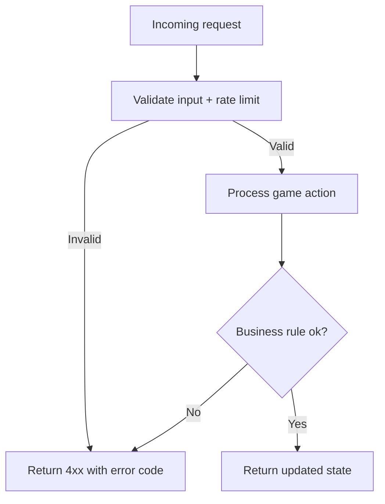
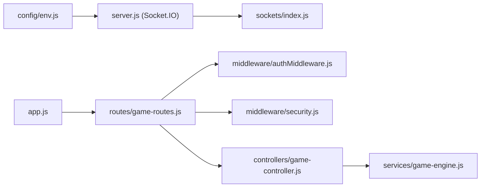

# Socket Connection Management

<cite>
**Referenced Files in This Document**
- [server.js](file://backend/server.js)
- [sockets/index.js](file://backend/sockets/index.js)
- [app.js](file://backend/app.js)
- [config/env.js](file://backend/config/env.js)
- [routes/game-routes.js](file://backend/routes/game-routes.js)
- [controllers/game-controller.js](file://backend/controllers/game-controller.js)
- [services/game-engine.js](file://backend/services/game-engine.js)
- [middleware/authMiddleware.js](file://backend/middleware/authMiddleware.js)
- [middleware/security.js](file://backend/middleware/security.js)
</cite>

## Table of Contents
1. [Introduction](#introduction)
2. [Project Structure](#project-structure)
3. [Core Components](#core-components)
4. [Architecture Overview](#architecture-overview)
5. [Detailed Component Analysis](#detailed-component-analysis)
6. [Dependency Analysis](#dependency-analysis)
7. [Performance Considerations](#performance-considerations)
8. [Troubleshooting Guide](#troubleshooting-guide)
9. [Conclusion](#conclusion)
10. [Appendices](#appendices)

## Introduction
This document explains how Socket.IO is integrated into the SIHProject backend to manage WebSocket connections, room-based communication for game sessions, and lifecycle events such as connection, authentication boundaries, and disconnection. It also covers security considerations, error handling patterns, monitoring via logging, and guidance for client-side reconnection strategies and high-concurrency best practices.

## Project Structure
The WebSocket server is initialized alongside the Express HTTP server. The Socket.IO instance is created with CORS and transport options, then socket event handlers are registered. Game session state and actions flow through REST endpoints protected by JWT authentication; rooms are used for real-time grouping by game ID.

**Diagram sources**
- [server.js:9-25](file://backend/server.js#L9-L25)
- [sockets/index.js:3-16](file://backend/sockets/index.js#L3-L16)
- [routes/game-routes.js:8-12](file://backend/routes/game-routes.js#L8-L12)
- [controllers/game-controller.js:18-120](file://backend/controllers/game-controller.js#L18-L120)
- [services/game-engine.js:51-121](file://backend/services/game-engine.js#L51-L121)

**Section sources**
- [server.js:9-25](file://backend/server.js#L9-L25)
- [sockets/index.js:3-16](file://backend/sockets/index.js#L3-L16)
- [routes/game-routes.js:8-12](file://backend/routes/game-routes.js#L8-L12)

## Core Components
- Socket.IO initialization and configuration:
  - Creates a Socket.IO server attached to the HTTP server with CORS and transports configured from environment variables.
  - Registers global connection, room join, and disconnect handlers.
- Room-based communication:
  - Clients join a room named after the game session ID to enable targeted broadcasts within that session.
- Authentication boundary:
  - Real-time events do not perform JWT verification directly; instead, game state and actions are validated via authenticated REST endpoints before any real-time messaging occurs.
- Logging and observability:
  - All connection, room join, and disconnect events are logged with socket identifiers for traceability.

**Section sources**
- [server.js:13-21](file://backend/server.js#L13-L21)
- [sockets/index.js:3-16](file://backend/sockets/index.js#L3-L16)
- [config/env.js:6-39](file://backend/config/env.js#L6-L39)

## Architecture Overview
The system separates concerns between HTTP (REST) and WebSocket layers:
- HTTP layer handles authentication, session creation, and game actions using JWT middleware and validation.
- WebSocket layer provides lightweight real-time signaling and room scoping for live updates within a game session.

**Diagram sources**
- [routes/game-routes.js:8-12](file://backend/routes/game-routes.js#L8-L12)
- [controllers/game-controller.js:18-28](file://backend/controllers/game-controller.js#L18-L28)
- [services/game-engine.js:51-64](file://backend/services/game-engine.js#L51-L64)
- [sockets/index.js:3-16](file://backend/sockets/index.js#L3-L16)

## Detailed Component Analysis

### Socket Initialization and Lifecycle
- Connection establishment:
  - A new Socket.IO server is created with CORS and transport settings derived from environment configuration.
  - On each connection, an informational log entry records the socket identifier.
- Room joining:
  - Clients emit a join event carrying the game session ID; the server joins the socket to a room named with a prefix and the session ID.
- Disconnection:
  - On disconnect, the server logs the socket identifier for audit and debugging.

**Diagram sources**
- [server.js:13-21](file://backend/server.js#L13-L21)
- [sockets/index.js:3-16](file://backend/sockets/index.js#L3-L16)

**Section sources**
- [server.js:13-21](file://backend/server.js#L13-L21)
- [sockets/index.js:3-16](file://backend/sockets/index.js#L3-L16)

### Authentication Boundary and Session Validation
- Authentication is enforced on all game-related REST endpoints using JWT middleware.
- Game sessions are created via an authenticated endpoint; the returned sessionId is used to scope WebSocket rooms and to validate subsequent actions.
- Actions like collecting clues, choosing options, and completing scenarios are validated server-side against active sessions and scenario content.

**Diagram sources**
- [middleware/authMiddleware.js:6-35](file://backend/middleware/authMiddleware.js#L6-L35)
- [routes/game-routes.js:8-12](file://backend/routes/game-routes.js#L8-L12)
- [controllers/game-controller.js:52-116](file://backend/controllers/game-controller.js#L52-L116)
- [services/game-engine.js:51-64](file://backend/services/game-engine.js#L51-L64)

**Section sources**
- [middleware/authMiddleware.js:6-35](file://backend/middleware/authMiddleware.js#L6-L35)
- [controllers/game-controller.js:52-116](file://backend/controllers/game-controller.js#L52-L116)

### Room-Based Communication for Game Sessions
- Rooms are named using a consistent pattern based on the game session ID.
- When a client emits a join event with the session ID, the server joins the socket to the corresponding room.
- Future real-time broadcasts can target this room to deliver synchronized updates to all participants in the same game session.

**Diagram sources**
- [sockets/index.js:7-10](file://backend/sockets/index.js#L7-L10)

**Section sources**
- [sockets/index.js:7-10](file://backend/sockets/index.js#L7-L10)

### Error Handling and Validation
- Input validation and rate limiting are applied at the API layer to protect endpoints and reduce abuse.
- Game actions enforce business rules (e.g., required clues before decision, preventing duplicate actions).
- Errors are standardized and returned with codes and messages for client handling.

**Diagram sources**
- [middleware/security.js:21-45](file://backend/middleware/security.js#L21-L45)
- [controllers/game-controller.js:52-116](file://backend/controllers/game-controller.js#L52-L116)

**Section sources**
- [middleware/security.js:21-45](file://backend/middleware/security.js#L21-L45)
- [controllers/game-controller.js:52-116](file://backend/controllers/game-controller.js#L52-L116)

### Monitoring and Health
- Connection and room events are logged with socket identifiers for operational visibility.
- HTTP health endpoints expose service status and readiness checks.

**Section sources**
- [sockets/index.js:3-16](file://backend/sockets/index.js#L3-L16)
- [app.js:34-38](file://backend/app.js#L34-L38)

## Dependency Analysis
Socket.IO depends on environment configuration for CORS and transports. The HTTP server and routes depend on authentication middleware and validation schemas. Game logic depends on models and services for persistence and AI-assisted chat.

**Diagram sources**
- [config/env.js:6-39](file://backend/config/env.js#L6-L39)
- [server.js:13-21](file://backend/server.js#L13-L21)
- [sockets/index.js:3-16](file://backend/sockets/index.js#L3-L16)
- [app.js:15-54](file://backend/app.js#L15-L54)
- [routes/game-routes.js:8-12](file://backend/routes/game-routes.js#L8-L12)
- [middleware/authMiddleware.js:6-35](file://backend/middleware/authMiddleware.js#L6-L35)
- [middleware/security.js:21-45](file://backend/middleware/security.js#L21-L45)
- [controllers/game-controller.js:18-120](file://backend/controllers/game-controller.js#L18-L120)
- [services/game-engine.js:51-121](file://backend/services/game-engine.js#L51-L121)

**Section sources**
- [config/env.js:6-39](file://backend/config/env.js#L6-L39)
- [server.js:13-21](file://backend/server.js#L13-L21)
- [sockets/index.js:3-16](file://backend/sockets/index.js#L3-L16)
- [routes/game-routes.js:8-12](file://backend/routes/game-routes.js#L8-L12)
- [controllers/game-controller.js:18-120](file://backend/controllers/game-controller.js#L18-L120)
- [services/game-engine.js:51-121](file://backend/services/game-engine.js#L51-L121)

## Performance Considerations
- Transports: Both WebSocket and polling are enabled; prefer WebSocket when available for lower latency.
- Room scoping: Use rooms to minimize broadcast overhead by targeting only relevant sockets.
- Rate limiting: Apply per-route limits to protect against bursts and abuse.
- Graceful shutdown: Close Socket.IO and database connections cleanly to avoid resource leaks.
- Concurrency: For high concurrency, consider horizontal scaling with a Socket.IO adapter backed by Redis to share rooms across processes.

[No sources needed since this section provides general guidance]

## Troubleshooting Guide
- Connection issues:
  - Verify CORS origins match the client’s origin and credentials are allowed.
  - Check that the server starts successfully and listens on the expected port.
- Room membership:
  - Ensure clients emit join events with the correct session ID immediately after connecting.
- Authentication errors:
  - Confirm JWT tokens are present and valid for all game-related requests.
  - Inspect token expiration and version mismatches.
- Action failures:
  - Review error codes returned by game actions (e.g., missing clues, already decided).
- Observability:
  - Use logs with socket IDs to trace connection lifecycle and room joins.
  - Use HTTP health endpoints to verify service readiness.

**Section sources**
- [config/env.js:6-39](file://backend/config/env.js#L6-L39)
- [middleware/authMiddleware.js:6-35](file://backend/middleware/authMiddleware.js#L6-L35)
- [controllers/game-controller.js:52-116](file://backend/controllers/game-controller.js#L52-L116)
- [sockets/index.js:3-16](file://backend/sockets/index.js#L3-L16)
- [app.js:34-38](file://backend/app.js#L34-L38)

## Conclusion
The SIHProject integrates Socket.IO to provide real-time, room-scoped communication for game sessions while enforcing strict authentication and validation on the HTTP layer. Connections are logged for observability, and rooms enable efficient broadcasting within a session. For production deployments, add an adapter for horizontal scaling, implement robust client-side reconnection logic, and continue monitoring via structured logs and health endpoints.

[No sources needed since this section summarizes without analyzing specific files]

## Appendices

### Security Considerations for Socket Connections
- Enforce HTTPS and restrict CORS origins to trusted domains.
- Do not rely on Socket.IO events for authorization; always validate session ownership via authenticated REST calls before processing sensitive actions.
- Sanitize and validate all inputs at the API layer; apply rate limits to prevent abuse.
- Avoid exposing sensitive data in logs; use request IDs and socket IDs for correlation.

**Section sources**
- [app.js:21-29](file://backend/app.js#L21-L29)
- [middleware/security.js:21-45](file://backend/middleware/security.js#L21-L45)
- [middleware/authMiddleware.js:6-35](file://backend/middleware/authMiddleware.js#L6-L35)

### Best Practices for High-Concurrency Scenarios
- Use a shared store (e.g., Redis) as the Socket.IO adapter to scale horizontally.
- Keep rooms small and focused on session scope to minimize fan-out.
- Implement backpressure and throttling on the client side to avoid overwhelming the server.
- Monitor memory and CPU usage; tune process counts and worker threads as needed.

[No sources needed since this section provides general guidance]

### Example: Connecting Clients and Handling Events
- Connect to the server and immediately join the game room using the session ID obtained from the authenticated start endpoint.
- Handle disconnects by attempting to reconnect with exponential backoff and rejoining the appropriate room once reconnected.
- Always synchronize state via authenticated REST calls; use WebSocket events for lightweight updates after successful synchronization.

[No sources needed since this section provides conceptual guidance]