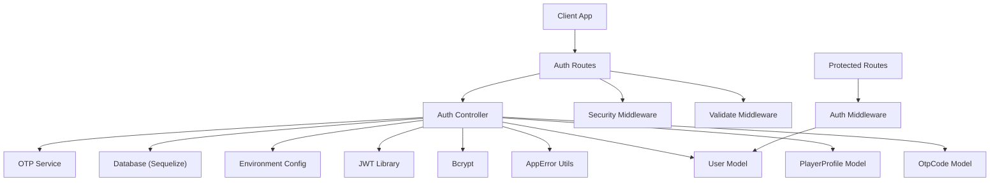
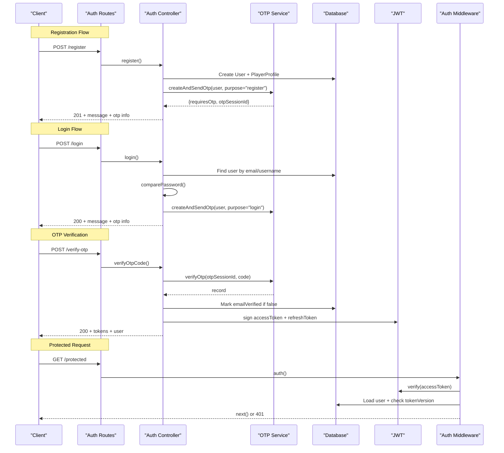
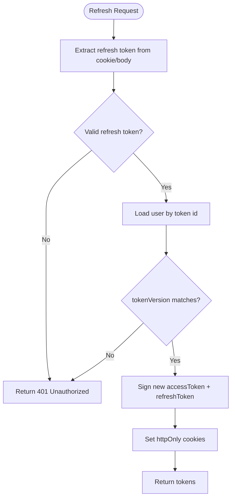
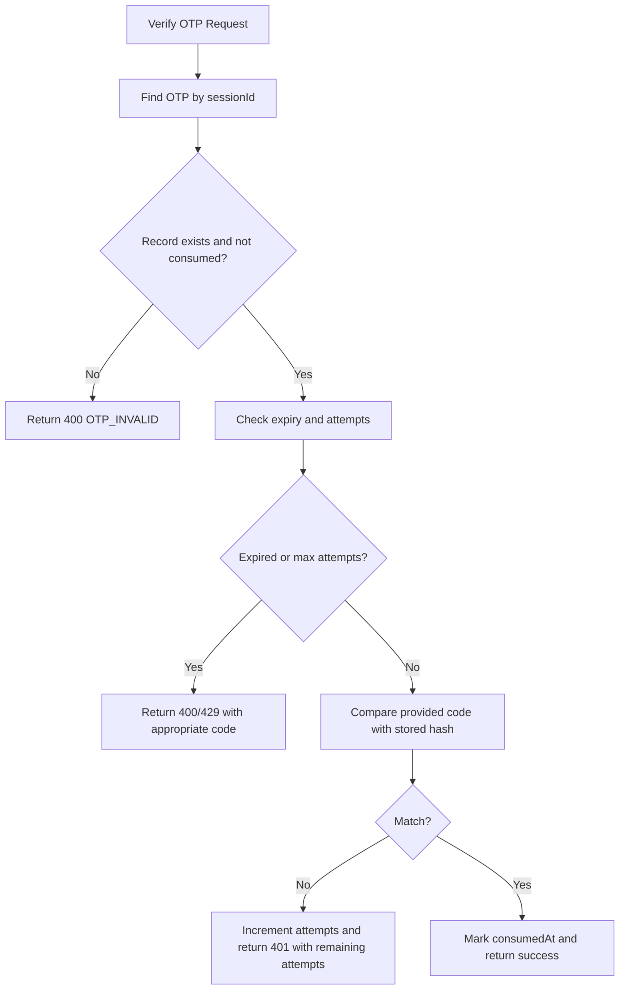
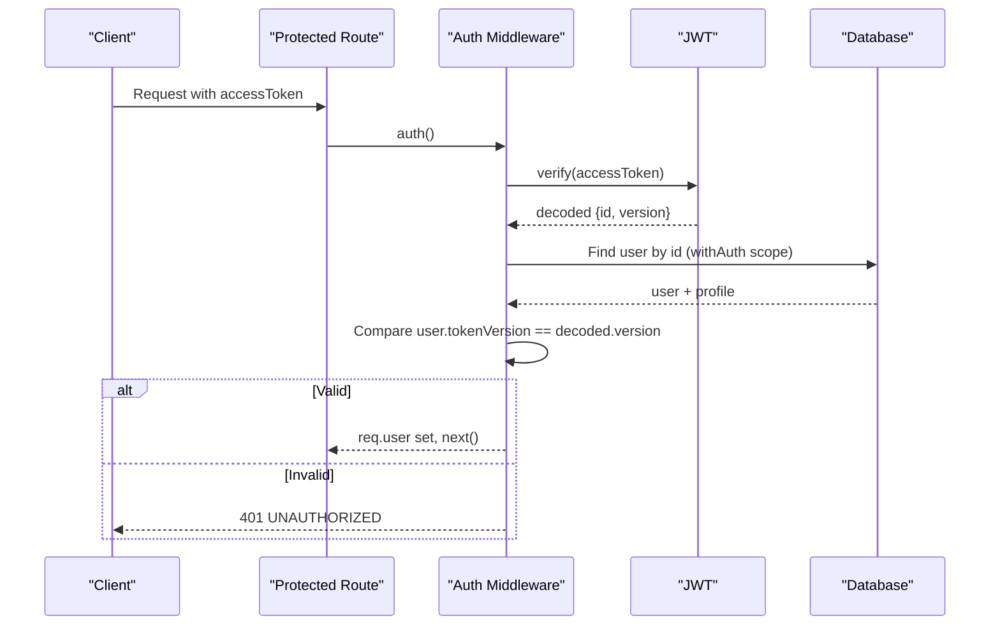
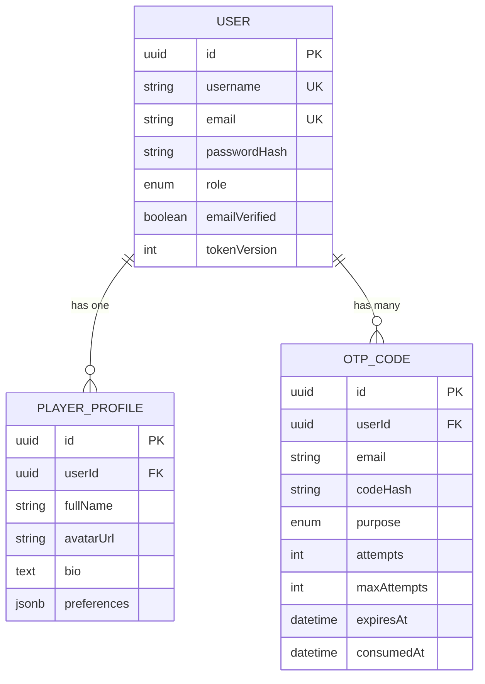
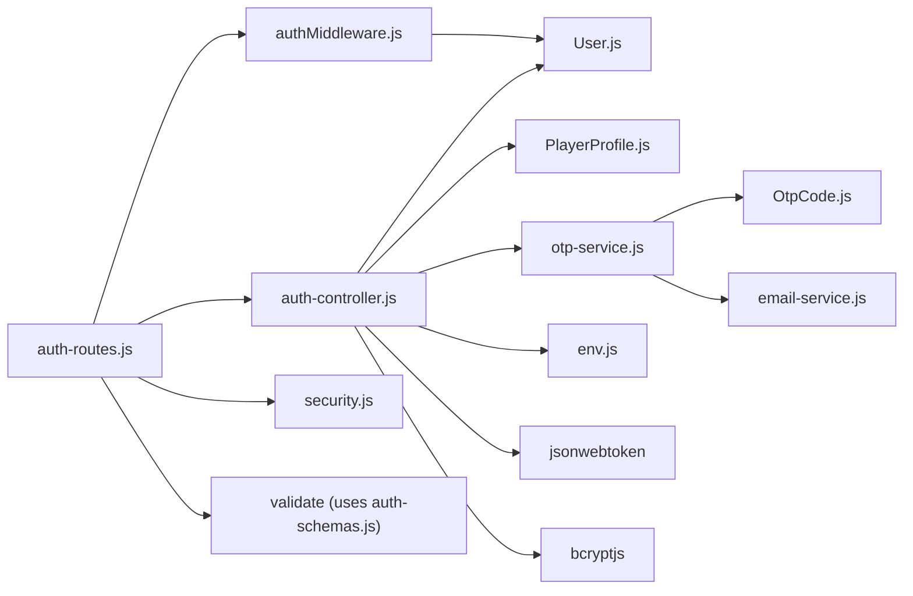

# Authentication System

<cite>
**Referenced Files in This Document**
- [auth-controller.js](file://backend/controllers/auth-controller.js)
- [authMiddleware.js](file://backend/middleware/authMiddleware.js)
- [auth-routes.js](file://backend/routes/auth-routes.js)
- [auth-schemas.js](file://backend/validators/auth-schemas.js)
- [otp-service.js](file://backend/services/otp-service.js)
- [User.js](file://backend/models/User.js)
- [OtpCode.js](file://backend/models/OtpCode.js)
- [PlayerProfile.js](file://backend/models/PlayerProfile.js)
- [env.js](file://backend/config/env.js)
- [security.js](file://backend/middleware/security.js)
- [app-error.js](file://backend/utils/app-error.js)
</cite>

## Table of Contents
1. [Introduction](#introduction)
2. [Project Structure](#project-structure)
3. [Core Components](#core-components)
4. [Architecture Overview](#architecture-overview)
5. [Detailed Component Analysis](#detailed-component-analysis)
6. [Dependency Analysis](#dependency-analysis)
7. [Performance Considerations](#performance-considerations)
8. [Troubleshooting Guide](#troubleshooting-guide)
9. [Conclusion](#conclusion)
10. [Appendices](#appendices)

## Introduction
This document explains the authentication system implemented in the backend, covering user registration, login with OTP verification, JWT token management (access and refresh tokens), session expiration handling, and route protection via middleware. It also documents password hashing with bcrypt, input validation schemas, error handling patterns, and provides examples of endpoints and request/response formats.

## Project Structure
The authentication feature is organized across controllers, routes, middleware, validators, services, and models:
- Routes define HTTP endpoints for auth flows.
- Controllers implement business logic for registration, login, OTP verification, logout, and token refresh.
- Middleware protects routes by validating JWTs and attaching user context.
- Validators enforce input schemas using Joi.
- Services handle OTP generation, storage, verification, and email delivery.
- Models define database entities for users, profiles, and OTP codes.
- Configuration centralizes environment variables including JWT secrets and TTLs.
- Security middleware adds rate limiting and unsafe input rejection.

**Diagram sources**
- [auth-routes.js:1-18](file://backend/routes/auth-routes.js#L1-L18)
- [auth-controller.js:1-154](file://backend/controllers/auth-controller.js#L1-L154)
- [authMiddleware.js:1-38](file://backend/middleware/authMiddleware.js#L1-L38)
- [otp-service.js:1-99](file://backend/services/otp-service.js#L1-L99)
- [User.js:1-23](file://backend/models/User.js#L1-L23)
- [OtpCode.js:1-22](file://backend/models/OtpCode.js#L1-L22)
- [PlayerProfile.js:1-14](file://backend/models/PlayerProfile.js#L1-L14)
- [env.js:1-40](file://backend/config/env.js#L1-L40)
- [security.js:1-48](file://backend/middleware/security.js#L1-L48)
- [app-error.js:1-12](file://backend/utils/app-error.js#L1-L12)

**Section sources**
- [auth-routes.js:1-18](file://backend/routes/auth-routes.js#L1-L18)
- [auth-controller.js:1-154](file://backend/controllers/auth-controller.js#L1-L154)
- [authMiddleware.js:1-38](file://backend/middleware/authMiddleware.js#L1-L38)
- [otp-service.js:1-99](file://backend/services/otp-service.js#L1-L99)
- [User.js:1-23](file://backend/models/User.js#L1-L23)
- [OtpCode.js:1-22](file://backend/models/OtpCode.js#L1-L22)
- [PlayerProfile.js:1-14](file://backend/models/PlayerProfile.js#L1-L14)
- [env.js:1-40](file://backend/config/env.js#L1-L40)
- [security.js:1-48](file://backend/middleware/security.js#L1-L48)
- [app-error.js:1-12](file://backend/utils/app-error.js#L1-L12)

## Core Components
- Registration: Creates a user with a hashed password, initializes a player profile, and issues an OTP for email verification.
- Login: Validates credentials, then issues an OTP to continue the flow.
- OTP Verification: Verifies the code, marks the account as verified, and returns access and refresh tokens.
- Logout: Invalidates the session by incrementing the user’s token version and clearing cookies.
- Token Refresh: Validates the refresh token, checks session validity via token version, and rotates both tokens.
- Route Protection: Middleware validates the access token and ensures the session is still valid.

Key implementation references:
- Registration, login, OTP verification, logout, refresh, guest login: [auth-controller.js:34-151](file://backend/controllers/auth-controller.js#L34-L151)
- JWT signing and cookie options: [auth-controller.js:10-32](file://backend/controllers/auth-controller.js#L10-L32)
- Access token verification and user loading: [authMiddleware.js:6-35](file://backend/middleware/authMiddleware.js#L6-L35)
- Input validation schemas: [auth-schemas.js:1-29](file://backend/validators/auth-schemas.js#L1-L29)
- OTP service (generation, storage, verification, resend): [otp-service.js:1-99](file://backend/services/otp-service.js#L1-L99)
- Environment configuration (JWT secrets/TTLs, flags): [env.js:1-40](file://backend/config/env.js#L1-L40)
- Rate limiting and security helpers: [security.js:1-48](file://backend/middleware/security.js#L1-L48)
- Error class used throughout: [app-error.js:1-12](file://backend/utils/app-error.js#L1-L12)

**Section sources**
- [auth-controller.js:10-151](file://backend/controllers/auth-controller.js#L10-L151)
- [authMiddleware.js:6-35](file://backend/middleware/authMiddleware.js#L6-L35)
- [auth-schemas.js:1-29](file://backend/validators/auth-schemas.js#L1-L29)
- [otp-service.js:1-99](file://backend/services/otp-service.js#L1-L99)
- [env.js:1-40](file://backend/config/env.js#L1-L40)
- [security.js:1-48](file://backend/middleware/security.js#L1-L48)
- [app-error.js:1-12](file://backend/utils/app-error.js#L1-L12)

## Architecture Overview
The authentication architecture follows a layered approach:
- Routes apply security middleware (rate limits) and input validation before invoking controller actions.
- Controllers orchestrate business logic, interact with models via Sequelize, use bcrypt for passwords, and JWT for tokens.
- OTP service manages secure OTP lifecycle and email delivery.
- Auth middleware protects downstream routes by verifying JWTs and checking session validity through token version.

**Diagram sources**
- [auth-routes.js:9-15](file://backend/routes/auth-routes.js#L9-L15)
- [auth-controller.js:34-121](file://backend/controllers/auth-controller.js#L34-L121)
- [otp-service.js:23-96](file://backend/services/otp-service.js#L23-L96)
- [authMiddleware.js:6-35](file://backend/middleware/authMiddleware.js#L6-L35)
- [User.js:18-20](file://backend/models/User.js#L18-L20)

## Detailed Component Analysis

### Authentication Endpoints
Defined in the auth router with rate limiting and validation applied where appropriate:
- POST /register: Registers a new user and sends an OTP for email verification.
- POST /login: Authenticates credentials and sends an OTP to proceed.
- POST /guest: Starts a guest session when enabled; returns tokens without OTP.
- POST /verify-otp: Verifies the OTP, marks email as verified, and issues tokens.
- POST /resend-otp: Resends OTP for the given session.
- POST /logout: Logs out by invalidating the session and clearing cookies.
- POST /refresh: Rotates tokens using a valid refresh token.

References:
- Endpoint definitions and middleware wiring: [auth-routes.js:9-15](file://backend/routes/auth-routes.js#L9-L15)
- Controller implementations: [auth-controller.js:34-151](file://backend/controllers/auth-controller.js#L34-L151)

**Section sources**
- [auth-routes.js:9-15](file://backend/routes/auth-routes.js#L9-L15)
- [auth-controller.js:34-151](file://backend/controllers/auth-controller.js#L34-L151)

### Input Validation Schemas
Joi schemas enforce strict input rules:
- Registration schema requires username, email, and a strong password pattern; optional ageGroup defaults to a safe value.
- Login schema requires identifier and password matching the same strength requirements.
- OTP verification and resend schemas validate session IDs and 6-digit numeric codes.

References:
- Schemas: [auth-schemas.js:1-29](file://backend/validators/auth-schemas.js#L1-L29)

**Section sources**
- [auth-schemas.js:1-29](file://backend/validators/auth-schemas.js#L1-L29)

### Password Hashing and Comparison
- Registration hashes the password using bcrypt with a cost factor suitable for modern hardware.
- Login compares provided password against stored hash via a model method.

References:
- Hashing during registration: [auth-controller.js:39-40](file://backend/controllers/auth-controller.js#L39-L40)
- Password comparison method: [User.js:18-20](file://backend/models/User.js#L18-L20)

**Section sources**
- [auth-controller.js:39-40](file://backend/controllers/auth-controller.js#L39-L40)
- [User.js:18-20](file://backend/models/User.js#L18-L20)

### JWT Token Management
- Tokens are signed using separate secrets for access and refresh tokens, with configurable TTLs from environment.
- Tokens are issued as httpOnly cookies with secure settings in production and SameSite Strict.
- Access tokens include user id and token version; refresh tokens include the same claims.
- Session invalidation uses tokenVersion: logout increments it, and both auth middleware and refresh endpoint check it.

References:
- Token generation and cookies: [auth-controller.js:10-32](file://backend/controllers/auth-controller.js#L10-L32)
- Refresh flow and rotation: [auth-controller.js:107-121](file://backend/controllers/auth-controller.js#L107-L121)
- Access token verification and session check: [authMiddleware.js:6-35](file://backend/middleware/authMiddleware.js#L6-L35)
- Environment config for secrets and TTLs: [env.js:11-15](file://backend/config/env.js#L11-L15)

**Diagram sources**
- [auth-controller.js:107-121](file://backend/controllers/auth-controller.js#L107-L121)
- [authMiddleware.js:6-35](file://backend/middleware/authMiddleware.js#L6-L35)
- [env.js:11-15](file://backend/config/env.js#L11-L15)

**Section sources**
- [auth-controller.js:10-32](file://backend/controllers/auth-controller.js#L10-L32)
- [auth-controller.js:107-121](file://backend/controllers/auth-controller.js#L107-L121)
- [authMiddleware.js:6-35](file://backend/middleware/authMiddleware.js#L6-L35)
- [env.js:11-15](file://backend/config/env.js#L11-L15)

### OTP Verification Flow
OTP handling includes generation, secure storage, email delivery, verification, and resending:
- Generation creates a random 6-digit code, stores its bcrypt hash, sets expiry, and associates with user and purpose.
- Verification checks existence, consumption status, expiry, attempt limits, and compares the provided code securely.
- Resending invalidates any pending OTP for the same purpose and generates a new one.

References:
- OTP creation and sending: [otp-service.js:23-56](file://backend/services/otp-service.js#L23-L56)
- OTP verification logic: [otp-service.js:58-83](file://backend/services/otp-service.js#L58-L83)
- OTP resend logic: [otp-service.js:85-96](file://backend/services/otp-service.js#L85-L96)
- OTP model fields and indexes: [OtpCode.js:4-19](file://backend/models/OtpCode.js#L4-L19)

**Diagram sources**
- [otp-service.js:58-83](file://backend/services/otp-service.js#L58-L83)
- [OtpCode.js:4-19](file://backend/models/OtpCode.js#L4-L19)

**Section sources**
- [otp-service.js:23-96](file://backend/services/otp-service.js#L23-L96)
- [OtpCode.js:4-19](file://backend/models/OtpCode.js#L4-L19)

### Route Protection Middleware
The auth middleware:
- Accepts tokens from cookies or Authorization header.
- Verifies the JWT signature and decodes claims.
- Loads the user with associated profile and verifies tokenVersion to ensure session validity.
- Attaches the user to the request context for downstream handlers.

References:
- Middleware implementation: [authMiddleware.js:6-35](file://backend/middleware/authMiddleware.js#L6-L35)

**Diagram sources**
- [authMiddleware.js:6-35](file://backend/middleware/authMiddleware.js#L6-L35)

**Section sources**
- [authMiddleware.js:6-35](file://backend/middleware/authMiddleware.js#L6-L35)

### Data Models and Relationships
- User: Stores identity, role, verification state, and tokenVersion for session invalidation. Includes default scopes to exclude sensitive fields by default.
- PlayerProfile: Holds user preferences and optional profile details.
- OtpCode: Tracks OTP sessions, hashed codes, purposes, attempts, expiry, and consumption.

References:
- User model and methods: [User.js:1-23](file://backend/models/User.js#L1-L23)
- PlayerProfile model: [PlayerProfile.js:1-14](file://backend/models/PlayerProfile.js#L1-L14)
- OtpCode model: [OtpCode.js:1-22](file://backend/models/OtpCode.js#L1-L22)

**Diagram sources**
- [User.js:5-16](file://backend/models/User.js#L5-L16)
- [PlayerProfile.js:4-11](file://backend/models/PlayerProfile.js#L4-L11)
- [OtpCode.js:4-19](file://backend/models/OtpCode.js#L4-L19)

**Section sources**
- [User.js:1-23](file://backend/models/User.js#L1-L23)
- [PlayerProfile.js:1-14](file://backend/models/PlayerProfile.js#L1-L14)
- [OtpCode.js:1-22](file://backend/models/OtpCode.js#L1-L22)

### Security and Rate Limiting
- Auth endpoints are protected by rate limiters to prevent brute force and abuse.
- OTP endpoints have stricter limits to mitigate spam and guessing attacks.
- Unsafe input detection rejects payloads containing suspicious keys.

References:
- Rate limiters and input rejection: [security.js:1-48](file://backend/middleware/security.js#L1-L48)

**Section sources**
- [security.js:1-48](file://backend/middleware/security.js#L1-L48)

### Error Handling Patterns
- The application uses a custom AppError class to standardize error responses with status codes and machine-readable codes.
- Controllers throw AppError instances for client and server errors, which are handled centrally elsewhere in the stack.

References:
- AppError definition: [app-error.js:1-12](file://backend/utils/app-error.js#L1-L12)
- Usage in controllers and services: [auth-controller.js:34-151](file://backend/controllers/auth-controller.js#L34-L151), [otp-service.js:58-96](file://backend/services/otp-service.js#L58-L96)

**Section sources**
- [app-error.js:1-12](file://backend/utils/app-error.js#L1-L12)
- [auth-controller.js:34-151](file://backend/controllers/auth-controller.js#L34-L151)
- [otp-service.js:58-96](file://backend/services/otp-service.js#L58-L96)

## Dependency Analysis
Authentication components depend on each other as follows:
- Routes depend on controllers, middleware (auth, validate, security), and validators.
- Controllers depend on models, services, JWT library, bcrypt, and environment configuration.
- Auth middleware depends on JWT verification and user model.
- OTP service depends on OTP model, email service, and environment configuration.

**Diagram sources**
- [auth-routes.js:1-18](file://backend/routes/auth-routes.js#L1-L18)
- [auth-controller.js:1-154](file://backend/controllers/auth-controller.js#L1-L154)
- [authMiddleware.js:1-38](file://backend/middleware/authMiddleware.js#L1-L38)
- [security.js:1-48](file://backend/middleware/security.js#L1-L48)
- [auth-schemas.js:1-29](file://backend/validators/auth-schemas.js#L1-L29)
- [otp-service.js:1-99](file://backend/services/otp-service.js#L1-L99)
- [User.js:1-23](file://backend/models/User.js#L1-L23)
- [PlayerProfile.js:1-14](file://backend/models/PlayerProfile.js#L1-L14)
- [OtpCode.js:1-22](file://backend/models/OtpCode.js#L1-L22)
- [env.js:1-40](file://backend/config/env.js#L1-L40)

**Section sources**
- [auth-routes.js:1-18](file://backend/routes/auth-routes.js#L1-L18)
- [auth-controller.js:1-154](file://backend/controllers/auth-controller.js#L1-L154)
- [authMiddleware.js:1-38](file://backend/middleware/authMiddleware.js#L1-L38)
- [otp-service.js:1-99](file://backend/services/otp-service.js#L1-L99)
- [User.js:1-23](file://backend/models/User.js#L1-L23)
- [OtpCode.js:1-22](file://backend/models/OtpCode.js#L1-L22)
- [PlayerProfile.js:1-14](file://backend/models/PlayerProfile.js#L1-L14)
- [env.js:1-40](file://backend/config/env.js#L1-L40)

## Performance Considerations
- Use separate JWT secrets for access and refresh tokens to isolate compromise impact.
- Keep access token TTL short to reduce exposure window; rotate via refresh endpoint.
- Store only hashed OTP codes to protect codes at rest.
- Apply rate limiting on auth and OTP endpoints to mitigate brute-force and enumeration.
- Ensure cookies are httpOnly and secure in production to minimize XSS risks.
- Avoid unnecessary joins; load related data only when needed.

[No sources needed since this section provides general guidance]

## Troubleshooting Guide
Common issues and resolutions:
- Invalid or expired OTP:
  - Causes: Code expired, already consumed, or exceeded max attempts.
  - Resolution: Resend OTP and retry within the allowed window.
  - References: [otp-service.js:58-83](file://backend/services/otp-service.js#L58-L83)
- Session expired or unauthorized:
  - Causes: Access token invalid, user not found, or tokenVersion mismatch after logout.
  - Resolution: Re-authenticate or refresh tokens.
  - References: [authMiddleware.js:6-35](file://backend/middleware/authMiddleware.js#L6-L35), [auth-controller.js:100-121](file://backend/controllers/auth-controller.js#L100-L121)
- Too many requests:
  - Causes: Rate limiting triggered on auth or OTP endpoints.
  - Resolution: Wait for the window to reset.
  - References: [security.js:31-45](file://backend/middleware/security.js#L31-L45)
- Unsafe input detected:
  - Causes: Payload contains suspicious keys like MongoDB operators.
  - Resolution: Sanitize inputs and remove unsafe keys.
  - References: [security.js:10-19](file://backend/middleware/security.js#L10-L19)

**Section sources**
- [otp-service.js:58-83](file://backend/services/otp-service.js#L58-L83)
- [authMiddleware.js:6-35](file://backend/middleware/authMiddleware.js#L6-L35)
- [auth-controller.js:100-121](file://backend/controllers/auth-controller.js#L100-L121)
- [security.js:31-45](file://backend/middleware/security.js#L31-L45)
- [security.js:10-19](file://backend/middleware/security.js#L10-L19)

## Conclusion
The authentication system implements a robust, secure flow combining strong password hashing, OTP-based email verification, and JWT token management with session invalidation via token versions. Route protection middleware ensures only authenticated and valid sessions can access protected resources. Input validation and rate limiting further harden the endpoints against common threats.

[No sources needed since this section summarizes without analyzing specific files]

## Appendices

### API Reference: Authentication Endpoints
- POST /register
  - Purpose: Create a new account and send OTP for email verification.
  - Body: username, email, password, optional ageGroup.
  - Response: 201 with message and OTP session info.
  - References: [auth-routes.js:9](file://backend/routes/auth-routes.js#L9), [auth-controller.js:34-52](file://backend/controllers/auth-controller.js#L34-L52)

- POST /login
  - Purpose: Authenticate user and send OTP to proceed.
  - Body: identifier (email or username), password.
  - Response: 200 with message and OTP session info.
  - References: [auth-routes.js:10](file://backend/routes/auth-routes.js#L10), [auth-controller.js:54-74](file://backend/controllers/auth-controller.js#L54-L74)

- POST /verify-otp
  - Purpose: Verify OTP, mark email verified, and issue tokens.
  - Body: otpSessionId, code.
  - Response: 200 with tokens and user info.
  - References: [auth-routes.js:12](file://backend/routes/auth-routes.js#L12), [auth-controller.js:76-89](file://backend/controllers/auth-controller.js#L76-L89)

- POST /resend-otp
  - Purpose: Resend OTP for the given session.
  - Body: otpSessionId.
  - Response: 200 with message and OTP session info.
  - References: [auth-routes.js:13](file://backend/routes/auth-routes.js#L13), [auth-controller.js:91-98](file://backend/controllers/auth-controller.js#L91-L98)

- POST /logout
  - Purpose: Invalidate session and clear cookies.
  - Headers: Authorization (optional if cookie present).
  - Response: 200 with success message.
  - References: [auth-routes.js:14](file://backend/routes/auth-routes.js#L14), [auth-controller.js:100-105](file://backend/controllers/auth-controller.js#L100-L105)

- POST /refresh
  - Purpose: Rotate tokens using a valid refresh token.
  - Body/Cookie: refreshToken.
  - Response: 200 with new tokens.
  - References: [auth-routes.js:15](file://backend/routes/auth-routes.js#L15), [auth-controller.js:107-121](file://backend/controllers/auth-controller.js#L107-L121)

- POST /guest
  - Purpose: Start a guest session when enabled.
  - Response: 200 with tokens and guest user info.
  - References: [auth-routes.js:11](file://backend/routes/auth-routes.js#L11), [auth-controller.js:123-151](file://backend/controllers/auth-controller.js#L123-L151)

**Section sources**
- [auth-routes.js:9-15](file://backend/routes/auth-routes.js#L9-L15)
- [auth-controller.js:34-151](file://backend/controllers/auth-controller.js#L34-L151)