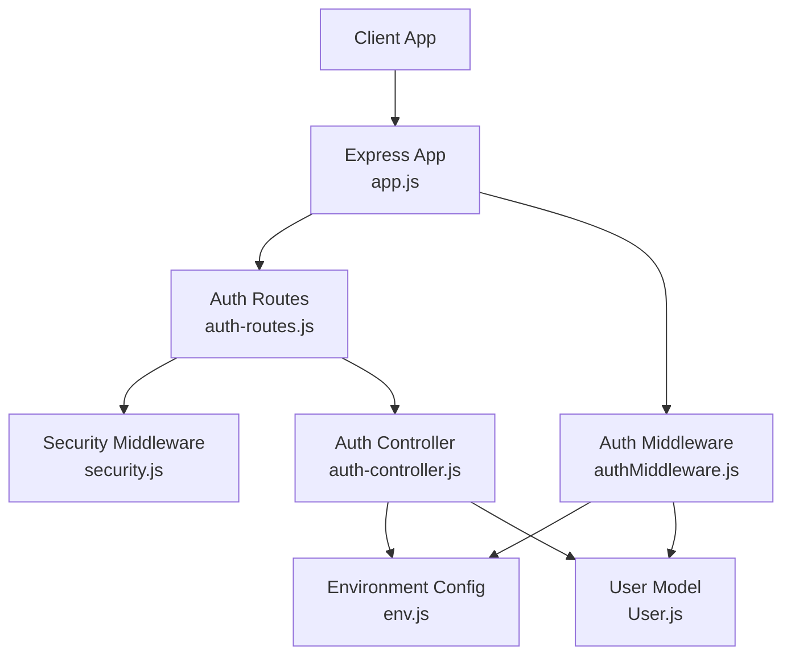
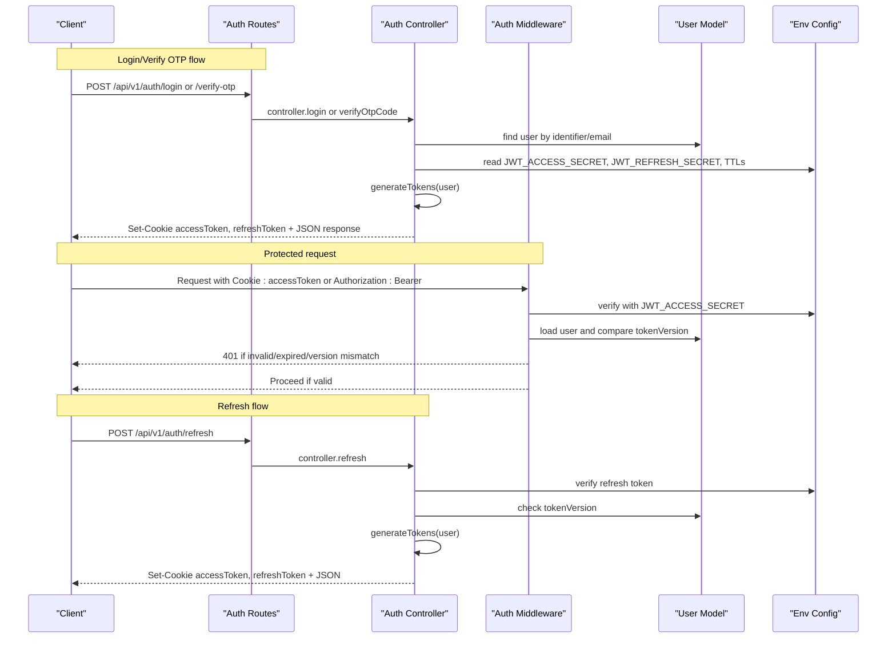
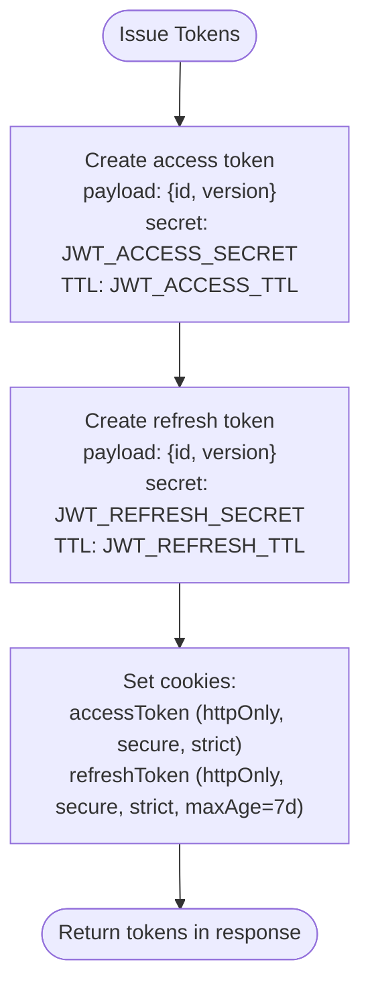
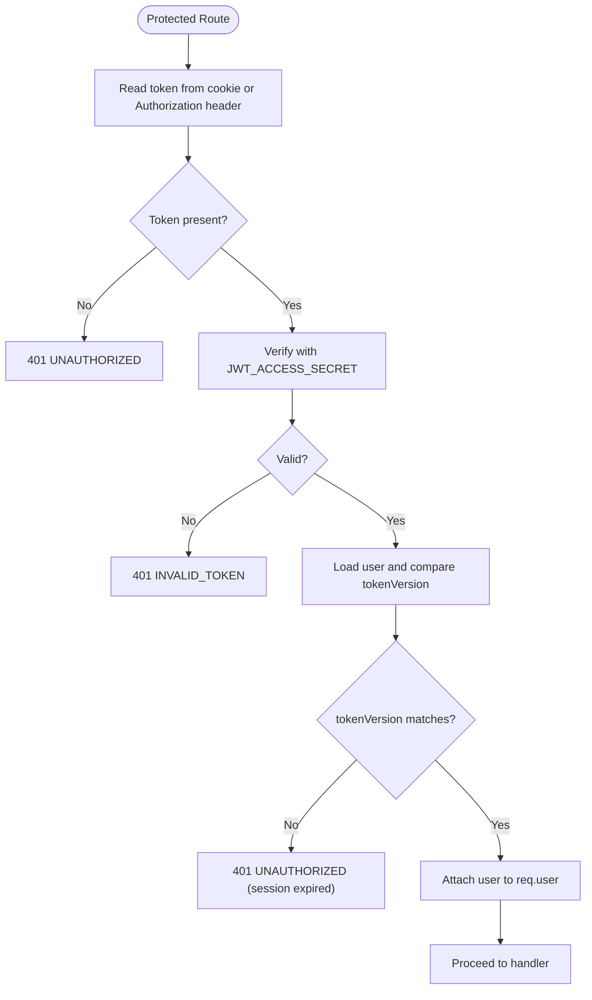
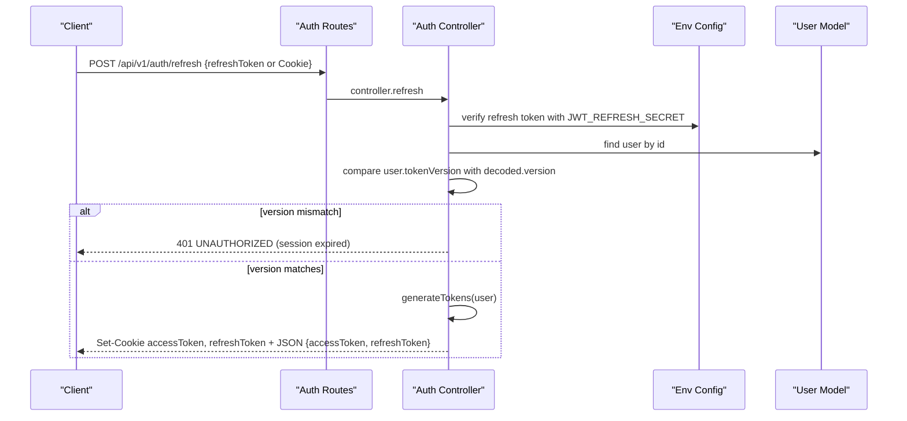
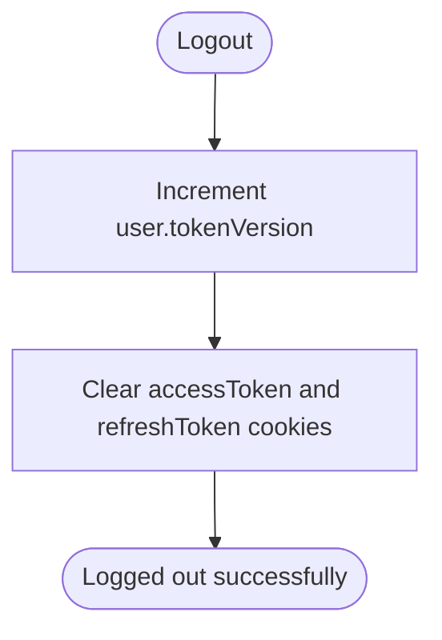
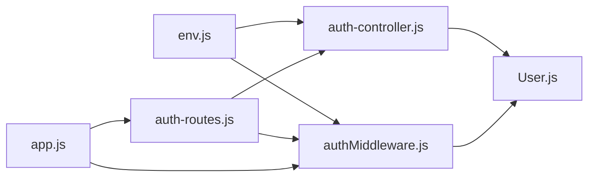

# JWT Token Management

<cite>
**Referenced Files in This Document**
- [auth-controller.js](file://backend/controllers/auth-controller.js)
- [authMiddleware.js](file://backend/middleware/authMiddleware.js)
- [auth-routes.js](file://backend/routes/auth-routes.js)
- [env.js](file://backend/config/env.js)
- [security.js](file://backend/middleware/security.js)
- [User.js](file://backend/models/User.js)
- [app.js](file://backend/app.js)
</cite>

## Table of Contents
1. [Introduction](#introduction)
2. [Project Structure](#project-structure)
3. [Core Components](#core-components)
4. [Architecture Overview](#architecture-overview)
5. [Detailed Component Analysis](#detailed-component-analysis)
6. [Dependency Analysis](#dependency-analysis)
7. [Performance Considerations](#performance-considerations)
8. [Troubleshooting Guide](#troubleshooting-guide)
9. [Conclusion](#conclusion)
10. [Appendices](#appendices)

## Introduction
This document explains how the application manages JSON Web Tokens (JWT) for secure authentication and session handling. It covers access and refresh token generation, validation, rotation via token versioning, cookie-based storage with secure configurations, environment-driven secret management, expiration handling, middleware integration for route protection, and examples of token refresh flows and error handling. The goal is to provide both a conceptual overview and code-level details so that developers can understand, operate, and extend the system safely in production.

## Project Structure
The JWT functionality spans controllers, middleware, routes, configuration, and models:
- Controllers implement token issuance, refresh, and logout logic.
- Middleware validates access tokens on protected routes.
- Routes expose endpoints for authentication and token operations.
- Configuration centralizes secrets and TTLs from environment variables.
- Security middleware adds rate limiting and request hygiene.
- The User model includes a tokenVersion field used for revocation.

**Diagram sources**
- [app.js:15-49](file://backend/app.js#L15-L49)
- [auth-routes.js:1-18](file://backend/routes/auth-routes.js#L1-L18)
- [auth-controller.js:10-121](file://backend/controllers/auth-controller.js#L10-L121)
- [authMiddleware.js:1-38](file://backend/middleware/authMiddleware.js#L1-L38)
- [env.js:6-39](file://backend/config/env.js#L6-L39)
- [security.js:1-48](file://backend/middleware/security.js#L1-L48)
- [User.js:1-23](file://backend/models/User.js#L1-L23)

**Section sources**
- [app.js:15-49](file://backend/app.js#L15-L49)
- [auth-routes.js:1-18](file://backend/routes/auth-routes.js#L1-L18)

## Core Components
- generateTokens(user): Creates separate access and refresh tokens using distinct secrets and TTLs. Payloads include user id and tokenVersion to support revocation.
- Cookie options: Secure, httpOnly cookies with SameSite Strict; domain optional; refresh token has a longer maxAge.
- Refresh flow: Validates refresh token, checks tokenVersion, issues new access and refresh tokens, and sets cookies.
- Logout flow: Increments tokenVersion to invalidate existing tokens and clears cookies.
- Access token middleware: Reads token from cookies or Authorization header, verifies signature, ensures tokenVersion matches current user record, and attaches user to request.

Key responsibilities and behaviors are implemented in:
- Token generation and lifecycle: [auth-controller.js:10-121](file://backend/controllers/auth-controller.js#L10-L121)
- Access token validation: [authMiddleware.js:6-35](file://backend/middleware/authMiddleware.js#L6-L35)
- Environment configuration for secrets and TTLs: [env.js:6-39](file://backend/config/env.js#L6-L39)
- Rate limiting and security helpers: [security.js:1-48](file://backend/middleware/security.js#L1-L48)
- User model with tokenVersion: [User.js:5-16](file://backend/models/User.js#L5-L16)

**Section sources**
- [auth-controller.js:10-121](file://backend/controllers/auth-controller.js#L10-L121)
- [authMiddleware.js:6-35](file://backend/middleware/authMiddleware.js#L6-L35)
- [env.js:6-39](file://backend/config/env.js#L6-L39)
- [security.js:1-48](file://backend/middleware/security.js#L1-L48)
- [User.js:5-16](file://backend/models/User.js#L5-L16)

## Architecture Overview
The authentication architecture uses short-lived access tokens and long-lived refresh tokens stored as secure cookies. Protected routes enforce authentication via middleware that validates the access token and checks tokenVersion against the database. When a user logs out or their session is revoked, tokenVersion increments, invalidating all previously issued tokens.

**Diagram sources**
- [auth-routes.js:9-15](file://backend/routes/auth-routes.js#L9-L15)
- [auth-controller.js:10-121](file://backend/controllers/auth-controller.js#L10-L121)
- [authMiddleware.js:6-35](file://backend/middleware/authMiddleware.js#L6-L35)
- [env.js:6-39](file://backend/config/env.js#L6-L39)
- [User.js:5-16](file://backend/models/User.js#L5-L16)

## Detailed Component Analysis

### Token Generation and Storage
- generateTokens creates two tokens:
  - Access token: signed with JWT_ACCESS_SECRET, short TTL (default 15 minutes).
  - Refresh token: signed with JWT_REFRESH_SECRET, long TTL (default 7 days).
- Both tokens carry id and version (tokenVersion) to enable revocation.
- Cookies are set with:
  - httpOnly: true
  - secure: true in production
  - sameSite: Strict
  - Optional domain from COOKIE_DOMAIN
  - Refresh token cookie has an explicit maxAge of 7 days

Implementation references:
- Token creation and payload: [auth-controller.js:10-14](file://backend/controllers/auth-controller.js#L10-L14)
- Cookie options and setting: [auth-controller.js:16-32](file://backend/controllers/auth-controller.js#L16-L32)
- Environment secrets and TTLs: [env.js:11-14](file://backend/config/env.js#L11-L14)

**Diagram sources**
- [auth-controller.js:10-32](file://backend/controllers/auth-controller.js#L10-L32)
- [env.js:11-14](file://backend/config/env.js#L11-L14)

**Section sources**
- [auth-controller.js:10-32](file://backend/controllers/auth-controller.js#L10-L32)
- [env.js:11-14](file://backend/config/env.js#L11-L14)

### Access Token Validation Middleware
- Reads token from Cookie: accessToken or Authorization: Bearer <token>.
- Verifies signature using JWT_ACCESS_SECRET.
- Loads user and compares tokenVersion to ensure the token is still valid.
- Attaches user to request context for downstream handlers.
- Handles invalid tokens with a specific error type.

References:
- Token extraction and verification: [authMiddleware.js:6-18](file://backend/middleware/authMiddleware.js#L6-L18)
- Version check and user attachment: [authMiddleware.js:18-27](file://backend/middleware/authMiddleware.js#L18-L27)
- Error mapping for invalid tokens: [authMiddleware.js:28-34](file://backend/middleware/authMiddleware.js#L28-L34)

**Diagram sources**
- [authMiddleware.js:6-35](file://backend/middleware/authMiddleware.js#L6-L35)

**Section sources**
- [authMiddleware.js:6-35](file://backend/middleware/authMiddleware.js#L6-L35)

### Refresh Token Flow
- Endpoint: POST /api/v1/auth/refresh
- Accepts refresh token from Cookie or body.
- Verifies refresh token signature and loads user.
- Checks tokenVersion to prevent replay after logout or revocation.
- Issues new access and refresh tokens and sets cookies.

References:
- Route registration: [auth-routes.js:15](file://backend/routes/auth-routes.js#L15)
- Refresh handler: [auth-controller.js:107-121](file://backend/controllers/auth-controller.js#L107-L121)

**Diagram sources**
- [auth-routes.js:15](file://backend/routes/auth-routes.js#L15)
- [auth-controller.js:107-121](file://backend/controllers/auth-controller.js#L107-L121)
- [env.js:11-14](file://backend/config/env.js#L11-L14)
- [User.js:5-16](file://backend/models/User.js#L5-L16)

**Section sources**
- [auth-routes.js:15](file://backend/routes/auth-routes.js#L15)
- [auth-controller.js:107-121](file://backend/controllers/auth-controller.js#L107-L121)

### Logout and Token Revocation
- On logout, tokenVersion is incremented for the user, invalidating all previously issued tokens.
- Cookies for accessToken and refreshToken are cleared.

References:
- Logout handler: [auth-controller.js:100-105](file://backend/controllers/auth-controller.js#L100-L105)
- User model tokenVersion field: [User.js:5-16](file://backend/models/User.js#L5-L16)

**Diagram sources**
- [auth-controller.js:100-105](file://backend/controllers/auth-controller.js#L100-L105)
- [User.js:5-16](file://backend/models/User.js#L5-L16)

**Section sources**
- [auth-controller.js:100-105](file://backend/controllers/auth-controller.js#L100-L105)
- [User.js:5-16](file://backend/models/User.js#L5-L16)

### Security Measures and Best Practices
- Separate secrets for access and refresh tokens reduce risk if one is compromised.
- Short-lived access tokens minimize exposure window.
- Long-lived refresh tokens are stored in httpOnly, secure cookies with SameSite Strict to mitigate XSS and CSRF risks.
- Production mode enforces secure cookies and disables guest play.
- Rate limiting protects auth endpoints from brute force and abuse.
- CORS is configured to allow only trusted origins and credentials.
- Request IDs and structured logging aid observability without leaking sensitive headers.

References:
- Secrets and TTLs: [env.js:11-14](file://backend/config/env.js#L11-L14)
- Cookie security flags: [auth-controller.js:16-21](file://backend/controllers/auth-controller.js#L16-L21)
- Rate limiters: [security.js:23-45](file://backend/middleware/security.js#L23-L45)
- CORS and credentials: [app.js:21-29](file://backend/app.js#L21-L29)
- Production behavior: [env.js:37-39](file://backend/config/env.js#L37-L39)

**Section sources**
- [env.js:11-14](file://backend/config/env.js#L11-L14)
- [auth-controller.js:16-21](file://backend/controllers/auth-controller.js#L16-L21)
- [security.js:23-45](file://backend/middleware/security.js#L23-L45)
- [app.js:21-29](file://backend/app.js#L21-L29)
- [env.js:37-39](file://backend/config/env.js#L37-L39)

## Dependency Analysis
The JWT subsystem depends on environment configuration, database-backed user records, and Express middleware for routing and security.

**Diagram sources**
- [env.js:6-39](file://backend/config/env.js#L6-L39)
- [auth-controller.js:10-121](file://backend/controllers/auth-controller.js#L10-L121)
- [authMiddleware.js:6-35](file://backend/middleware/authMiddleware.js#L6-L35)
- [auth-routes.js:1-18](file://backend/routes/auth-routes.js#L1-L18)
- [app.js:15-49](file://backend/app.js#L15-L49)
- [User.js:5-16](file://backend/models/User.js#L5-L16)

**Section sources**
- [env.js:6-39](file://backend/config/env.js#L6-L39)
- [auth-controller.js:10-121](file://backend/controllers/auth-controller.js#L10-L121)
- [authMiddleware.js:6-35](file://backend/middleware/authMiddleware.js#L6-L35)
- [auth-routes.js:1-18](file://backend/routes/auth-routes.js#L1-L18)
- [app.js:15-49](file://backend/app.js#L15-L49)
- [User.js:5-16](file://backend/models/User.js#L5-L16)

## Performance Considerations
- Use short-lived access tokens to reduce the cost of frequent validations and limit exposure.
- Cache user lookups judiciously if needed, but always validate tokenVersion on each request to maintain revocation semantics.
- Keep refresh token TTL reasonable to balance convenience and security.
- Ensure database queries for user lookup are efficient; consider indexing user.id.
- Rate limiting prevents excessive token operations under load.

[No sources needed since this section provides general guidance]

## Troubleshooting Guide
Common errors and resolutions:
- Missing refresh token: Ensure client sends refreshToken in Cookie or body for /refresh. See [auth-controller.js:107-110](file://backend/controllers/auth-controller.js#L107-L110).
- Invalid token signature: Check JWT_ACCESS_SECRET/JWT_REFRESH_SECRET configuration and ensure correct values at runtime. See [env.js:11-14](file://backend/config/env.js#L11-L14).
- Session expired or user not found: Occurs when tokenVersion changed (logout or revocation). See [authMiddleware.js:22-24](file://backend/middleware/authMiddleware.js#L22-L24) and [auth-controller.js:112-115](file://backend/controllers/auth-controller.js#L112-L115).
- Too many requests: Auth endpoints are rate-limited. Wait and retry. See [security.js:31-37](file://backend/middleware/security.js#L31-L37).
- CORS origin denied: Ensure client origin is allowed in CORS config. See [app.js:21-29](file://backend/app.js#L21-L29).

**Section sources**
- [auth-controller.js:107-115](file://backend/controllers/auth-controller.js#L107-L115)
- [authMiddleware.js:22-24](file://backend/middleware/authMiddleware.js#L22-L24)
- [security.js:31-37](file://backend/middleware/security.js#L31-L37)
- [app.js:21-29](file://backend/app.js#L21-L29)
- [env.js:11-14](file://backend/config/env.js#L11-L14)

## Conclusion
The application implements a robust JWT strategy with separate access and refresh tokens, secure cookie storage, and token versioning for immediate revocation upon logout. The middleware enforces strong validation and integrates seamlessly with Express routes. Environment-driven configuration ensures secrets and TTLs are managed securely. Following the recommended practices and troubleshooting steps will help maintain a safe and reliable authentication experience in production.

[No sources needed since this section summarizes without analyzing specific files]

## Appendices

### API Endpoints Summary
- POST /api/v1/auth/register: Create account and send OTP.
- POST /api/v1/auth/login: Verify password and send OTP.
- POST /api/v1/auth/verify-otp: Verify OTP and issue tokens.
- POST /api/v1/auth/resend-otp: Resend OTP.
- POST /api/v1/auth/logout: Increment tokenVersion and clear cookies.
- POST /api/v1/auth/refresh: Exchange refresh token for new access and refresh tokens.

References:
- Route definitions: [auth-routes.js:9-15](file://backend/routes/auth-routes.js#L9-L15)

**Section sources**
- [auth-routes.js:9-15](file://backend/routes/auth-routes.js#L9-L15)

### Example Requests and Responses

- Refresh token request:
  - Method: POST
  - Path: /api/v1/auth/refresh
  - Headers: Cookie: refreshToken=<value>
  - Body: Optional refreshToken if not sent via cookie
  - Success response: JSON with accessToken and refreshToken; cookies set for both tokens
  - Failure responses: 401 UNAUTHORIZED if token missing, invalid, or version mismatch

References:
- Refresh handler: [auth-controller.js:107-121](file://backend/controllers/auth-controller.js#L107-L121)

**Section sources**
- [auth-controller.js:107-121](file://backend/controllers/auth-controller.js#L107-L121)

### Security Checklist for Production
- Use strong, unique secrets for JWT_ACCESS_SECRET and JWT_REFRESH_SECRET.
- Set NODE_ENV=production to enforce secure cookies and disable guest play.
- Configure CORS_ORIGINS to restrict to known frontends.
- Ensure COOKIE_DOMAIN is set appropriately for multi-domain setups.
- Monitor rate limits and adjust thresholds based on traffic patterns.
- Rotate secrets periodically and manage key lifecycle securely.

References:
- Environment schema and defaults: [env.js:6-39](file://backend/config/env.js#L6-L39)
- CORS configuration: [app.js:21-29](file://backend/app.js#L21-L29)
- Rate limiting: [security.js:23-45](file://backend/middleware/security.js#L23-L45)

**Section sources**
- [env.js:6-39](file://backend/config/env.js#L6-L39)
- [app.js:21-29](file://backend/app.js#L21-L29)
- [security.js:23-45](file://backend/middleware/security.js#L23-L45)