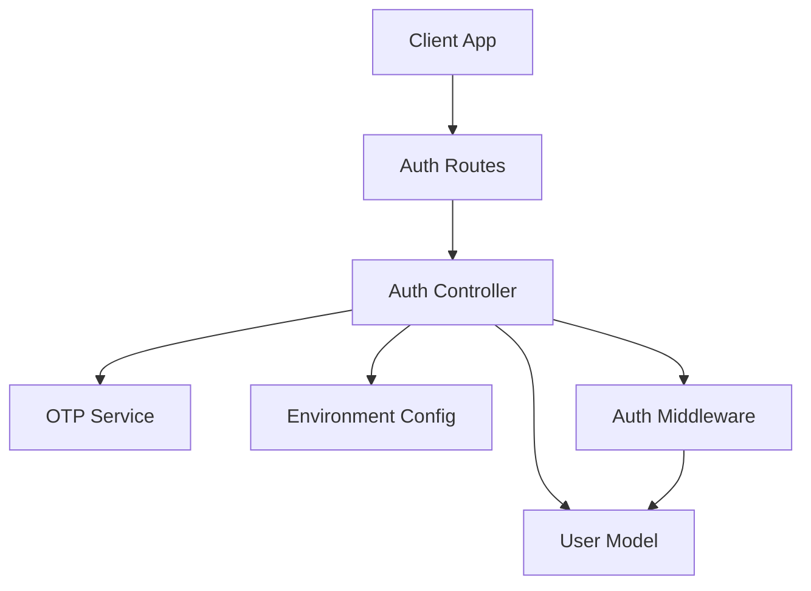
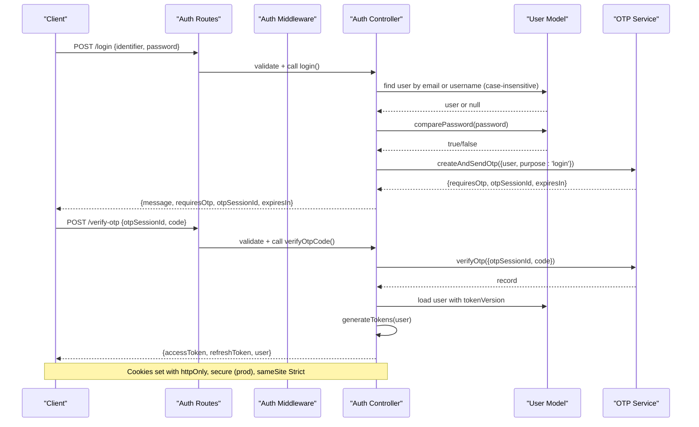
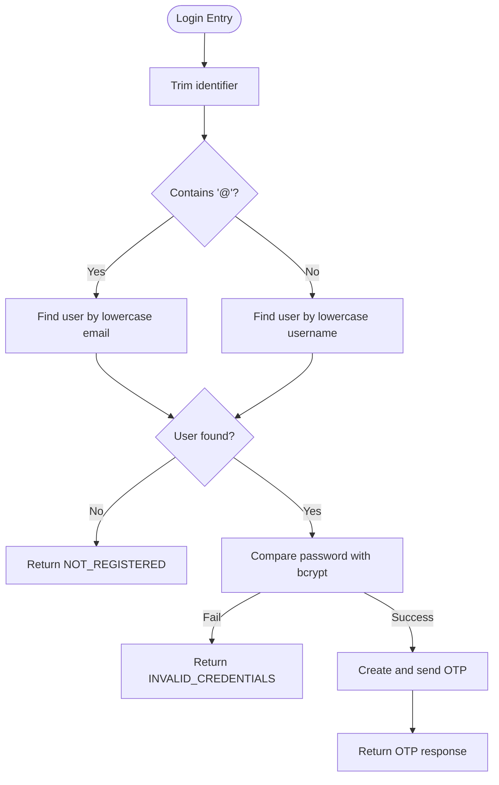
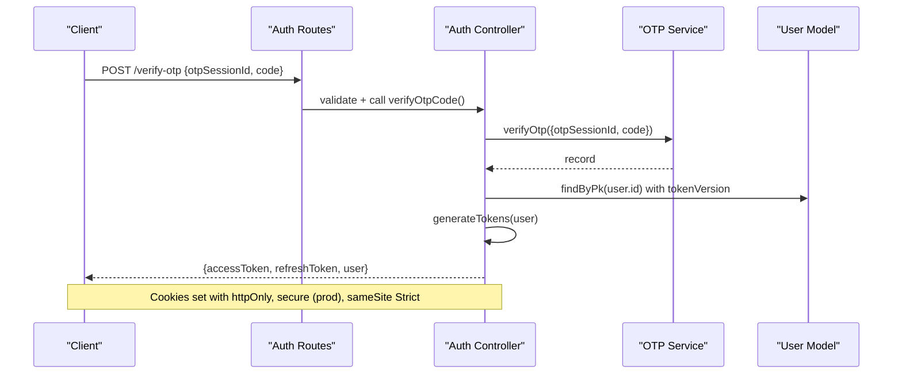
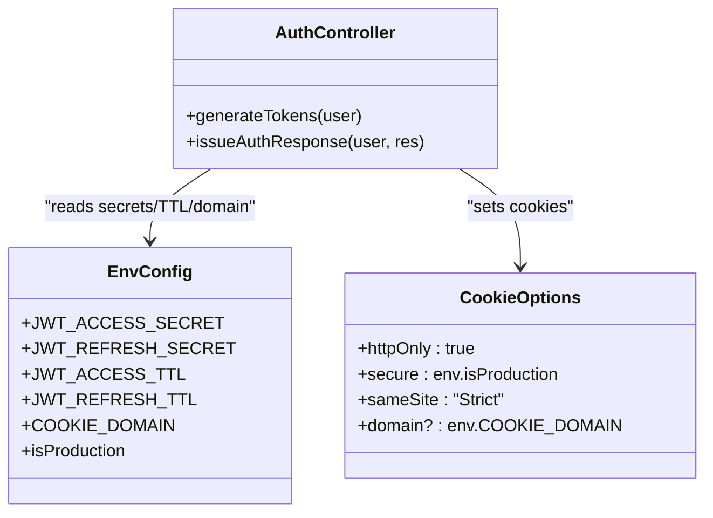
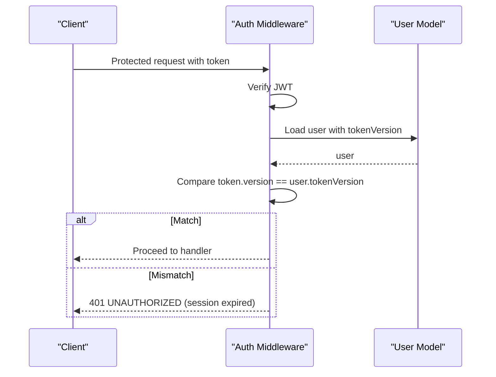
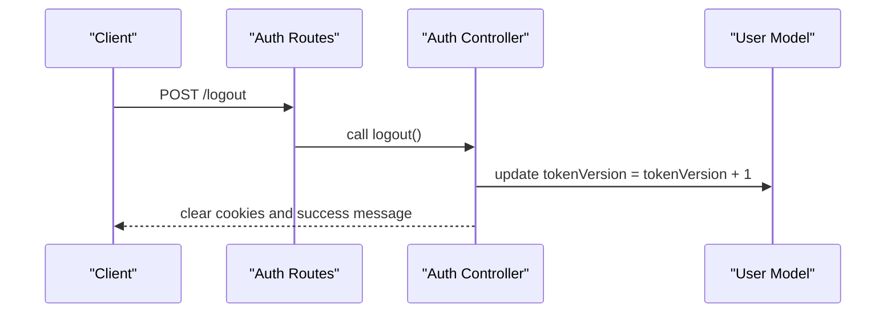
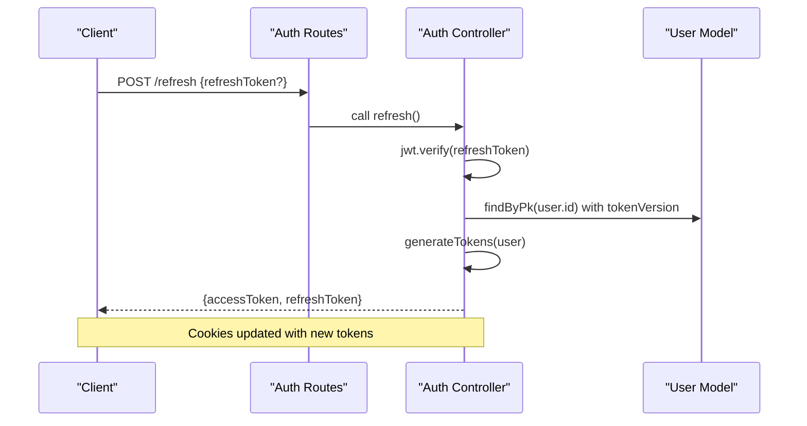
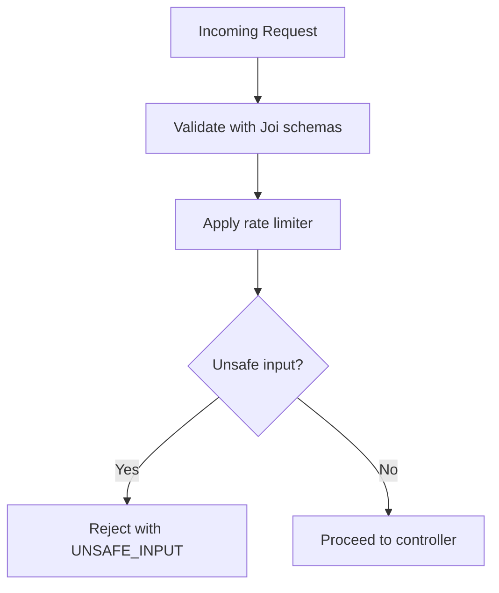
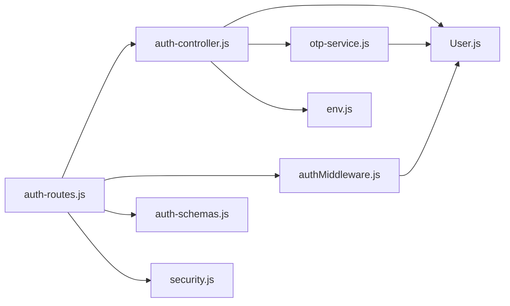

# Login & Session Management

<cite>
**Referenced Files in This Document**
- [auth-controller.js](file://backend/controllers/auth-controller.js)
- [auth-routes.js](file://backend/routes/auth-routes.js)
- [authMiddleware.js](file://backend/middleware/authMiddleware.js)
- [User.js](file://backend/models/User.js)
- [auth-schemas.js](file://backend/validators/auth-schemas.js)
- [env.js](file://backend/config/env.js)
- [security.js](file://backend/middleware/security.js)
- [otp-service.js](file://backend/services/otp-service.js)
- [app-error.js](file://backend/utils/app-error.js)
</cite>

## Table of Contents
1. [Introduction](#introduction)
2. [Project Structure](#project-structure)
3. [Core Components](#core-components)
4. [Architecture Overview](#architecture-overview)
5. [Detailed Component Analysis](#detailed-component-analysis)
6. [Dependency Analysis](#dependency-analysis)
7. [Performance Considerations](#performance-considerations)
8. [Troubleshooting Guide](#troubleshooting-guide)
9. [Conclusion](#conclusion)
10. [Appendices](#appendices)

## Introduction
This document explains the login and session management system with a focus on:
- Multi-identifier authentication (email or username)
- Password verification using bcrypt compare
- JWT access and refresh tokens
- Secure cookie configuration
- Case-insensitive lookup for email and username
- Session expiration handling via token versioning
- Logout that invalidates sessions by incrementing tokenVersion
- OTP-based verification flow to complete login
- Request/response examples and lifecycle guidance

## Project Structure
The authentication feature spans controllers, routes, middleware, models, validators, services, and environment configuration:
- Routes define endpoints and apply rate limiting and validation
- Controllers implement business logic for registration, login, OTP verification, logout, and token refresh
- Middleware validates requests and enforces authentication
- Models define user schema and password comparison
- Validators enforce input constraints
- Services handle OTP generation, hashing, and delivery
- Environment configuration controls security-sensitive settings

**Diagram sources**
- [auth-routes.js:9-15](file://backend/routes/auth-routes.js#L9-L15)
- [auth-controller.js:10-121](file://backend/controllers/auth-controller.js#L10-L121)
- [authMiddleware.js:6-35](file://backend/middleware/authMiddleware.js#L6-L35)
- [User.js:5-22](file://backend/models/User.js#L5-L22)
- [otp-service.js:23-96](file://backend/services/otp-service.js#L23-L96)
- [env.js:6-39](file://backend/config/env.js#L6-L39)

**Section sources**
- [auth-routes.js:1-18](file://backend/routes/auth-routes.js#L1-L18)
- [auth-controller.js:1-154](file://backend/controllers/auth-controller.js#L1-L154)
- [authMiddleware.js:1-38](file://backend/middleware/authMiddleware.js#L1-L38)
- [User.js:1-23](file://backend/models/User.js#L1-L23)
- [auth-schemas.js:1-29](file://backend/validators/auth-schemas.js#L1-L29)
- [env.js:1-40](file://backend/config/env.js#L1-L40)
- [security.js:1-48](file://backend/middleware/security.js#L1-L48)
- [otp-service.js:1-99](file://backend/services/otp-service.js#L1-L99)
- [app-error.js:1-12](file://backend/utils/app-error.js#L1-L12)

## Core Components
- Authentication controller: handles register, login, OTP verification, logout, refresh, and guest login; issues JWTs and sets secure cookies
- Auth middleware: extracts token from cookies or Authorization header, verifies JWT, checks tokenVersion, attaches user to request
- User model: stores credentials and tokenVersion; provides bcrypt.compare for password verification
- Validators: enforce input rules for login, registration, and OTP flows
- Security middleware: rate limits auth and OTP endpoints and rejects unsafe inputs
- OTP service: generates, hashes, stores, verifies, and resends one-time codes
- Environment config: defines JWT secrets, TTLs, cookie domain, production flags, and guest play toggle

Key behaviors:
- Multi-identifier login accepts either an email or username; case-insensitive lookup is enforced
- Passwords are verified using bcrypt.compare
- Access and refresh tokens include a version claim tied to the user’s tokenVersion
- Cookies are set with httpOnly, secure (in production), sameSite Strict, and optional domain
- Logout increments tokenVersion to invalidate existing tokens
- Refresh validates tokenVersion before issuing new tokens

**Section sources**
- [auth-controller.js:10-32](file://backend/controllers/auth-controller.js#L10-L32)
- [auth-controller.js:54-89](file://backend/controllers/auth-controller.js#L54-L89)
- [auth-controller.js:100-121](file://backend/controllers/auth-controller.js#L100-L121)
- [authMiddleware.js:6-35](file://backend/middleware/authMiddleware.js#L6-L35)
- [User.js:5-22](file://backend/models/User.js#L5-L22)
- [auth-schemas.js:13-17](file://backend/validators/auth-schemas.js#L13-L17)
- [security.js:31-45](file://backend/middleware/security.js#L31-L45)
- [otp-service.js:23-96](file://backend/services/otp-service.js#L23-L96)
- [env.js:6-39](file://backend/config/env.js#L6-L39)

## Architecture Overview
The login flow integrates multi-step verification with OTP and culminates in issuing JWTs and setting secure cookies.

**Diagram sources**
- [auth-routes.js:9-15](file://backend/routes/auth-routes.js#L9-L15)
- [auth-controller.js:54-89](file://backend/controllers/auth-controller.js#L54-L89)
- [otp-service.js:23-83](file://backend/services/otp-service.js#L23-L83)
- [User.js:5-22](file://backend/models/User.js#L5-L22)

## Detailed Component Analysis

### Login Flow: Multi-Identifier and Case-Insensitive Lookup
- Accepts identifier that can be email or username
- If identifier contains “@”, treat as email and match exactly after lowercasing
- Otherwise, perform case-insensitive username lookup using database functions
- Uses a scope that includes passwordHash and tokenVersion for secure operations
- On success, triggers OTP issuance and returns OTP metadata without issuing tokens yet

**Diagram sources**
- [auth-controller.js:54-74](file://backend/controllers/auth-controller.js#L54-L74)
- [User.js:5-22](file://backend/models/User.js#L5-L22)

**Section sources**
- [auth-controller.js:54-74](file://backend/controllers/auth-controller.js#L54-L74)
- [auth-schemas.js:13-17](file://backend/validators/auth-schemas.js#L13-L17)

### OTP Verification and Token Issuance
- After successful password check, OTP is sent to the user’s email
- The client calls verify-otp with otpSessionId and code
- OTP service verifies code hash, expiry, and attempt limits
- Upon success, the controller loads the user, generates JWTs, and sets cookies

**Diagram sources**
- [auth-controller.js:76-89](file://backend/controllers/auth-controller.js#L76-L89)
- [otp-service.js:58-83](file://backend/services/otp-service.js#L58-L83)

**Section sources**
- [auth-controller.js:76-89](file://backend/controllers/auth-controller.js#L76-L89)
- [otp-service.js:58-83](file://backend/services/otp-service.js#L58-L83)

### JWT Generation and Cookie Configuration
- Tokens include user id and tokenVersion claims
- Access token TTL and refresh token TTL are configured via environment
- Cookies are set with:
  - httpOnly: true
  - secure: true in production, false otherwise
  - sameSite: Strict
  - Optional domain from environment
- Refresh token has a longer maxAge than default cookie lifetime

**Diagram sources**
- [auth-controller.js:10-32](file://backend/controllers/auth-controller.js#L10-L32)
- [env.js:6-39](file://backend/config/env.js#L6-L39)

**Section sources**
- [auth-controller.js:10-32](file://backend/controllers/auth-controller.js#L10-L32)
- [env.js:6-39](file://backend/config/env.js#L6-L39)

### Authentication Middleware and Session Expiration
- Extracts accessToken from cookie or Authorization header
- Verifies JWT with the access secret
- Loads user with tokenVersion and compares against token’s version claim
- On mismatch or missing user, returns unauthorized error indicating session expired or invalid token

**Diagram sources**
- [authMiddleware.js:6-35](file://backend/middleware/authMiddleware.js#L6-L35)

**Section sources**
- [authMiddleware.js:6-35](file://backend/middleware/authMiddleware.js#L6-L35)

### Logout and Token Versioning
- Logout increments the user’s tokenVersion to invalidate all active tokens
- Clears both accessToken and refreshToken cookies
- Subsequent protected requests will fail until re-authentication

**Diagram sources**
- [auth-controller.js:100-105](file://backend/controllers/auth-controller.js#L100-L105)

**Section sources**
- [auth-controller.js:100-105](file://backend/controllers/auth-controller.js#L100-L105)

### Refresh Token Flow
- Accepts refresh token from cookie or body
- Verifies JWT with refresh secret
- Loads user and ensures tokenVersion matches the stored value
- Issues new access and refresh tokens and updates cookies

**Diagram sources**
- [auth-controller.js:107-121](file://backend/controllers/auth-controller.js#L107-L121)

**Section sources**
- [auth-controller.js:107-121](file://backend/controllers/auth-controller.js#L107-L121)

### Input Validation and Security Controls
- Login schema enforces required fields and password complexity
- Rate limiting protects auth and OTP endpoints
- Unsafe input detection blocks potential injection patterns

**Diagram sources**
- [auth-schemas.js:13-17](file://backend/validators/auth-schemas.js#L13-L17)
- [security.js:10-19](file://backend/middleware/security.js#L10-L19)
- [security.js:31-45](file://backend/middleware/security.js#L31-L45)

**Section sources**
- [auth-schemas.js:13-17](file://backend/validators/auth-schemas.js#L13-L17)
- [security.js:10-19](file://backend/middleware/security.js#L10-L19)
- [security.js:31-45](file://backend/middleware/security.js#L31-L45)

## Dependency Analysis
- Routes depend on controller, middleware, validators, and security modules
- Controller depends on models, services, and environment configuration
- Middleware depends on models and environment configuration
- OTP service depends on models and email service
- All components rely on consistent environment variables for security

**Diagram sources**
- [auth-routes.js:1-18](file://backend/routes/auth-routes.js#L1-L18)
- [auth-controller.js:1-154](file://backend/controllers/auth-controller.js#L1-L154)
- [authMiddleware.js:1-38](file://backend/middleware/authMiddleware.js#L1-L38)
- [auth-schemas.js:1-29](file://backend/validators/auth-schemas.js#L1-L29)
- [security.js:1-48](file://backend/middleware/security.js#L1-L48)
- [User.js:1-23](file://backend/models/User.js#L1-L23)
- [otp-service.js:1-99](file://backend/services/otp-service.js#L1-L99)
- [env.js:1-40](file://backend/config/env.js#L1-L40)

**Section sources**
- [auth-routes.js:1-18](file://backend/routes/auth-routes.js#L1-L18)
- [auth-controller.js:1-154](file://backend/controllers/auth-controller.js#L1-L154)
- [authMiddleware.js:1-38](file://backend/middleware/authMiddleware.js#L1-L38)
- [auth-schemas.js:1-29](file://backend/validators/auth-schemas.js#L1-L29)
- [security.js:1-48](file://backend/middleware/security.js#L1-L48)
- [User.js:1-23](file://backend/models/User.js#L1-L23)
- [otp-service.js:1-99](file://backend/services/otp-service.js#L1-L99)
- [env.js:1-40](file://backend/config/env.js#L1-L40)

## Performance Considerations
- Rate limiting reduces brute-force risk on auth and OTP endpoints
- JWT verification is lightweight; ensure secrets are strong and TTLs are appropriate
- Database queries use scopes to minimize payload size while including necessary fields for auth
- OTP hashing uses bcrypt to balance security and performance
- Consider connection pooling and query optimization for high-throughput scenarios

[No sources needed since this section provides general guidance]

## Troubleshooting Guide
Common errors and their causes:
- Invalid credentials: password does not match stored hash
- Not registered: identifier not found in database
- Unauthorized: missing or invalid token; token version mismatch indicates session invalidation
- OTP invalid/expired/max attempts: OTP misuse or time limit exceeded
- Too many requests: rate limit exceeded on auth or OTP endpoints

Resolution steps:
- Ensure identifier is correct and case-insensitive matching is used
- Verify password meets complexity requirements
- Use refresh endpoint to obtain new tokens when access token expires
- Re-request OTP if expired or attempts exceeded
- Adjust rate limits or wait for window to reset

**Section sources**
- [auth-controller.js:54-89](file://backend/controllers/auth-controller.js#L54-L89)
- [auth-controller.js:100-121](file://backend/controllers/auth-controller.js#L100-L121)
- [authMiddleware.js:6-35](file://backend/middleware/authMiddleware.js#L6-L35)
- [otp-service.js:58-96](file://backend/services/otp-service.js#L58-L96)
- [security.js:31-45](file://backend/middleware/security.js#L31-L45)

## Conclusion
The system implements a robust, secure login and session management flow:
- Multi-identifier login with case-insensitive lookup
- Password verification via bcrypt.compare
- JWT access and refresh tokens with versioned claims
- Secure cookie configuration tailored to environment
- OTP-based verification to finalize login
- Session invalidation through tokenVersion increments on logout
- Comprehensive validation and rate limiting for safety

[No sources needed since this section summarizes without analyzing specific files]

## Appendices

### API Endpoints Summary
- POST /register: Create account and initiate email verification
- POST /login: Validate credentials and issue OTP
- POST /guest: Start guest session (if enabled)
- POST /verify-otp: Verify OTP and issue tokens
- POST /resend-otp: Resend OTP
- POST /logout: Invalidate session by incrementing tokenVersion
- POST /refresh: Obtain new tokens using refresh token

**Section sources**
- [auth-routes.js:9-15](file://backend/routes/auth-routes.js#L9-L15)

### Example Requests and Responses

- Login request
  - Method: POST
  - Path: /login
  - Body: { identifier: "user@example.com", password: "StrongP@ss1" }
  - Response: { message, requiresOtp: true, otpSessionId, expiresIn }

- Verify OTP request
  - Method: POST
  - Path: /verify-otp
  - Body: { otpSessionId: "<uuid>", code: "123456" }
  - Response: { accessToken, refreshToken, user: { id, username, role, emailVerified } }
  - Cookies: accessToken, refreshToken set with httpOnly, secure (prod), sameSite Strict

- Refresh request
  - Method: POST
  - Path: /refresh
  - Body or Cookie: refreshToken
  - Response: { accessToken, refreshToken }
  - Cookies: Updated with new tokens

- Logout request
  - Method: POST
  - Path: /logout
  - Headers: Authorization: Bearer <accessToken> or Cookie: accessToken
  - Response: { message: "Logged out successfully" }
  - Cookies: Cleared

**Section sources**
- [auth-routes.js:9-15](file://backend/routes/auth-routes.js#L9-L15)
- [auth-controller.js:54-89](file://backend/controllers/auth-controller.js#L54-L89)
- [auth-controller.js:100-121](file://backend/controllers/auth-controller.js#L100-L121)

### Environment Variables for Security
- JWT_ACCESS_SECRET, JWT_REFRESH_SECRET: Strong secrets for signing tokens
- JWT_ACCESS_TTL, JWT_REFRESH_TTL: Token lifetimes
- COOKIE_DOMAIN: Optional domain for cookies
- NODE_ENV: Determines secure cookie behavior
- GUEST_PLAY_ENABLED: Enables/disables guest login

**Section sources**
- [env.js:6-39](file://backend/config/env.js#L6-L39)