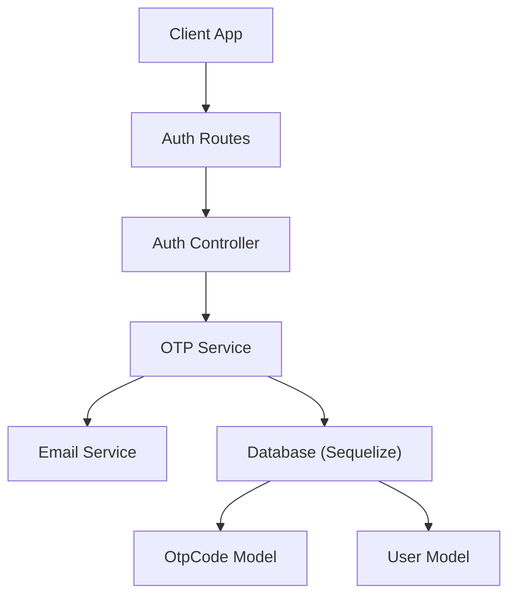
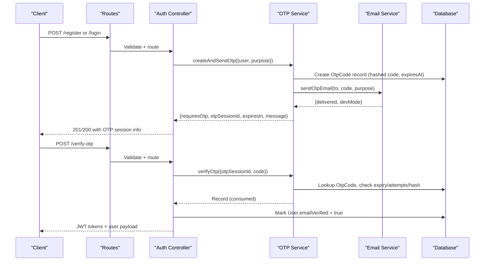
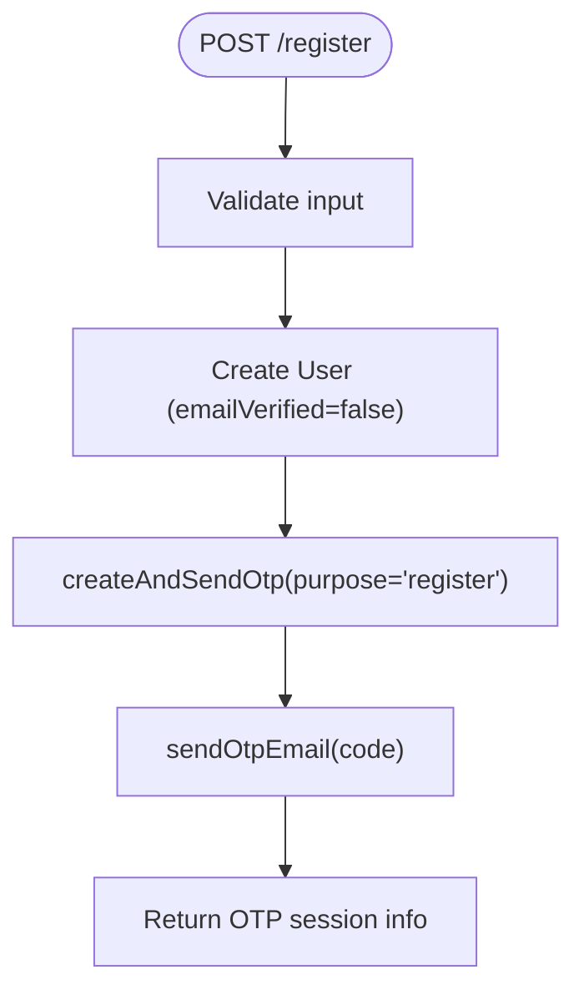
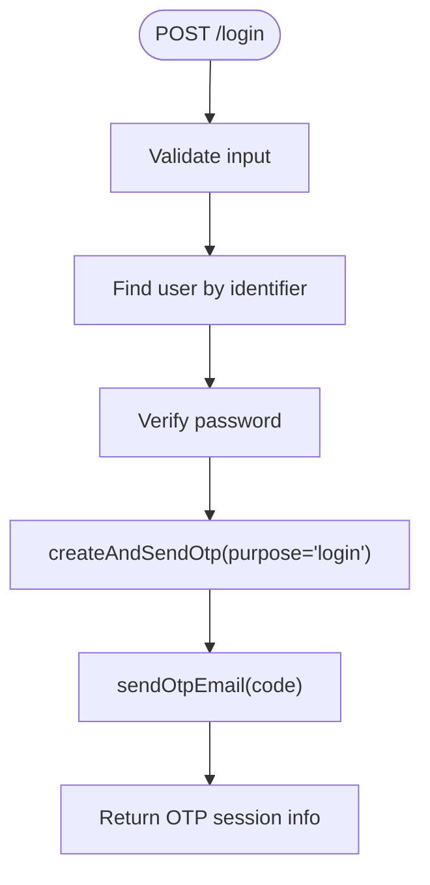
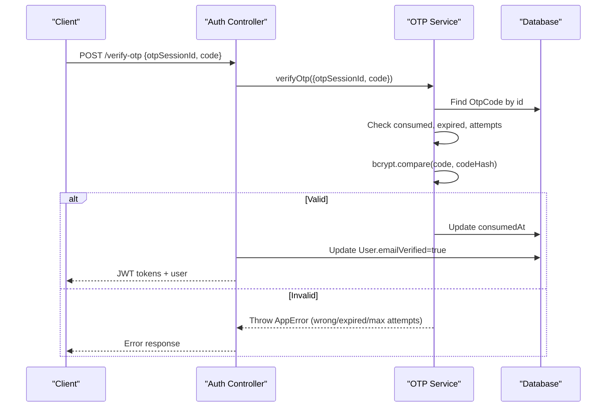
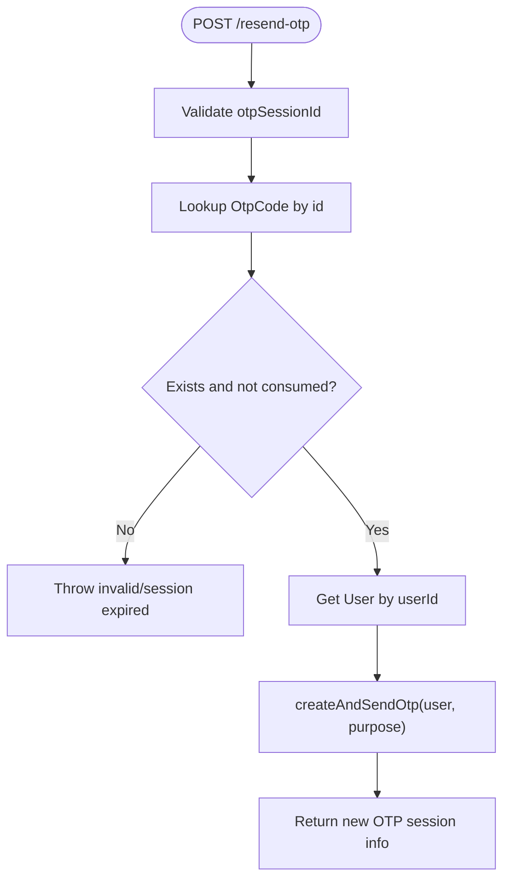
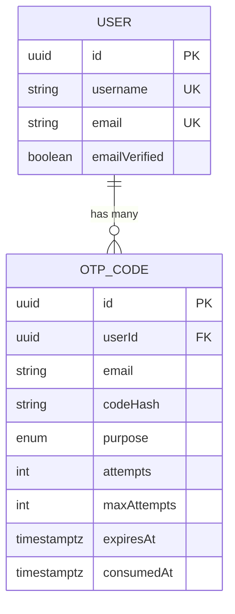
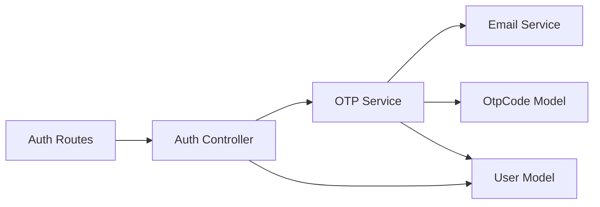

# OTP Verification Process

<cite>
**Referenced Files in This Document**
- [auth-controller.js](file://backend/controllers/auth-controller.js)
- [otp-service.js](file://backend/services/otp-service.js)
- [email-service.js](file://backend/services/email-service.js)
- [OtpCode.js](file://backend/models/OtpCode.js)
- [User.js](file://backend/models/User.js)
- [auth-routes.js](file://backend/routes/auth-routes.js)
- [auth-schemas.js](file://backend/validators/auth-schemas.js)
- [security.js](file://backend/middleware/security.js)
- [migrations-20260813-otp-verification.sql](file://backend/migrations-20260813-otp-verification.sql)
</cite>

## Table of Contents
1. [Introduction](#introduction)
2. [Project Structure](#project-structure)
3. [Core Components](#core-components)
4. [Architecture Overview](#architecture-overview)
5. [Detailed Component Analysis](#detailed-component-analysis)
6. [Dependency Analysis](#dependency-analysis)
7. [Performance Considerations](#performance-considerations)
8. [Troubleshooting Guide](#troubleshooting-guide)
9. [Conclusion](#conclusion)

## Introduction
This document explains the One-Time Password (OTP) verification system used during user registration and login. It covers OTP generation, email delivery via createAndSendOtp, code verification through verifyOtp, resend functionality, session management, purpose-based handling (register vs login), automatic email verification marking upon success, model structure, expiration handling, security measures, request/response cycles, error handling, and integration with the authentication controller.

## Project Structure
The OTP flow spans routes, controllers, services, models, validators, and middleware:
- Routes expose endpoints for register, login, verify-otp, and resend-otp.
- The auth controller orchestrates user creation/login and delegates OTP tasks to the OTP service.
- The OTP service generates codes, persists hashed OTPs, sends emails, verifies codes, and supports resends.
- Models define the OtpCode and User entities.
- Validators enforce input constraints.
- Security middleware applies rate limiting and safe input checks.

**Diagram sources**
- [auth-routes.js:9-15](file://backend/routes/auth-routes.js#L9-L15)
- [auth-controller.js:34-98](file://backend/controllers/auth-controller.js#L34-L98)
- [otp-service.js:23-96](file://backend/services/otp-service.js#L23-L96)
- [email-service.js:20-58](file://backend/services/email-service.js#L20-L58)
- [OtpCode.js:4-19](file://backend/models/OtpCode.js#L4-L19)
- [User.js:5-16](file://backend/models/User.js#L5-L16)

**Section sources**
- [auth-routes.js:9-15](file://backend/routes/auth-routes.js#L9-L15)
- [auth-controller.js:34-98](file://backend/controllers/auth-controller.js#L34-L98)
- [otp-service.js:23-96](file://backend/services/otp-service.js#L23-L96)
- [email-service.js:20-58](file://backend/services/email-service.js#L20-L58)
- [OtpCode.js:4-19](file://backend/models/OtpCode.js#L4-L19)
- [User.js:5-16](file://backend/models/User.js#L5-L16)

## Core Components
- OTP Service: Generates secure 6-digit codes, hashes them, persists sessions, enforces TTL and attempt limits, sends emails, and validates inputs.
- Auth Controller: Handles register/login flows, triggers OTP issuance, verifies OTPs, marks users as verified, and issues JWT tokens.
- Email Service: Sends OTP emails via SMTP or logs codes in dev mode when SMTP is not configured.
- Models: OtpCode stores hashed OTPs, purpose, attempts, expiry, and consumption; User tracks emailVerified status.
- Validators: Enforce UUID format for session IDs and 6-digit numeric codes.
- Security Middleware: Rate limits auth and OTP endpoints and rejects unsafe input patterns.

**Section sources**
- [otp-service.js:1-99](file://backend/services/otp-service.js#L1-L99)
- [auth-controller.js:34-98](file://backend/controllers/auth-controller.js#L34-L98)
- [email-service.js:20-58](file://backend/services/email-service.js#L20-L58)
- [OtpCode.js:4-19](file://backend/models/OtpCode.js#L4-L19)
- [User.js:5-16](file://backend/models/User.js#L5-L16)
- [auth-schemas.js:19-26](file://backend/validators/auth-schemas.js#L19-L26)
- [security.js:31-45](file://backend/middleware/security.js#L31-L45)

## Architecture Overview
The OTP architecture follows a layered design:
- Routes receive HTTP requests and apply validation and rate limiting.
- Controllers coordinate business logic and call services.
- Services encapsulate OTP lifecycle operations and interact with models and external email transport.
- Models persist data using Sequelize and database migrations ensure schema alignment.

**Diagram sources**
- [auth-routes.js:9-15](file://backend/routes/auth-routes.js#L9-L15)
- [auth-controller.js:34-98](file://backend/controllers/auth-controller.js#L34-L98)
- [otp-service.js:23-96](file://backend/services/otp-service.js#L23-L96)
- [email-service.js:20-58](file://backend/services/email-service.js#L20-L58)
- [OtpCode.js:4-19](file://backend/models/OtpCode.js#L4-L19)
- [User.js:5-16](file://backend/models/User.js#L5-L16)

## Detailed Component Analysis

### Registration Flow
- Input validation ensures username, email, and password meet requirements.
- Creates a new User with emailVerified set to false and associated PlayerProfile.
- Calls createAndSendOtp with purpose 'register' to generate and deliver an OTP.
- Returns a response indicating OTP requirement and session details.

**Diagram sources**
- [auth-controller.js:34-52](file://backend/controllers/auth-controller.js#L34-L52)
- [otp-service.js:23-56](file://backend/services/otp-service.js#L23-L56)
- [email-service.js:20-58](file://backend/services/email-service.js#L20-L58)

**Section sources**
- [auth-controller.js:34-52](file://backend/controllers/auth-controller.js#L34-L52)
- [auth-schemas.js:5-11](file://backend/validators/auth-schemas.js#L5-L11)

### Login Flow
- Validates identifier (email or username) and password.
- On successful credentials check, calls createAndSendOtp with purpose 'login'.
- Returns OTP session info to continue verification.

**Diagram sources**
- [auth-controller.js:54-74](file://backend/controllers/auth-controller.js#L54-L74)
- [otp-service.js:23-56](file://backend/services/otp-service.js#L23-L56)
- [email-service.js:20-58](file://backend/services/email-service.js#L20-L58)

**Section sources**
- [auth-controller.js:54-74](file://backend/controllers/auth-controller.js#L54-L74)
- [auth-schemas.js:13-17](file://backend/validators/auth-schemas.js#L13-L17)

### OTP Verification Flow
- Receives otpSessionId and 6-digit code.
- Looks up the OTP record, checks if consumed, expired, or exceeded attempts.
- Compares provided code against stored hash.
- On success, marks OTP as consumed and sets User.emailVerified to true.
- Issues JWT access and refresh tokens and returns authenticated user payload.

**Diagram sources**
- [auth-controller.js:76-89](file://backend/controllers/auth-controller.js#L76-L89)
- [otp-service.js:58-83](file://backend/services/otp-service.js#L58-L83)
- [User.js:5-16](file://backend/models/User.js#L5-L16)

**Section sources**
- [auth-controller.js:76-89](file://backend/controllers/auth-controller.js#L76-L89)
- [otp-service.js:58-83](file://backend/services/otp-service.js#L58-L83)
- [auth-schemas.js:19-22](file://backend/validators/auth-schemas.js#L19-L22)

### Resend OTP Flow
- Validates otpSessionId.
- Ensures session exists and is not consumed.
- Retrieves user and reissues OTP with the same purpose.
- Returns updated OTP session info.

**Diagram sources**
- [auth-controller.js:91-98](file://backend/controllers/auth-controller.js#L91-L98)
- [otp-service.js:85-96](file://backend/services/otp-service.js#L85-L96)

**Section sources**
- [auth-controller.js:91-98](file://backend/controllers/auth-controller.js#L91-L98)
- [otp-service.js:85-96](file://backend/services/otp-service.js#L85-L96)
- [auth-schemas.js:24-26](file://backend/validators/auth-schemas.js#L24-L26)

### OTP Model Structure and Expiration Handling
- OtpCode fields include unique id, userId, email, codeHash, purpose ('login' or 'register'), attempts, maxAttempts, expiresAt, and consumedAt.
- Indexes optimize queries by userId+purpose and expiresAt.
- Expiration enforced at verification time; consumed records cannot be reused.
- Attempts are incremented on wrong code and capped at maxAttempts.

**Diagram sources**
- [OtpCode.js:4-19](file://backend/models/OtpCode.js#L4-L19)
- [User.js:5-16](file://backend/models/User.js#L5-L16)
- [migrations-20260813-otp-verification.sql:6-21](file://backend/migrations-20260813-otp-verification.sql#L6-L21)

**Section sources**
- [OtpCode.js:4-19](file://backend/models/OtpCode.js#L4-L19)
- [migrations-20260813-otp-verification.sql:6-21](file://backend/migrations-20260813-otp-verification.sql#L6-L21)

### Security Measures
- OTP codes are never stored in plaintext; only hashed values are persisted.
- Codes expire after a fixed TTL; expired codes are rejected.
- Attempt limiting per OTP session prevents brute force.
- Rate limiting on auth and OTP endpoints mitigates abuse.
- Input validation ensures correct formats (UUID session ID, 6-digit numeric code).
- Dev mode safely logs OTPs when SMTP is not configured.

**Section sources**
- [otp-service.js:1-14](file://backend/services/otp-service.js#L1-L14)
- [otp-service.js:58-83](file://backend/services/otp-service.js#L58-L83)
- [security.js:31-45](file://backend/middleware/security.js#L31-L45)
- [auth-schemas.js:19-26](file://backend/validators/auth-schemas.js#L19-L26)
- [email-service.js:43-48](file://backend/services/email-service.js#L43-L48)

### Request/Response Examples
- Registration:
  - Request: POST /register with username, email, password.
  - Response: 201 with message, userId, requiresOtp, otpSessionId, expiresIn, email, message about delivery.
- Login:
  - Request: POST /login with identifier and password.
  - Response: 200 with message, requiresOtp, otpSessionId, expiresIn, email, delivery status.
- Verify OTP:
  - Request: POST /verify-otp with otpSessionId and 6-digit code.
  - Response: 200 with accessToken, refreshToken, and user payload including emailVerified.
- Resend OTP:
  - Request: POST /resend-otp with otpSessionId.
  - Response: 200 with message and updated OTP session info.

**Section sources**
- [auth-controller.js:34-98](file://backend/controllers/auth-controller.js#L34-L98)
- [auth-routes.js:9-15](file://backend/routes/auth-routes.js#L9-L15)

### Integration Patterns with Authentication Controller
- The controller centralizes OTP usage across register and login, ensuring consistent behavior and token issuance post-verification.
- It updates User.emailVerified upon successful OTP verification, enabling subsequent protected actions without further OTP checks.
- It leverages middleware for validation and rate limiting to protect endpoints.

**Section sources**
- [auth-controller.js:34-98](file://backend/controllers/auth-controller.js#L34-L98)
- [auth-routes.js:9-15](file://backend/routes/auth-routes.js#L9-L15)
- [security.js:31-45](file://backend/middleware/security.js#L31-L45)

## Dependency Analysis
The OTP system has clear dependencies:
- Routes depend on controllers and middleware.
- Controllers depend on services and models.
- OTP service depends on email service and database models.
- Email service depends on environment configuration for SMTP.

**Diagram sources**
- [auth-routes.js:9-15](file://backend/routes/auth-routes.js#L9-L15)
- [auth-controller.js:34-98](file://backend/controllers/auth-controller.js#L34-L98)
- [otp-service.js:23-96](file://backend/services/otp-service.js#L23-L96)
- [email-service.js:20-58](file://backend/services/email-service.js#L20-L58)
- [OtpCode.js:4-19](file://backend/models/OtpCode.js#L4-L19)
- [User.js:5-16](file://backend/models/User.js#L5-L16)

**Section sources**
- [auth-routes.js:9-15](file://backend/routes/auth-routes.js#L9-L15)
- [auth-controller.js:34-98](file://backend/controllers/auth-controller.js#L34-L98)
- [otp-service.js:23-96](file://backend/services/otp-service.js#L23-L96)
- [email-service.js:20-58](file://backend/services/email-service.js#L20-L58)

## Performance Considerations
- OTP TTL is short (10 minutes) to reduce exposure window.
- Database indexes on userId+purpose and expiresAt improve lookup performance.
- Rate limiting protects endpoints from high-volume abuse.
- Hashing OTPs adds minimal overhead while significantly improving security.
- In dev mode, skipping SMTP reduces latency but should not be used in production.

[No sources needed since this section provides general guidance]

## Troubleshooting Guide
Common errors and their causes:
- Invalid or already used code: Occurs when the OTP session does not exist or has been consumed.
- Expired code: Occurs when the current time exceeds expiresAt.
- Too many wrong attempts: Occurs when attempts reach maxAttempts.
- Wrong code: Occurs when the provided code does not match the stored hash; includes remaining attempts count.
- Session expired on resend: Occurs when attempting to resend a consumed or missing session.
- User not found: Occurs when the linked user no longer exists.

Mitigation steps:
- Ensure the client uses the latest otpSessionId returned by the server.
- Prompt users to resend OTP if they exceed attempts or encounter expiration.
- Configure SMTP properly in production to avoid dev-mode logging of codes.

**Section sources**
- [otp-service.js:58-96](file://backend/services/otp-service.js#L58-L96)
- [auth-controller.js:76-98](file://backend/controllers/auth-controller.js#L76-L98)

## Conclusion
The OTP verification system provides a secure, efficient mechanism for email-based verification during registration and login. It combines hashed OTP storage, strict expiration and attempt limits, robust validation, and rate limiting to protect user accounts. Upon successful verification, users are automatically marked as email verified and issued JWT tokens, completing the activation flow.

[No sources needed since this section summarizes without analyzing specific files]