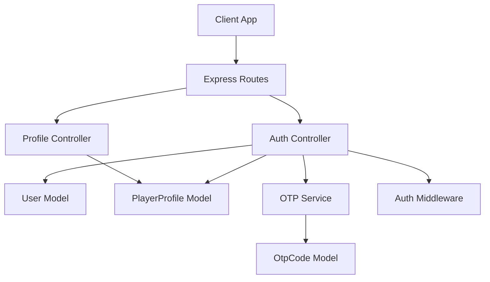
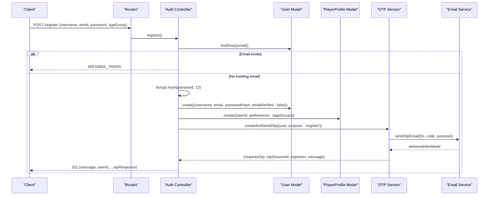
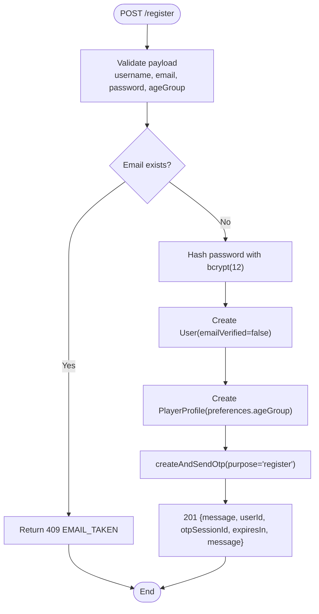
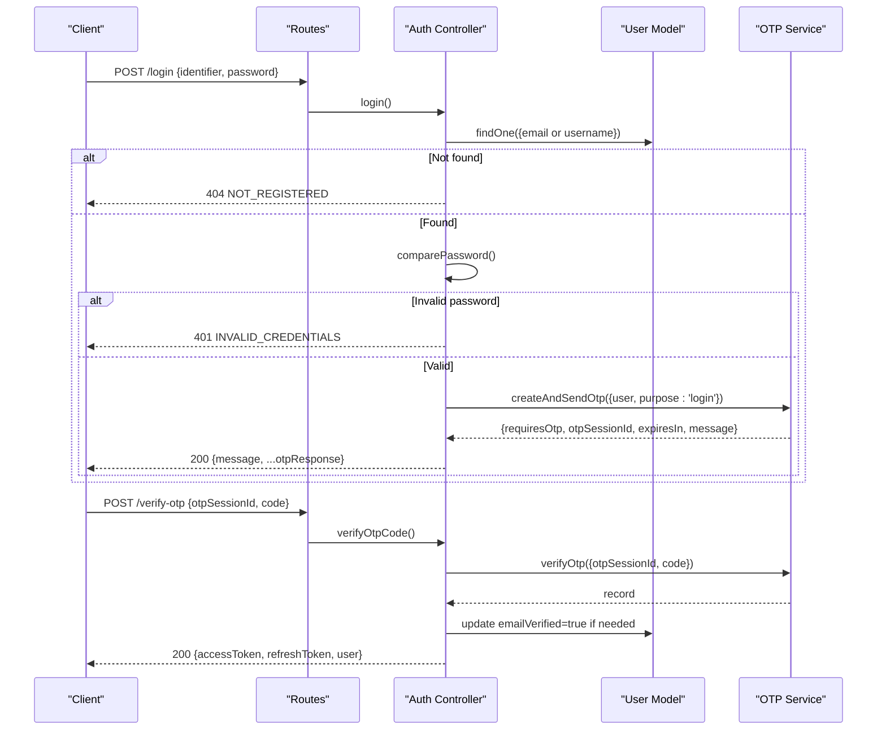
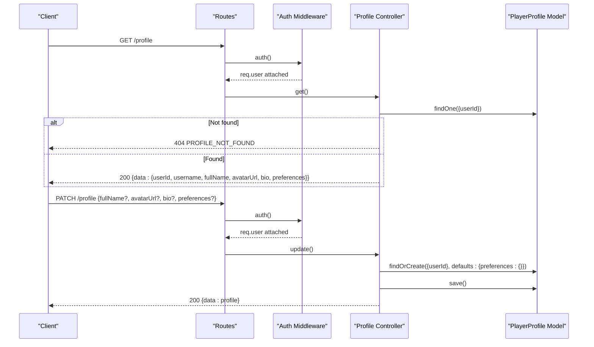
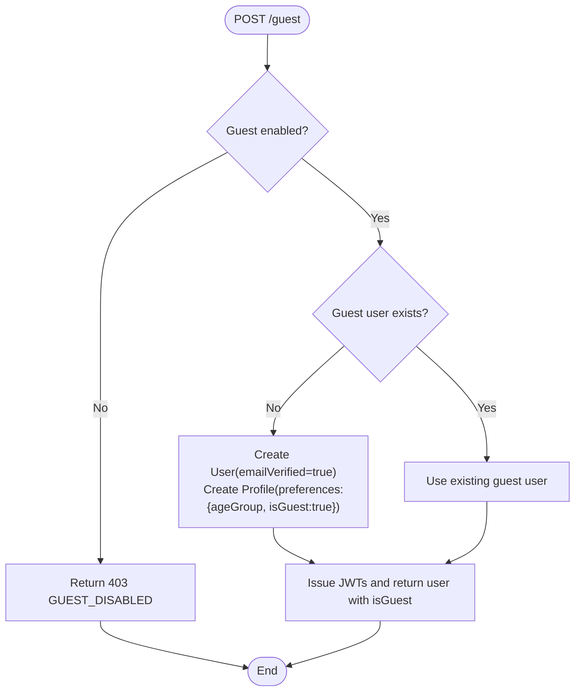
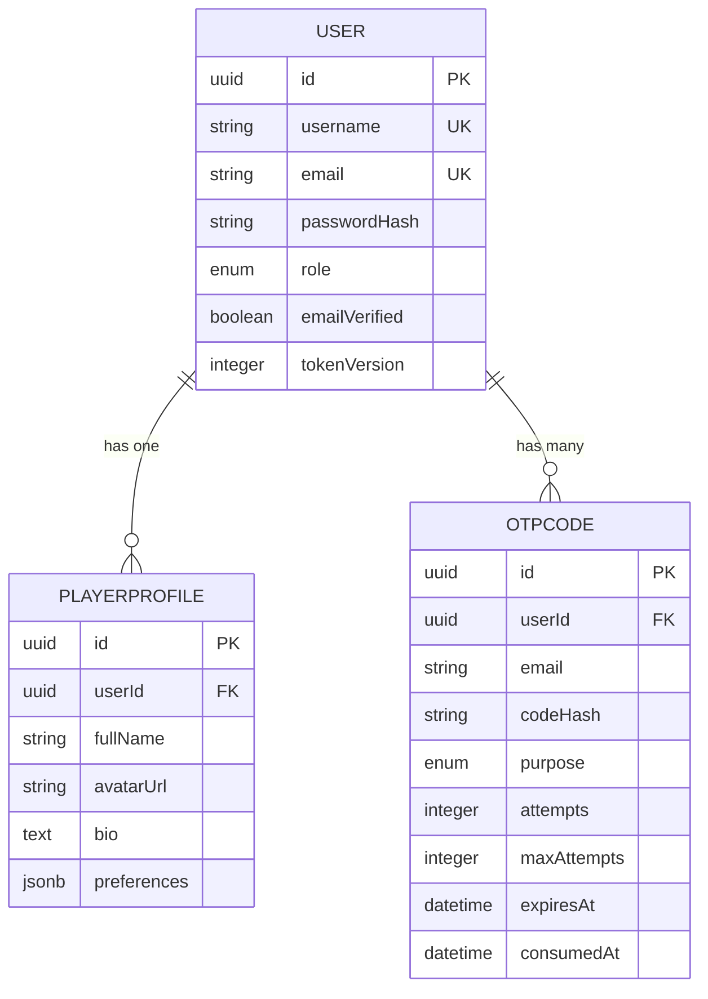
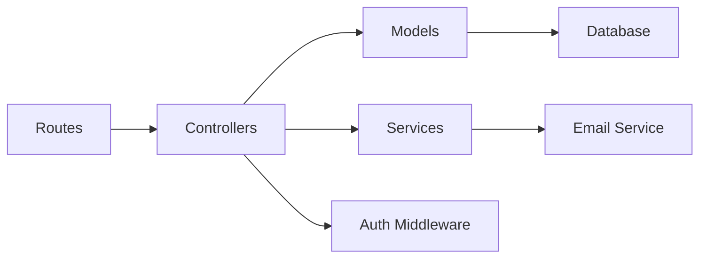

# User Registration & Profile Management

<cite>
**Referenced Files in This Document**
- [auth-controller.js](file://backend/controllers/auth-controller.js)
- [profile-controller.js](file://backend/controllers/profile-controller.js)
- [User.js](file://backend/models/User.js)
- [PlayerProfile.js](file://backend/models/PlayerProfile.js)
- [OtpCode.js](file://backend/models/OtpCode.js)
- [otp-service.js](file://backend/services/otp-service.js)
- [auth-routes.js](file://backend/routes/auth-routes.js)
- [profile-routes.js](file://backend/routes/profile-routes.js)
- [auth-schemas.js](file://backend/validators/auth-schemas.js)
- [authMiddleware.js](file://backend/middleware/authMiddleware.js)
</cite>

## Table of Contents
1. [Introduction](#introduction)
2. [Project Structure](#project-structure)
3. [Core Components](#core-components)
4. [Architecture Overview](#architecture-overview)
5. [Detailed Component Analysis](#detailed-component-analysis)
6. [Dependency Analysis](#dependency-analysis)
7. [Performance Considerations](#performance-considerations)
8. [Troubleshooting Guide](#troubleshooting-guide)
9. [Conclusion](#conclusion)

## Introduction
This document explains the user registration and profile management system, focusing on:
- Registration flow with input validation, duplicate email checks, password hashing with bcrypt at 12 rounds, and automatic player profile creation
- OTP-based email verification integration for both registration and login
- Guest user creation and profile initialization patterns
- Request/response examples for endpoints
- Error handling strategies

## Project Structure
The registration and profile features are implemented across controllers, models, routes, validators, and services:
- Controllers handle HTTP logic and orchestrate business flows
- Models define database schemas and instance methods
- Routes expose REST endpoints with middleware for validation and authentication
- Validators enforce request payload constraints
- Services encapsulate OTP generation, storage, and email delivery

**Diagram sources**
- [auth-routes.js:9-15](file://backend/routes/auth-routes.js#L9-L15)
- [profile-routes.js:6-7](file://backend/routes/profile-routes.js#L6-L7)
- [auth-controller.js:34-150](file://backend/controllers/auth-controller.js#L34-L150)
- [profile-controller.js:5-33](file://backend/controllers/profile-controller.js#L5-L33)
- [otp-service.js:23-96](file://backend/services/otp-service.js#L23-L96)
- [User.js:5-16](file://backend/models/User.js#L5-L16)
- [PlayerProfile.js:4-11](file://backend/models/PlayerProfile.js#L4-L11)
- [OtpCode.js:4-19](file://backend/models/OtpCode.js#L4-L19)

**Section sources**
- [auth-routes.js:1-18](file://backend/routes/auth-routes.js#L1-L18)
- [profile-routes.js:1-10](file://backend/routes/profile-routes.js#L1-L10)

## Core Components
- User model: stores username, email, passwordHash, role, emailVerified, tokenVersion; includes a method to compare passwords using bcrypt
- PlayerProfile model: stores fullName, avatarUrl, bio, preferences (JSONB), linked to User via userId
- OTP service: generates, hashes, stores, verifies, and resends one-time codes; integrates with email service
- Auth controller: implements register, login, verify OTP, resend OTP, logout, refresh, guest login
- Profile controller: retrieves and updates player profiles
- Validators: enforce schema rules for registration, login, OTP verification, and resend
- Auth middleware: validates JWT tokens and attaches authenticated user to requests

**Section sources**
- [User.js:5-20](file://backend/models/User.js#L5-L20)
- [PlayerProfile.js:4-11](file://backend/models/PlayerProfile.js#L4-L11)
- [otp-service.js:23-96](file://backend/services/otp-service.js#L23-L96)
- [auth-controller.js:34-150](file://backend/controllers/auth-controller.js#L34-L150)
- [profile-controller.js:5-33](file://backend/controllers/profile-controller.js#L5-L33)
- [auth-schemas.js:5-26](file://backend/validators/auth-schemas.js#L5-L26)
- [authMiddleware.js:6-35](file://backend/middleware/authMiddleware.js#L6-L35)

## Architecture Overview
High-level flow for registration and profile management:
- Registration: validate input, check for existing email, hash password, create user, create profile with ageGroup preference, send OTP for email verification
- Login: validate input, find user by email or username, verify password, send OTP for login
- OTP verification: validate code, mark as consumed, set emailVerified if needed, issue JWTs
- Profile management: get/update profile data for authenticated users
- Guest login: optional feature that creates a guest user and profile if enabled

**Diagram sources**
- [auth-routes.js:9](file://backend/routes/auth-routes.js#L9)
- [auth-controller.js:34-52](file://backend/controllers/auth-controller.js#L34-L52)
- [User.js:5-16](file://backend/models/User.js#L5-L16)
- [PlayerProfile.js:4-11](file://backend/models/PlayerProfile.js#L4-L11)
- [otp-service.js:23-56](file://backend/services/otp-service.js#L23-L56)

**Section sources**
- [auth-controller.js:34-52](file://backend/controllers/auth-controller.js#L34-L52)
- [auth-schemas.js:5-11](file://backend/validators/auth-schemas.js#L5-L11)

## Detailed Component Analysis

### Registration Flow
- Input validation: Joi schema enforces username format and length, email format and max length, password complexity and length, and optional ageGroup with default value
- Duplicate email check: queries User by email; returns 409 if taken
- Password hashing: uses bcrypt with 12 rounds before persisting passwordHash
- User creation: creates User with emailVerified set to false
- Profile creation: automatically creates PlayerProfile with preferences.ageGroup derived from request or default
- OTP integration: calls OTP service to generate, store hashed code, and send email; responds with requiresOtp, otpSessionId, expiresIn, and message
- Response example:
  - Success: 201 with message, userId, and OTP metadata
  - Conflict: 409 with EMAIL_TAKEN when email already exists

**Diagram sources**
- [auth-controller.js:34-52](file://backend/controllers/auth-controller.js#L34-L52)
- [auth-schemas.js:5-11](file://backend/validators/auth-schemas.js#L5-L11)
- [otp-service.js:23-56](file://backend/services/otp-service.js#L23-L56)

**Section sources**
- [auth-controller.js:34-52](file://backend/controllers/auth-controller.js#L34-L52)
- [auth-schemas.js:5-11](file://backend/validators/auth-schemas.js#L5-L11)

### Login and OTP Verification Flow
- Login: accepts identifier (email or username) and password; finds user by normalized email or username; verifies password; sends OTP for login
- OTP verification: validates session and code; marks OTP as consumed; sets emailVerified if needed; issues JWTs via cookie response
- Response examples:
  - Login: 200 with message and OTP metadata
  - Verify OTP: 200 with accessToken, refreshToken, and user info

**Diagram sources**
- [auth-controller.js:54-89](file://backend/controllers/auth-controller.js#L54-L89)
- [otp-service.js:58-83](file://backend/services/otp-service.js#L58-L83)

**Section sources**
- [auth-controller.js:54-89](file://backend/controllers/auth-controller.js#L54-L89)
- [otp-service.js:58-83](file://backend/services/otp-service.js#L58-L83)

### Profile Management
- Get profile: returns profile data merged with user info for authenticated user
- Update profile: supports partial updates for fullName, avatarUrl, bio, and preferences; merges new preferences into existing JSONB
- Authentication required: protected by auth middleware which validates JWT and attaches user

**Diagram sources**
- [profile-routes.js:6-7](file://backend/routes/profile-routes.js#L6-L7)
- [profile-controller.js:5-33](file://backend/controllers/profile-controller.js#L5-L33)
- [authMiddleware.js:6-35](file://backend/middleware/authMiddleware.js#L6-L35)

**Section sources**
- [profile-controller.js:5-33](file://backend/controllers/profile-controller.js#L5-L33)
- [profile-routes.js:6-7](file://backend/routes/profile-routes.js#L6-L7)
- [authMiddleware.js:6-35](file://backend/middleware/authMiddleware.js#L6-L35)

### Guest User Creation and Profile Initialization
- Guest login endpoint conditionally enables guest play based on environment flag
- If guest user does not exist, creates a User with a generated password hash and emailVerified set to true
- Creates PlayerProfile with preferences.isGuest set to true and a default ageGroup
- Returns JWTs and a user object indicating isGuest

**Diagram sources**
- [auth-controller.js:123-150](file://backend/controllers/auth-controller.js#L123-L150)
- [auth-routes.js:11](file://backend/routes/auth-routes.js#L11)

**Section sources**
- [auth-controller.js:123-150](file://backend/controllers/auth-controller.js#L123-L150)

### Data Models
- User fields: id (UUID), username (unique), email (unique, validated), passwordHash, role (player/admin), emailVerified (boolean), tokenVersion (integer)
- PlayerProfile fields: id (UUID), userId (UUID), fullName, avatarUrl, bio, preferences (JSONB)
- OtpCode fields: id (UUID), userId, email, codeHash, purpose (login/register), attempts, maxAttempts, expiresAt, consumedAt

**Diagram sources**
- [User.js:5-16](file://backend/models/User.js#L5-L16)
- [PlayerProfile.js:4-11](file://backend/models/PlayerProfile.js#L4-L11)
- [OtpCode.js:4-19](file://backend/models/OtpCode.js#L4-L19)

**Section sources**
- [User.js:5-16](file://backend/models/User.js#L5-L16)
- [PlayerProfile.js:4-11](file://backend/models/PlayerProfile.js#L4-L11)
- [OtpCode.js:4-19](file://backend/models/OtpCode.js#L4-L19)

## Dependency Analysis
- Controllers depend on models for persistence and on services for OTP operations
- Routes wire endpoints to controllers with validation and security middleware
- Auth middleware depends on JWT configuration and user/session versioning
- OTP service depends on email service for delivery and bcrypt for hashing codes

**Diagram sources**
- [auth-routes.js:1-18](file://backend/routes/auth-routes.js#L1-L18)
- [profile-routes.js:1-10](file://backend/routes/profile-routes.js#L1-L10)
- [auth-controller.js:1-154](file://backend/controllers/auth-controller.js#L1-L154)
- [profile-controller.js:1-37](file://backend/controllers/profile-controller.js#L1-L37)
- [authMiddleware.js:1-38](file://backend/middleware/authMiddleware.js#L1-L38)
- [otp-service.js:1-99](file://backend/services/otp-service.js#L1-L99)

**Section sources**
- [auth-controller.js:1-154](file://backend/controllers/auth-controller.js#L1-L154)
- [profile-controller.js:1-37](file://backend/controllers/profile-controller.js#L1-L37)
- [authMiddleware.js:1-38](file://backend/middleware/authMiddleware.js#L1-L38)
- [otp-service.js:1-99](file://backend/services/otp-service.js#L1-L99)

## Performance Considerations
- Password hashing uses bcrypt with 12 rounds; ensure server resources can handle concurrent hashing during peak registration times
- OTP TTL is set to 10 minutes; consider adjusting based on user experience and security requirements
- Profile updates merge JSONB preferences; avoid sending large payloads to reduce serialization overhead
- Database indexes on OTP records improve lookup performance for expiration and consumption checks

[No sources needed since this section provides general guidance]

## Troubleshooting Guide
Common errors and their causes:
- EMAIL_TAKEN: Registration fails because the email already exists; suggest logging in instead
- NOT_REGISTERED: Login attempt for an unregistered identifier; prompt to register
- INVALID_CREDENTIALS: Password mismatch; encourage retry or password reset flow
- OTP_INVALID: Session expired or code already used; instruct to request a new code
- OTP_EXPIRED: Code exceeded TTL; instruct to resend OTP
- OTP_MAX_ATTEMPTS: Too many wrong attempts; instruct to resend OTP
- UNAUTHORIZED: Missing or invalid token; ensure cookies or Authorization header are set correctly
- PROFILE_NOT_FOUND: Profile missing for authenticated user; initialize profile on first access if necessary

**Section sources**
- [auth-controller.js:34-89](file://backend/controllers/auth-controller.js#L34-L89)
- [otp-service.js:58-96](file://backend/services/otp-service.js#L58-L96)
- [profile-controller.js:5-33](file://backend/controllers/profile-controller.js#L5-L33)

## Conclusion
The system provides a robust registration and profile management workflow:
- Secure registration with strict input validation, duplicate email checks, and strong password hashing
- Automatic player profile creation with ageGroup preferences
- OTP-based email verification integrated throughout registration and login
- Optional guest user creation with profile initialization
- Protected profile endpoints for retrieving and updating user data

This design balances security, usability, and extensibility, enabling future enhancements such as additional profile fields, multi-factor authentication, and enhanced analytics.