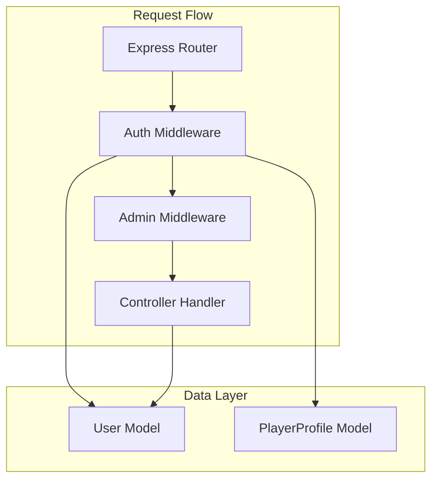
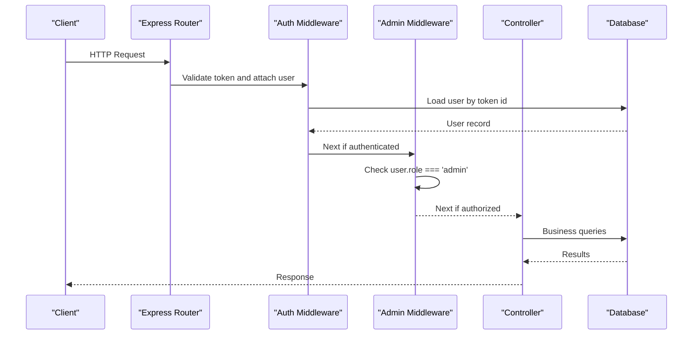
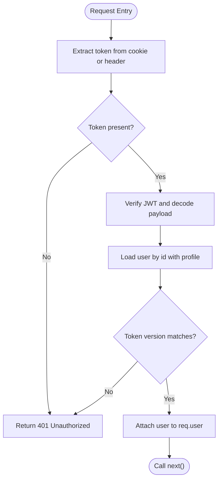
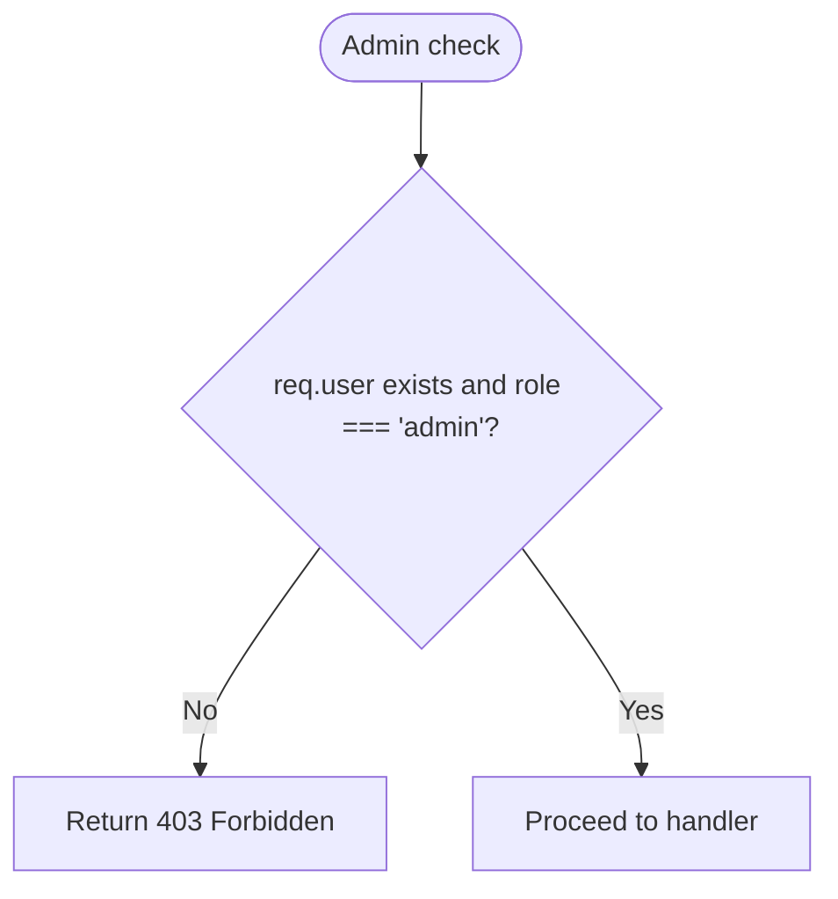
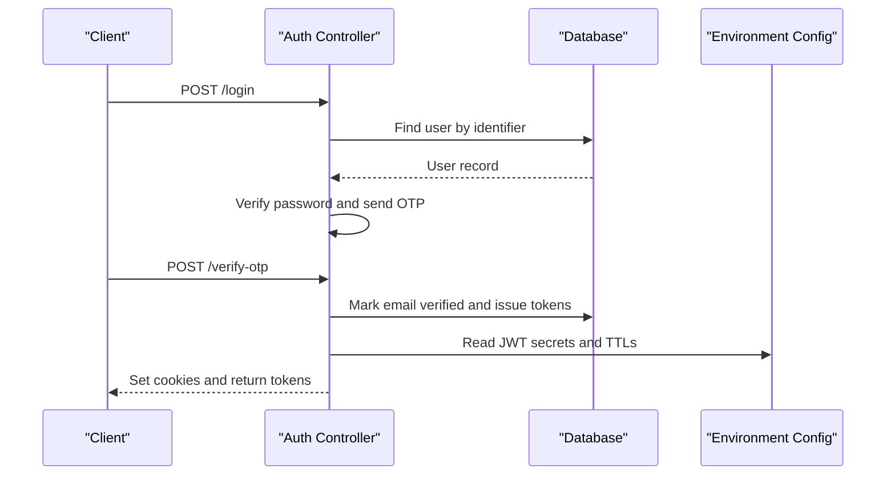
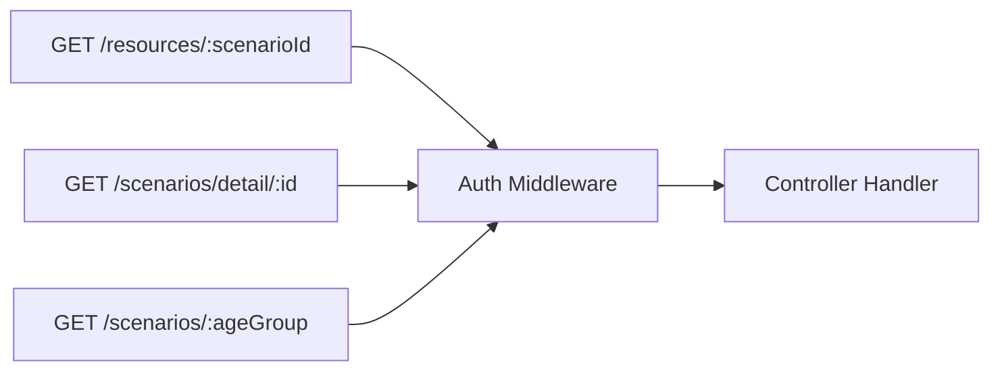
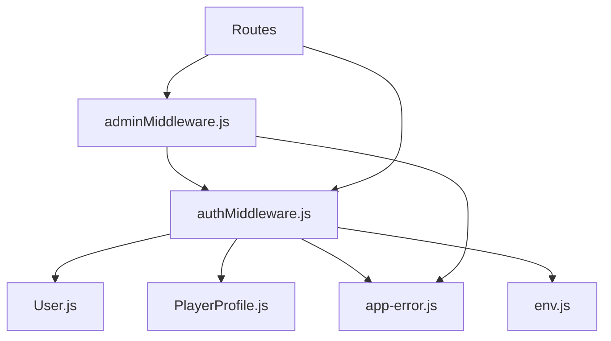

# Authorization & Access Control

<cite>
**Referenced Files in This Document**
- [authMiddleware.js](file://backend/middleware/authMiddleware.js)
- [adminMiddleware.js](file://backend/middleware/adminMiddleware.js)
- [User.js](file://backend/models/User.js)
- [PlayerProfile.js](file://backend/models/PlayerProfile.js)
- [auth-controller.js](file://backend/controllers/auth-controller.js)
- [auth-routes.js](file://backend/routes/auth-routes.js)
- [resource-routes.js](file://backend/routes/resource-routes.js)
- [scenario-routes.js](file://backend/routes/scenario-routes.js)
- [security.js](file://backend/middleware/security.js)
- [app-error.js](file://backend/utils/app-error.js)
- [env.js](file://backend/config/env.js)
</cite>

## Table of Contents
1. [Introduction](#introduction)
2. [Project Structure](#project-structure)
3. [Core Components](#core-components)
4. [Architecture Overview](#architecture-overview)
5. [Detailed Component Analysis](#detailed-component-analysis)
6. [Dependency Analysis](#dependency-analysis)
7. [Performance Considerations](#performance-considerations)
8. [Troubleshooting Guide](#troubleshooting-guide)
9. [Conclusion](#conclusion)
10. [Appendices](#appendices)

## Introduction
This document explains the role-based access control (RBAC) and authorization mechanisms implemented in the backend. It covers how authentication is enforced, how admin-only routes are protected, how user roles are stored and validated, and how resource-level access control can be applied. It also provides examples of protected routes, role-checking patterns, and best practices for fine-grained authorization.

## Project Structure
The authorization system spans middleware, models, controllers, and route definitions:
- Authentication middleware validates tokens and attaches a user to the request.
- Admin middleware enforces that only users with an admin role can access protected endpoints.
- Models define roles and relationships used during validation and authorization.
- Controllers issue tokens and handle session lifecycle.
- Routes compose middleware to protect specific endpoints.

**Diagram sources**
- [authMiddleware.js:6-35](file://backend/middleware/authMiddleware.js#L6-L35)
- [adminMiddleware.js:3-8](file://backend/middleware/adminMiddleware.js#L3-L8)
- [User.js:5-16](file://backend/models/User.js#L5-L16)
- [PlayerProfile.js:4-11](file://backend/models/PlayerProfile.js#L4-L11)

**Section sources**
- [authMiddleware.js:6-35](file://backend/middleware/authMiddleware.js#L6-L35)
- [adminMiddleware.js:3-8](file://backend/middleware/adminMiddleware.js#L3-L8)
- [User.js:5-16](file://backend/models/User.js#L5-L16)
- [PlayerProfile.js:4-11](file://backend/models/PlayerProfile.js#L4-L11)

## Core Components
- Authentication middleware: Validates JWT from cookies or Authorization header, verifies token version against the current user record, and attaches the user to the request.
- Admin middleware: Ensures the authenticated user has the admin role; otherwise returns a forbidden error.
- User model: Stores role as an enum (player, admin), supports scopes to include sensitive fields when needed, and exposes password comparison utility.
- Auth controller: Issues access and refresh tokens, handles login/registration/OTP verification, logout, and guest sessions.
- Security middleware: Adds request IDs, rejects unsafe input shapes, and applies rate limits for auth and OTP flows.

Key behaviors:
- Token payload includes user id and token version to support forced invalidation on logout or password changes.
- Role checks are performed server-side using the persisted role field.
- Resource-level protection is achieved by composing auth middleware on routes that require authentication.

**Section sources**
- [authMiddleware.js:6-35](file://backend/middleware/authMiddleware.js#L6-L35)
- [adminMiddleware.js:3-8](file://backend/middleware/adminMiddleware.js#L3-L8)
- [User.js:5-16](file://backend/models/User.js#L5-L16)
- [auth-controller.js:10-32](file://backend/controllers/auth-controller.js#L10-L32)
- [auth-controller.js:54-89](file://backend/controllers/auth-controller.js#L54-L89)
- [auth-controller.js:100-121](file://backend/controllers/auth-controller.js#L100-L121)
- [security.js:4-19](file://backend/middleware/security.js#L4-L19)
- [security.js:23-45](file://backend/middleware/security.js#L23-L45)

## Architecture Overview
The authorization architecture follows a layered approach:
- Route layer composes middleware to enforce authentication and authorization per endpoint.
- Middleware layer validates tokens and roles before invoking controllers.
- Controller layer performs business logic and interacts with data models.
- Data layer persists roles and related profiles used for authorization decisions.

**Diagram sources**
- [authMiddleware.js:6-35](file://backend/middleware/authMiddleware.js#L6-L35)
- [adminMiddleware.js:3-8](file://backend/middleware/adminMiddleware.js#L3-L8)
- [User.js:5-16](file://backend/models/User.js#L5-L16)

## Detailed Component Analysis

### Authentication Middleware
Responsibilities:
- Extracts access token from cookies or Authorization header.
- Verifies the JWT signature and decodes payload.
- Loads the user with associated profile and ensures token version matches the stored version.
- Attaches the user object to the request context for downstream authorization checks.

Error handling:
- Missing or invalid tokens result in unauthorized errors.
- Token version mismatch indicates session invalidation (e.g., after logout).

**Diagram sources**
- [authMiddleware.js:6-35](file://backend/middleware/authMiddleware.js#L6-L35)

**Section sources**
- [authMiddleware.js:6-35](file://backend/middleware/authMiddleware.js#L6-L35)

### Admin Middleware
Responsibilities:
- Enforces that only users with the admin role can proceed to protected handlers.
- Returns a standardized forbidden error when access is denied.

Usage pattern:
- Compose after auth middleware on administrative routes to ensure both authentication and authorization are enforced.

**Diagram sources**
- [adminMiddleware.js:3-8](file://backend/middleware/adminMiddleware.js#L3-L8)

**Section sources**
- [adminMiddleware.js:3-8](file://backend/middleware/adminMiddleware.js#L3-L8)

### User Model and Roles
- Role field is an enum with values player and admin, defaulting to player.
- Scopes allow including sensitive fields (password hash, token version) when necessary for authentication flows.
- Password comparison utility supports secure verification during login.

Role storage and validation:
- Role is persisted in the database and read during authentication to make authorization decisions.
- Token version enables revocation of active sessions upon logout or credential changes.

**Section sources**
- [User.js:5-16](file://backend/models/User.js#L5-L16)
- [User.js:18-20](file://backend/models/User.js#L18-L20)

### Auth Controller and Session Lifecycle
- Issues short-lived access tokens and longer-lived refresh tokens signed with distinct secrets.
- Sets secure cookies for tokens and returns minimal user metadata (id, username, role, emailVerified).
- Handles registration, login with OTP verification, logout (invalidates session via token version bump), and token refresh.
- Supports guest play mode when enabled by configuration.

**Diagram sources**
- [auth-controller.js:10-32](file://backend/controllers/auth-controller.js#L10-L32)
- [auth-controller.js:54-89](file://backend/controllers/auth-controller.js#L54-L89)
- [env.js:11-14](file://backend/config/env.js#L11-L14)

**Section sources**
- [auth-controller.js:10-32](file://backend/controllers/auth-controller.js#L10-L32)
- [auth-controller.js:54-89](file://backend/controllers/auth-controller.js#L54-L89)
- [auth-controller.js:100-121](file://backend/controllers/auth-controller.js#L100-L121)
- [env.js:11-14](file://backend/config/env.js#L11-L14)

### Protected Routes and Resource-Level Access Control
- Public discovery endpoints for resources are intentionally open; scenario-linked resource lists require authentication.
- Scenario detail and listing endpoints are protected by authentication middleware.
- To protect administrative endpoints, compose admin middleware after auth middleware.

Examples:
- Resource list by scenario requires authentication.
- Scenario detail and listing require authentication.

**Diagram sources**
- [resource-routes.js:1-10](file://backend/routes/resource-routes.js#L1-L10)
- [scenario-routes.js:1-1](file://backend/routes/scenario-routes.js#L1-L1)

**Section sources**
- [resource-routes.js:1-10](file://backend/routes/resource-routes.js#L1-L10)
- [scenario-routes.js:1-1](file://backend/routes/scenario-routes.js#L1-L1)

### Permission Hierarchy and Enforcement
- Two primary roles exist: player and admin.
- Player role grants access to authenticated features such as scenario-linked resources and personal progress.
- Admin role grants access to administrative endpoints guarded by admin middleware.
- Enforcement occurs at the middleware level before reaching controllers, ensuring consistent policy application.

Best practices:
- Always place admin middleware after auth middleware.
- Keep role checks centralized in middleware rather than scattering them across controllers.
- Use explicit deny-by-default for new routes until permissions are defined.

**Section sources**
- [User.js:5-16](file://backend/models/User.js#L5-L16)
- [adminMiddleware.js:3-8](file://backend/middleware/adminMiddleware.js#L3-L8)

### Custom Authorization Logic Patterns
- Role-based checks: Use admin middleware for admin-only routes.
- Resource-scoped checks: For finer granularity, add middleware that inspects resource ownership or attributes (e.g., organization type, state codes) before allowing access.
- Feature flags: Gate features like guest play using environment configuration.

Implementation tips:
- Extend admin middleware to accept a list of allowed roles for multi-role scenarios.
- Add resource-level policies in middleware that load the target resource and compare requester attributes.

[No sources needed since this section provides general guidance]

## Dependency Analysis
Authorization components depend on each other as follows:
- Auth middleware depends on JWT library, environment config, app error utility, and data models.
- Admin middleware depends on app error utility and relies on auth middleware to populate req.user.
- Routes compose middleware to enforce security policies.
- Controllers rely on models and services to perform operations under authenticated contexts.

**Diagram sources**
- [authMiddleware.js:1-4](file://backend/middleware/authMiddleware.js#L1-L4)
- [adminMiddleware.js:1-2](file://backend/middleware/adminMiddleware.js#L1-L2)
- [User.js:1-3](file://backend/models/User.js#L1-L3)
- [PlayerProfile.js:1-3](file://backend/models/PlayerProfile.js#L1-L3)
- [env.js:1-4](file://backend/config/env.js#L1-L4)

**Section sources**
- [authMiddleware.js:1-4](file://backend/middleware/authMiddleware.js#L1-L4)
- [adminMiddleware.js:1-2](file://backend/middleware/adminMiddleware.js#L1-L2)
- [User.js:1-3](file://backend/models/User.js#L1-L3)
- [PlayerProfile.js:1-3](file://backend/models/PlayerProfile.js#L1-L3)
- [env.js:1-4](file://backend/config/env.js#L1-L4)

## Performance Considerations
- Token verification is lightweight; avoid redundant user lookups by caching where appropriate.
- Rate limiting protects auth and OTP endpoints from abuse without impacting normal flows.
- Use scoped queries to minimize payload size and reduce memory usage.
- Ensure database indexes on frequently queried fields (e.g., user id, email) to keep authorization checks fast.

[No sources needed since this section provides general guidance]

## Troubleshooting Guide
Common issues and resolutions:
- 401 Unauthorized:
  - Missing or malformed token: Ensure client sends accessToken in cookie or Authorization header.
  - Invalid token: Verify secret configuration and token signing process.
  - Session expired: Token version mismatch indicates logout or credential change; re-authenticate.
- 403 Forbidden:
  - Insufficient role: Ensure user has admin role for admin-only routes.
  - Misordered middleware: Place admin middleware after auth middleware.
- Unsafe input rejection:
  - Input contains suspicious keys: Sanitize payloads to avoid injection attempts.

Operational notes:
- AppError provides structured error responses with status code and code for consistent handling.
- Environment configuration controls JWT secrets, TTLs, and feature flags like guest play.

**Section sources**
- [authMiddleware.js:13-35](file://backend/middleware/authMiddleware.js#L13-L35)
- [adminMiddleware.js:3-8](file://backend/middleware/adminMiddleware.js#L3-L8)
- [security.js:10-19](file://backend/middleware/security.js#L10-L19)
- [app-error.js:1-12](file://backend/utils/app-error.js#L1-L12)
- [env.js:11-14](file://backend/config/env.js#L11-L14)

## Conclusion
The authorization system implements robust RBAC through middleware-driven enforcement, secure token management, and clear role boundaries between players and administrators. By composing auth and admin middleware on routes, the application ensures consistent protection of sensitive endpoints. Extending these patterns enables fine-grained, resource-level access control while maintaining clarity and performance.

[No sources needed since this section summarizes without analyzing specific files]

## Appendices

### Examples of Protected Routes
- Resource list by scenario: Requires authentication.
- Scenario detail and listing: Require authentication.
- Administrative endpoints: Require both authentication and admin role.

**Section sources**
- [resource-routes.js:1-10](file://backend/routes/resource-routes.js#L1-L10)
- [scenario-routes.js:1-1](file://backend/routes/scenario-routes.js#L1-L1)

### Role Checking Patterns
- Use auth middleware to ensure a valid user context.
- Use admin middleware to restrict admin-only functionality.
- For custom roles or permissions, extend middleware to evaluate additional claims or resource attributes.

**Section sources**
- [authMiddleware.js:6-35](file://backend/middleware/authMiddleware.js#L6-L35)
- [adminMiddleware.js:3-8](file://backend/middleware/adminMiddleware.js#L3-L8)

### Best Practices for Fine-Grained Access Control
- Prefer middleware over inline checks in controllers for consistency.
- Apply deny-by-default to new routes until explicitly permitted.
- Scope queries to minimize exposure of sensitive data.
- Use rate limiting and input validation to harden endpoints.
- Centralize error handling with structured error objects.

[No sources needed since this section provides general guidance]