# Data Protection & Security

<cite>
**Referenced Files in This Document**
- [app.js](file://backend/app.js)
- [server.js](file://backend/server.js)
- [security.js](file://backend/middleware/security.js)
- [validate.js](file://backend/middleware/validate.js)
- [authMiddleware.js](file://backend/middleware/authMiddleware.js)
- [error-handler.js](file://backend/middleware/error-handler.js)
- [env.js](file://backend/config/env.js)
- [logger.js](file://backend/config/logger.js)
- [db.js](file://backend/config/db.js)
- [auth-controller.js](file://backend/controllers/auth-controller.js)
- [otp-service.js](file://backend/services/otp-service.js)
- [auth-schemas.js](file://backend/validators/auth-schemas.js)
- [app-error.js](file://backend/utils/app-error.js)
</cite>

## Table of Contents
1. [Introduction](#introduction)
2. [Project Structure](#project-structure)
3. [Core Components](#core-components)
4. [Architecture Overview](#architecture-overview)
5. [Detailed Component Analysis](#detailed-component-analysis)
6. [Dependency Analysis](#dependency-analysis)
7. [Performance Considerations](#performance-considerations)
8. [Troubleshooting Guide](#troubleshooting-guide)
9. [Conclusion](#conclusion)

## Introduction
This document explains the data protection and security measures implemented in the backend, focusing on input validation and sanitization, SQL injection prevention, CORS configuration, security headers, HTTPS enforcement strategies, secure error handling, environment variable management, logging security, and secure communication protocols. It also provides examples of security middleware, input validation patterns, common vulnerability mitigations, performance considerations for security checks, and monitoring approaches for security events.

## Project Structure
Security-related concerns are distributed across middleware, configuration, controllers, services, and utilities:
- Middleware enforces request identity, unsafe input rejection, rate limiting, and global error handling.
- Configuration centralizes environment variables with strict validation and derived settings (e.g., CORS origins).
- Controllers implement authentication flows, token issuance, and OTP verification securely.
- Services handle OTP generation, hashing, and email delivery with safe practices.
- Utilities provide a consistent error type used by the error handler to prevent information leakage.

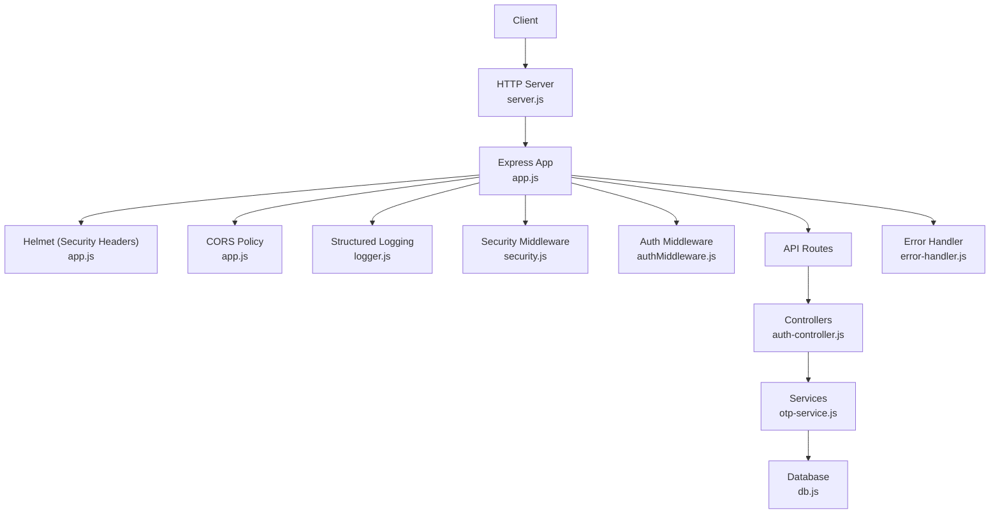

**Diagram sources**
- [server.js:9-25](file://backend/server.js#L9-L25)
- [app.js:15-53](file://backend/app.js#L15-L53)
- [security.js:10-47](file://backend/middleware/security.js#L10-L47)
- [authMiddleware.js:6-35](file://backend/middleware/authMiddleware.js#L6-L35)
- [error-handler.js:15-49](file://backend/middleware/error-handler.js#L15-L49)
- [logger.js:1-12](file://backend/config/logger.js#L1-L12)
- [db.js:7-13](file://backend/config/db.js#L7-L13)

**Section sources**
- [app.js:15-53](file://backend/app.js#L15-L53)
- [server.js:9-25](file://backend/server.js#L9-L25)

## Core Components
- Request identity and tracing: Adds a unique request ID header for correlation across logs and responses.
- Unsafe input rejection: Rejects payloads containing MongoDB-style operators or nested keys that could lead to injection-like behavior.
- Rate limiting: Protects write endpoints, authentication, and OTP flows from abuse.
- Input validation: Centralized schema-based validation using Joi with strict mode and unknown field stripping.
- Authentication: JWT-based access and refresh tokens with cookie options tuned for production safety.
- Error handling: Uniform error responses that avoid leaking internals except in development.
- Environment configuration: Strictly validated env vars including secrets, CORS origins, SSL flags, and feature toggles.
- Database security: Optional PostgreSQL SSL and controlled query logging.
- Logging security: Structured logs with redaction of sensitive headers.

**Section sources**
- [security.js:4-47](file://backend/middleware/security.js#L4-L47)
- [validate.js:3-11](file://backend/middleware/validate.js#L3-L11)
- [authMiddleware.js:6-35](file://backend/middleware/authMiddleware.js#L6-L35)
- [error-handler.js:15-49](file://backend/middleware/error-handler.js#L15-L49)
- [env.js:6-39](file://backend/config/env.js#L6-L39)
- [db.js:7-13](file://backend/config/db.js#L7-L13)
- [logger.js:5-11](file://backend/config/logger.js#L5-L11)

## Architecture Overview
The application uses Express with layered middleware to enforce security before reaching business logic. Requests flow through identity assignment, structured logging, security headers, CORS policy, JSON parsing with size limits, unsafe input rejection, and optional rate limiting. Protected routes use JWT authentication. Errors are normalized and logged without leaking internal details.

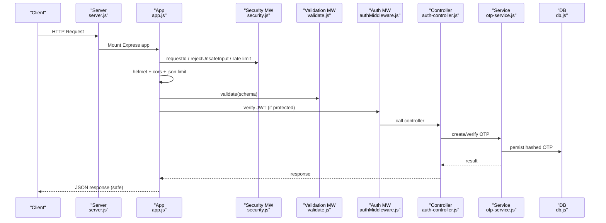

**Diagram sources**
- [server.js:9-25](file://backend/server.js#L9-L25)
- [app.js:15-53](file://backend/app.js#L15-L53)
- [security.js:10-47](file://backend/middleware/security.js#L10-L47)
- [validate.js:3-11](file://backend/middleware/validate.js#L3-L11)
- [authMiddleware.js:6-35](file://backend/middleware/authMiddleware.js#L6-L35)
- [auth-controller.js:34-121](file://backend/controllers/auth-controller.js#L34-L121)
- [otp-service.js:23-83](file://backend/services/otp-service.js#L23-L83)
- [db.js:7-13](file://backend/config/db.js#L7-L13)

## Detailed Component Analysis

### Security Middleware and Request Sanitization
- Request ID propagation ensures traceability across logs and responses.
- Unsafe input detection rejects payloads with operator-like keys or nested traversal characters to mitigate injection-like attacks.
- JSON body size is limited to reduce memory abuse.
- Rate limiters protect writes, authentication, and OTP endpoints against brute-force and abuse.

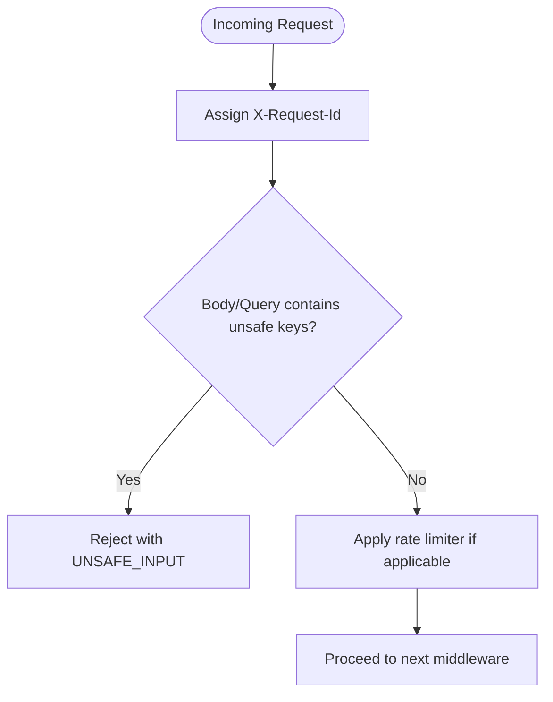

**Diagram sources**
- [security.js:4-47](file://backend/middleware/security.js#L4-L47)

**Section sources**
- [security.js:4-47](file://backend/middleware/security.js#L4-L47)

### Input Validation with Schemas
- All user inputs are validated via Joi schemas with strict mode and unknown fields stripped to prevent unexpected properties from reaching business logic.
- Validation errors are converted into standardized AppError instances with clear codes and messages.

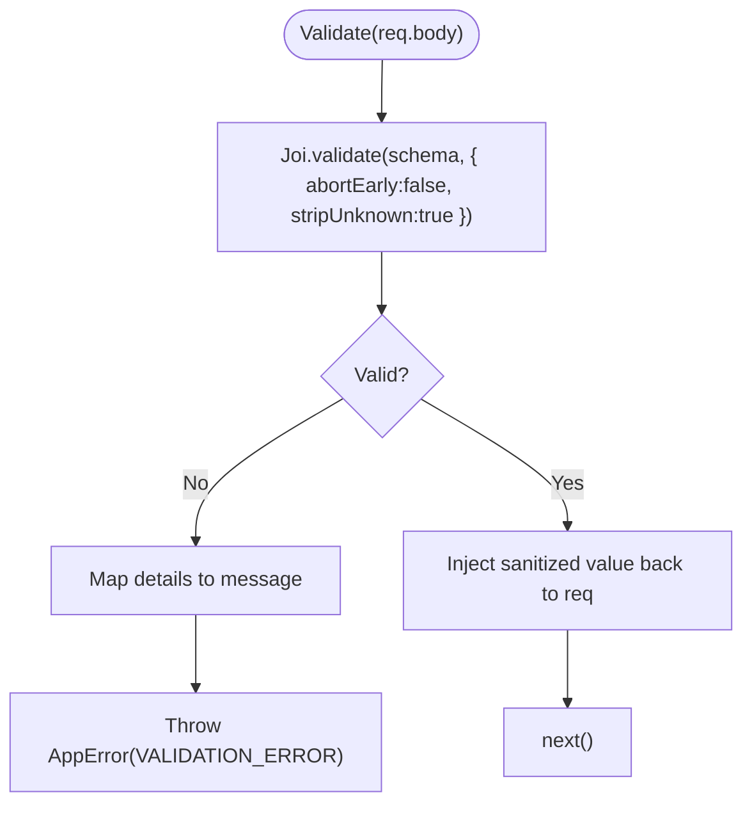

**Diagram sources**
- [validate.js:3-11](file://backend/middleware/validate.js#L3-L11)
- [auth-schemas.js:5-26](file://backend/validators/auth-schemas.js#L5-L26)

**Section sources**
- [validate.js:3-11](file://backend/middleware/validate.js#L3-L11)
- [auth-schemas.js:5-26](file://backend/validators/auth-schemas.js#L5-L26)

### Authentication and Token Handling
- Tokens are issued as HttpOnly cookies; in production, Secure flag is enabled to enforce HTTPS-only transmission.
- Access tokens include a version claim tied to the user’s tokenVersion to support forced invalidation on logout or password change.
- Refresh flow validates the refresh token and issues new tokens only when the session is valid.
- Authentication middleware verifies tokens and attaches the user context to requests.

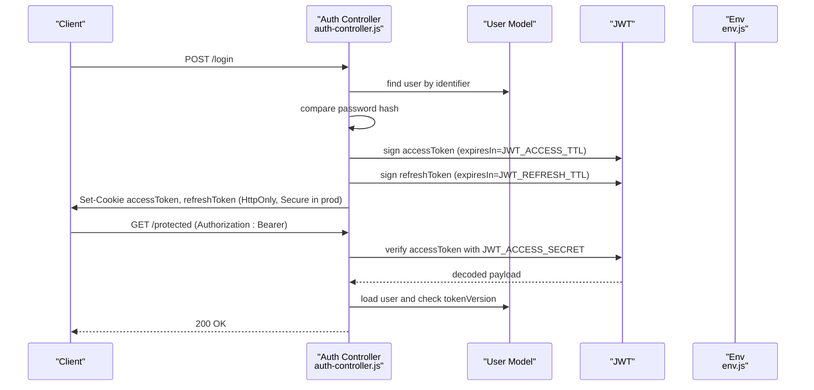

**Diagram sources**
- [auth-controller.js:10-32](file://backend/controllers/auth-controller.js#L10-L32)
- [auth-controller.js:54-121](file://backend/controllers/auth-controller.js#L54-L121)
- [authMiddleware.js:6-35](file://backend/middleware/authMiddleware.js#L6-L35)
- [env.js:11-14](file://backend/config/env.js#L11-L14)

**Section sources**
- [auth-controller.js:10-32](file://backend/controllers/auth-controller.js#L10-L32)
- [auth-controller.js:54-121](file://backend/controllers/auth-controller.js#L54-L121)
- [authMiddleware.js:6-35](file://backend/middleware/authMiddleware.js#L6-L35)
- [env.js:11-14](file://backend/config/env.js#L11-L14)

### OTP Flow and Secure Storage
- OTP codes are generated cryptographically and stored as bcrypt hashes to prevent plaintext exposure.
- Each OTP has a short TTL and attempt limits; expired or consumed codes are rejected.
- Resend invalidates pending OTPs for the same purpose to ensure single-use semantics per session.

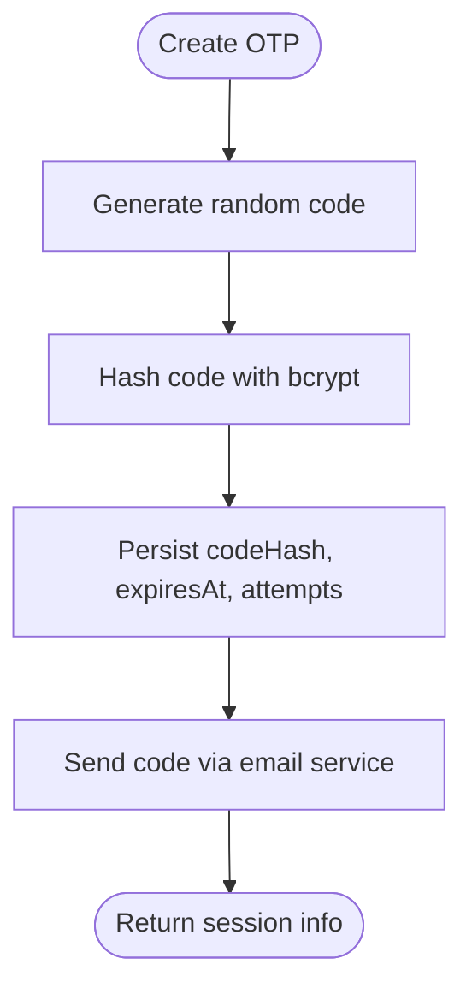

**Diagram sources**
- [otp-service.js:12-56](file://backend/services/otp-service.js#L12-L56)

**Section sources**
- [otp-service.js:12-56](file://backend/services/otp-service.js#L12-L56)
- [otp-service.js:58-83](file://backend/services/otp-service.js#L58-L83)

### CORS Configuration and Allowed Origins
- CORS is configured to allow only explicitly listed origins from environment variables.
- Credentials are allowed for authenticated cross-origin requests.
- Socket.IO mirrors the same origin policy for real-time connections.

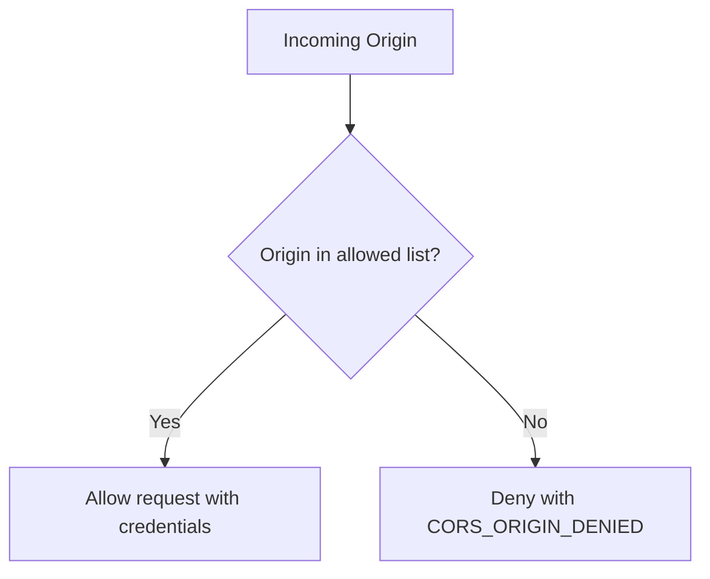

**Diagram sources**
- [app.js:21-29](file://backend/app.js#L21-L29)
- [env.js:16-17](file://backend/config/env.js#L16-L17)
- [env.js:36-39](file://backend/config/env.js#L36-L39)
- [server.js:13-19](file://backend/server.js#L13-L19)

**Section sources**
- [app.js:21-29](file://backend/app.js#L21-L29)
- [env.js:16-17](file://backend/config/env.js#L16-L17)
- [env.js:36-39](file://backend/config/env.js#L36-L39)
- [server.js:13-19](file://backend/server.js#L13-L19)

### Security Headers and HTTPS Enforcement
- Helmet is enabled to set security-related headers; Content Security Policy is disabled intentionally for this setup.
- The server runs over plain HTTP; HTTPS termination should be handled by a reverse proxy or container orchestration layer. Cookies are marked Secure in production to enforce HTTPS-only transport when a TLS-terminating proxy is present.

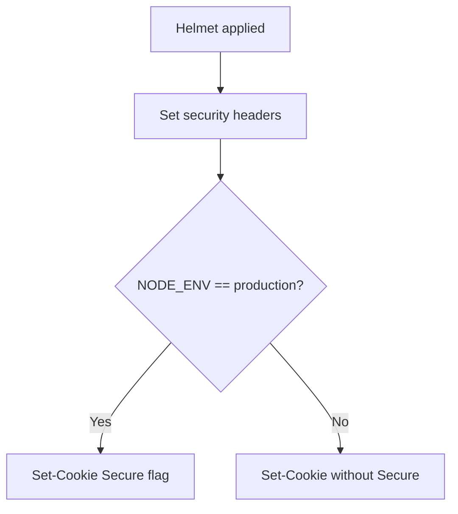

**Diagram sources**
- [app.js:17-21](file://backend/app.js#L17-L21)
- [auth-controller.js:16-21](file://backend/controllers/auth-controller.js#L16-L21)
- [env.js:37-39](file://backend/config/env.js#L37-L39)

**Section sources**
- [app.js:17-21](file://backend/app.js#L17-L21)
- [auth-controller.js:16-21](file://backend/controllers/auth-controller.js#L16-L21)
- [env.js:37-39](file://backend/config/env.js#L37-L39)

### Error Handling and Information Leakage Prevention
- All errors are wrapped in a custom AppError with status code, machine-readable code, and message.
- The error handler maps database-specific errors to appropriate HTTP codes and returns uniform JSON.
- Internal stack traces and detailed messages are omitted in non-development environments to prevent information leakage.
- Structured logs capture contextual data (request ID, method, URL, user) without sensitive values.

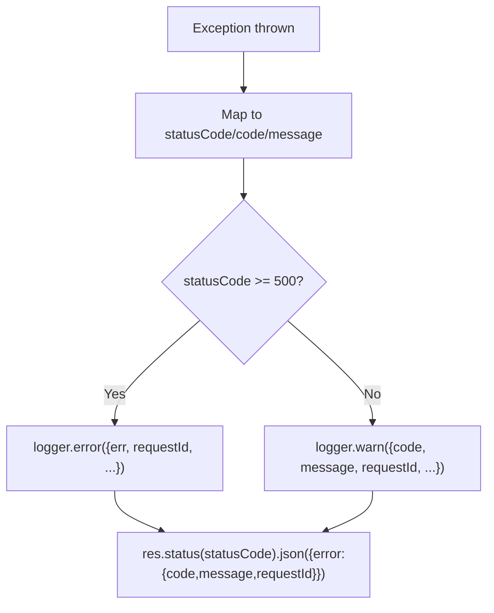

**Diagram sources**
- [error-handler.js:8-49](file://backend/middleware/error-handler.js#L8-L49)
- [app-error.js:1-12](file://backend/utils/app-error.js#L1-L12)
- [logger.js:5-11](file://backend/config/logger.js#L5-L11)

**Section sources**
- [error-handler.js:8-49](file://backend/middleware/error-handler.js#L8-L49)
- [app-error.js:1-12](file://backend/utils/app-error.js#L1-L12)
- [logger.js:5-11](file://backend/config/logger.js#L5-L11)

### Environment Variables and Secrets Management
- All environment variables are validated with strict types and constraints at startup; invalid configurations cause an early failure.
- Secrets such as JWT secrets are required and must meet minimum length requirements.
- Feature toggles like guest play are disabled in production by default.
- CORS origins are parsed into an array for runtime checks.

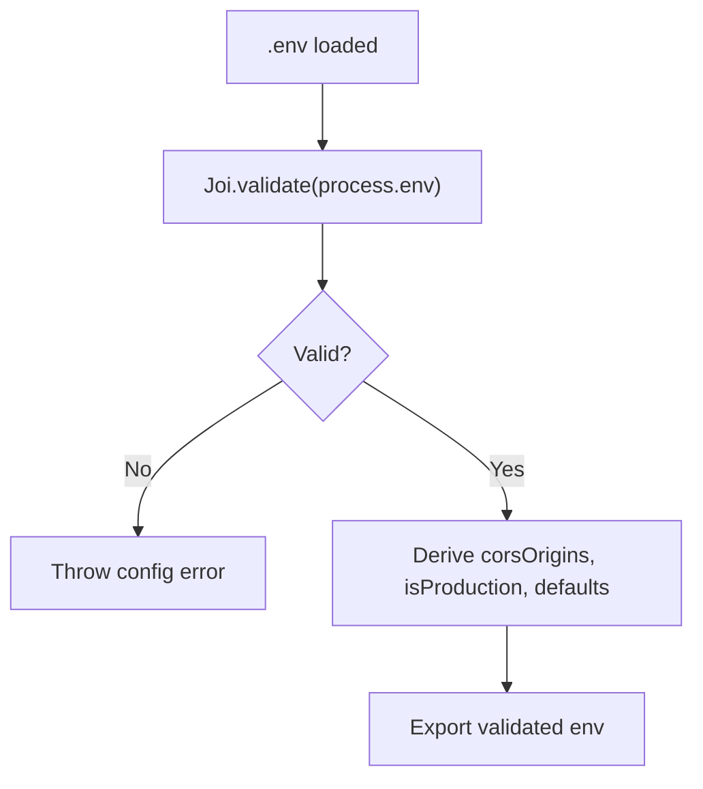

**Diagram sources**
- [env.js:1-39](file://backend/config/env.js#L1-L39)

**Section sources**
- [env.js:1-39](file://backend/config/env.js#L1-L39)

### Logging Security Practices
- Structured logging via Pino with configurable log level from environment.
- Sensitive headers (authorization, cookies) are redacted in HTTP logs.
- Errors above warning level include full context for debugging while keeping client-facing responses safe.

**Section sources**
- [logger.js:1-12](file://backend/config/logger.js#L1-L12)
- [app.js:19](file://backend/app.js#L19)
- [error-handler.js:23-39](file://backend/middleware/error-handler.js#L23-L39)

### Secure Communication Protocols
- Database connection supports PostgreSQL SSL when enabled via environment configuration.
- Application-level secrets are never logged; only safe identifiers and codes are included in logs.
- Real-time connections mirror CORS policies for consistency.

**Section sources**
- [db.js:7-13](file://backend/config/db.js#L7-L13)
- [server.js:13-19](file://backend/server.js#L13-L19)

## Dependency Analysis
Security depends on tightly coupled modules:
- app.js composes middleware and routes, relying on env.js for configuration and logger.js for observability.
- security.js provides reusable rate limiters and input guards used by multiple route groups.
- auth-controller.js orchestrates JWT and OTP flows, depending on otp-service.js and models.
- otp-service.js persists hashed OTPs and enforces TTL/attempts.
- error-handler.js consumes AppError to standardize responses and logging.

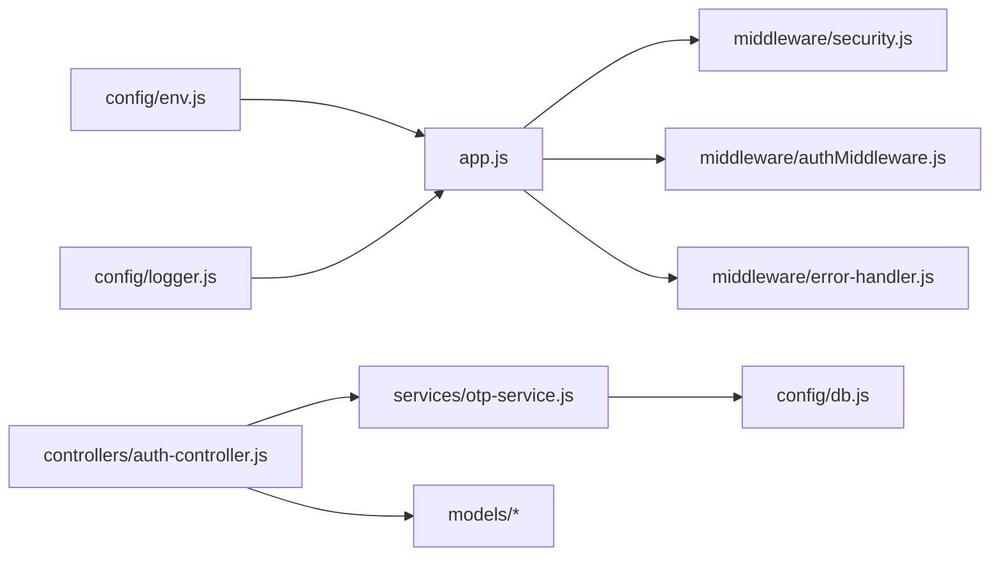

**Diagram sources**
- [app.js:1-53](file://backend/app.js#L1-L53)
- [env.js:1-39](file://backend/config/env.js#L1-L39)
- [logger.js:1-12](file://backend/config/logger.js#L1-L12)
- [security.js:1-47](file://backend/middleware/security.js#L1-L47)
- [authMiddleware.js:1-35](file://backend/middleware/authMiddleware.js#L1-L35)
- [error-handler.js:1-49](file://backend/middleware/error-handler.js#L1-L49)
- [auth-controller.js:1-121](file://backend/controllers/auth-controller.js#L1-L121)
- [otp-service.js:1-83](file://backend/services/otp-service.js#L1-L83)
- [db.js:1-13](file://backend/config/db.js#L1-L13)

**Section sources**
- [app.js:1-53](file://backend/app.js#L1-L53)
- [env.js:1-39](file://backend/config/env.js#L1-L39)
- [logger.js:1-12](file://backend/config/logger.js#L1-L12)
- [security.js:1-47](file://backend/middleware/security.js#L1-L47)
- [authMiddleware.js:1-35](file://backend/middleware/authMiddleware.js#L1-L35)
- [error-handler.js:1-49](file://backend/middleware/error-handler.js#L1-L49)
- [auth-controller.js:1-121](file://backend/controllers/auth-controller.js#L1-L121)
- [otp-service.js:1-83](file://backend/services/otp-service.js#L1-L83)
- [db.js:1-13](file://backend/config/db.js#L1-L13)

## Performance Considerations
- Rate limiting windows and max values balance protection and throughput; tune per endpoint sensitivity.
- JSON body size limits prevent large payloads from consuming memory.
- Strict validation reduces downstream processing and avoids unnecessary DB calls.
- Structured logging with selective levels helps maintain performance in production.
- Database pool sizing and retry settings should be aligned with expected load.

[No sources needed since this section provides general guidance]

## Troubleshooting Guide
- If clients receive CORS_ORIGIN_DENIED, verify that the requesting origin is included in CORS_ORIGINS and that the server trusts proxies correctly.
- If authentication fails with INVALID_TOKEN, ensure the correct secret is used and that tokens are not tampered with.
- If OTP flows fail with OTP_INVALID or OTP_EXPIRED, confirm that sessions are fresh and within TTL; resend if necessary.
- For 5xx errors, inspect server logs using the X-Request-Id to correlate request traces.
- Ensure NODE_ENV is set appropriately so that debug details are only exposed in development.

**Section sources**
- [app.js:21-29](file://backend/app.js#L21-L29)
- [authMiddleware.js:6-35](file://backend/middleware/authMiddleware.js#L6-L35)
- [otp-service.js:58-83](file://backend/services/otp-service.js#L58-L83)
- [error-handler.js:15-49](file://backend/middleware/error-handler.js#L15-L49)
- [env.js:37-39](file://backend/config/env.js#L37-L39)

## Conclusion
The backend implements a comprehensive security posture through layered middleware, strict input validation, robust authentication, secure OTP handling, safe error responses, and careful environment configuration. While HTTPS termination is delegated to the deployment layer, the application enforces secure cookies in production and supports SSL for database connections. Monitoring and observability are built-in via structured logging and request tracing, enabling effective detection and response to security events.