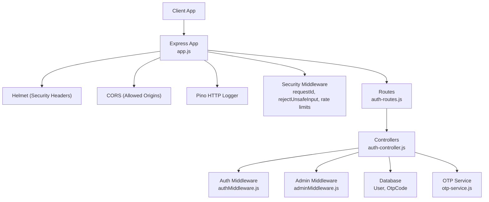
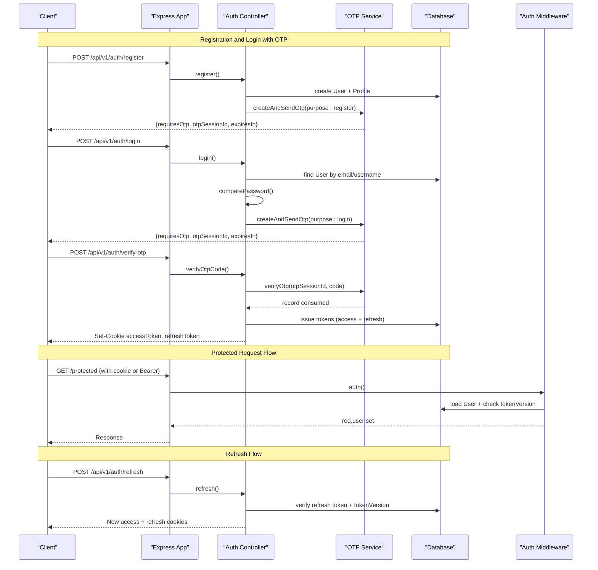
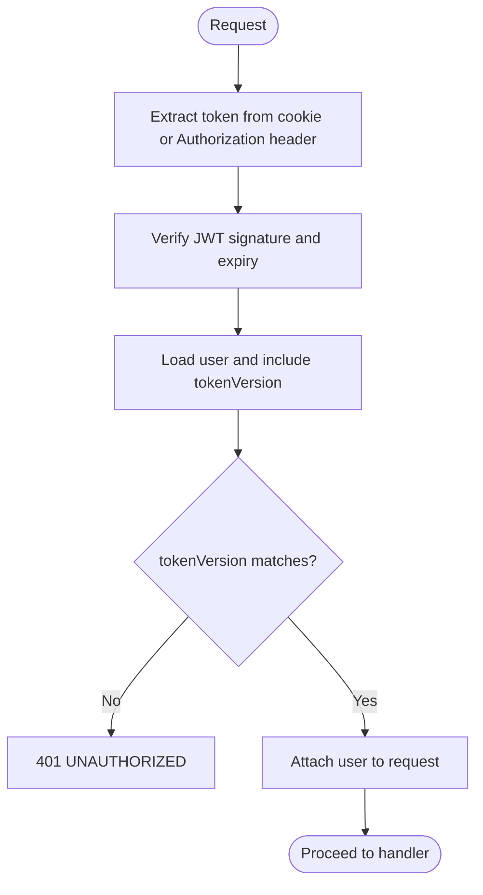
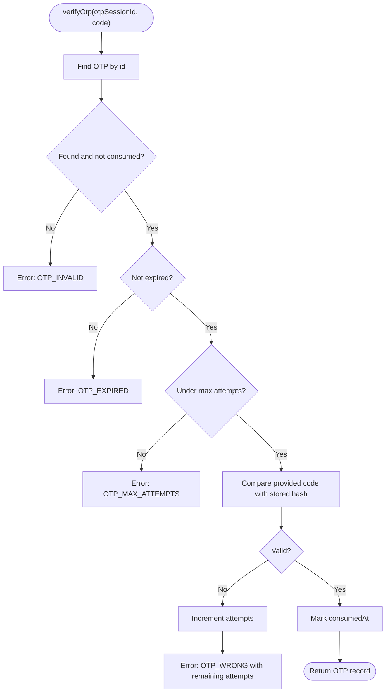
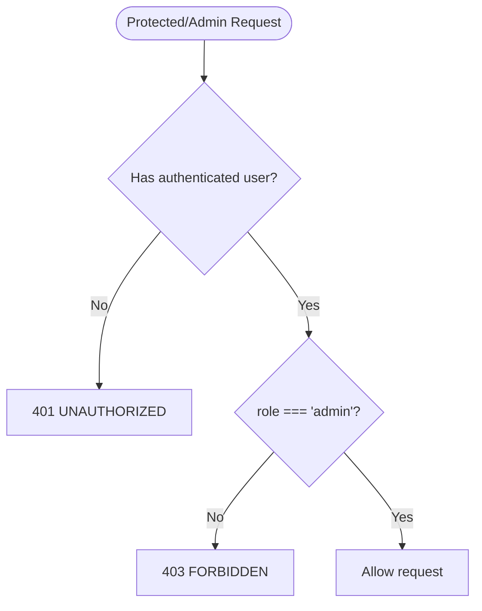
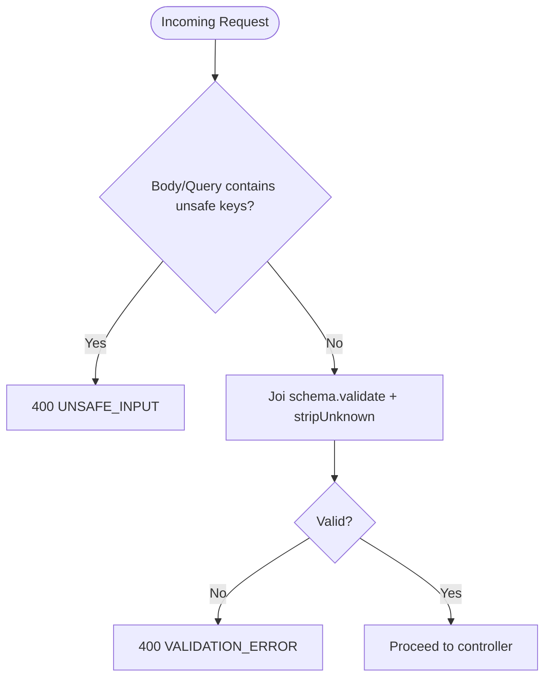
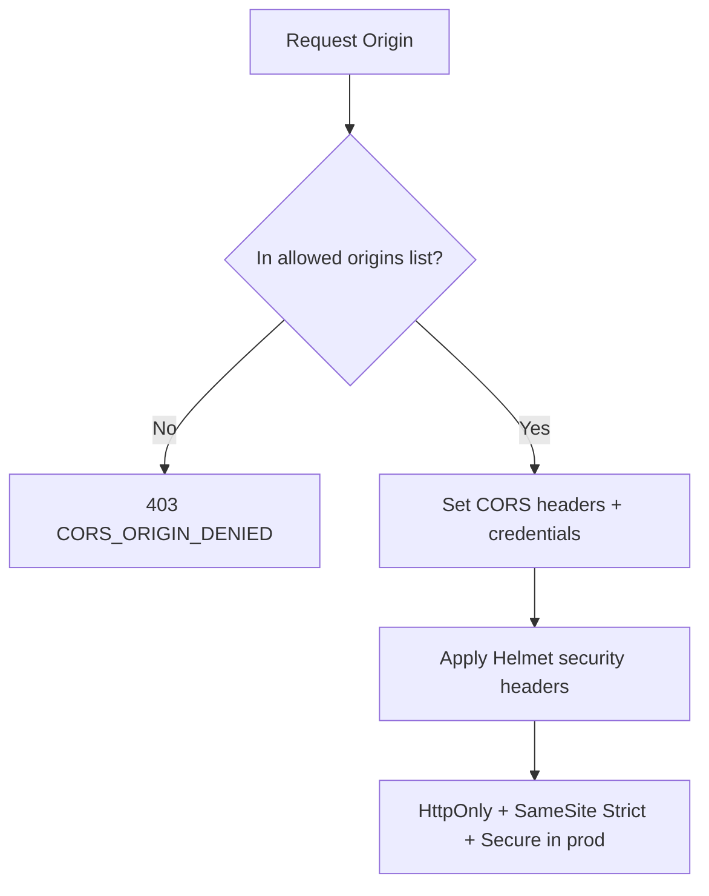
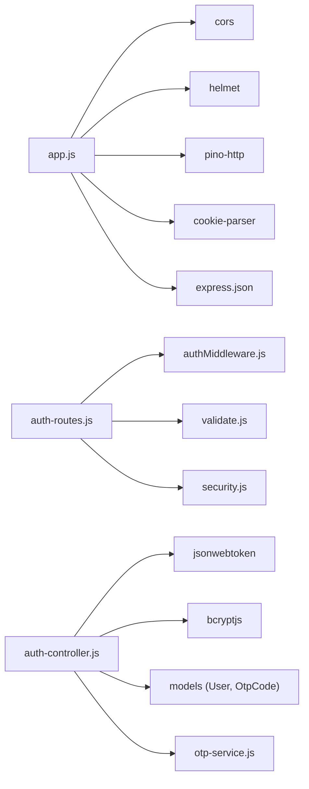

# Security & Authentication

<cite>
**Referenced Files in This Document**
- [app.js](file://backend/app.js)
- [auth-routes.js](file://backend/routes/auth-routes.js)
- [auth-controller.js](file://backend/controllers/auth-controller.js)
- [authMiddleware.js](file://backend/middleware/authMiddleware.js)
- [adminMiddleware.js](file://backend/middleware/adminMiddleware.js)
- [security.js](file://backend/middleware/security.js)
- [validate.js](file://backend/middleware/validate.js)
- [auth-schemas.js](file://backend/validators/auth-schemas.js)
- [User.js](file://backend/models/User.js)
- [OtpCode.js](file://backend/models/OtpCode.js)
- [otp-service.js](file://backend/services/otp-service.js)
- [env.js](file://backend/config/env.js)
- [logger.js](file://backend/config/logger.js)
- [app-error.js](file://backend/utils/app-error.js)
</cite>

## Table of Contents
1. [Introduction](#introduction)
2. [Project Structure](#project-structure)
3. [Core Components](#core-components)
4. [Architecture Overview](#architecture-overview)
5. [Detailed Component Analysis](#detailed-component-analysis)
6. [Dependency Analysis](#dependency-analysis)
7. [Performance Considerations](#performance-considerations)
8. [Troubleshooting Guide](#troubleshooting-guide)
9. [Conclusion](#conclusion)

## Introduction
This document explains the application’s security and authentication design, focusing on:
- JWT-based authentication with access and refresh tokens
- Session management via token versioning and logout rotation
- Role-based access control for players and administrators
- Input validation, sanitization, and protection against injection attacks
- CORS configuration, security headers, and HTTPS considerations
- Password hashing with bcrypt and OTP verification flow
- Rate limiting and secure communication practices
- Common vulnerabilities and mitigation strategies implemented in this codebase

## Project Structure
The backend is an Express application that centralizes security concerns in middleware, validators, and configuration modules. Key areas:
- Application bootstrap and global security middleware (helmet, cors, rate limits, request ID)
- Auth routes with per-endpoint rate limiting and schema validation
- Controllers implementing JWT issuance, OTP flows, and session lifecycle
- Middleware enforcing authentication and admin-only access
- Models defining user and OTP storage with hashed secrets
- Environment configuration validating sensitive settings

**Diagram sources**
- [app.js:1-55](file://backend/app.js#L1-L55)
- [auth-routes.js:1-18](file://backend/routes/auth-routes.js#L1-L18)
- [auth-controller.js:1-154](file://backend/controllers/auth-controller.js#L1-L154)
- [authMiddleware.js:1-38](file://backend/middleware/authMiddleware.js#L1-L38)
- [adminMiddleware.js:1-11](file://backend/middleware/adminMiddleware.js#L1-L11)
- [security.js:1-48](file://backend/middleware/security.js#L1-L48)
- [otp-service.js:1-99](file://backend/services/otp-service.js#L1-L99)

**Section sources**
- [app.js:1-55](file://backend/app.js#L1-L55)
- [auth-routes.js:1-18](file://backend/routes/auth-routes.js#L1-L18)

## Core Components
- JWT Access Token: Short-lived, signed with a dedicated secret; included in cookies and Authorization header when present.
- JWT Refresh Token: Longer-lived, signed with a separate secret; used to obtain new access tokens and rotated on refresh.
- Session Management: User model stores a tokenVersion incremented on logout or when sessions are invalidated; both access and refresh tokens embed this version to enforce revocation.
- OTP Verification: One-time codes are hashed and stored with TTL and attempt limits; verified via service before issuing tokens.
- RBAC: Roles enforced via middleware; only users with role "admin" can access admin endpoints.
- Input Validation: Joi schemas validate and strip unknown fields; unsafe input patterns are rejected globally.
- Security Headers and CORS: Helmet configured; CORS restricted to configured origins with credentials enabled.
- Rate Limiting: Separate limits for auth attempts, OTP requests, and write-heavy endpoints.

**Section sources**
- [auth-controller.js:10-32](file://backend/controllers/auth-controller.js#L10-L32)
- [auth-controller.js:107-121](file://backend/controllers/auth-controller.js#L107-L121)
- [authMiddleware.js:6-35](file://backend/middleware/authMiddleware.js#L6-L35)
- [adminMiddleware.js:3-8](file://backend/middleware/adminMiddleware.js#L3-L8)
- [otp-service.js:23-83](file://backend/services/otp-service.js#L23-L83)
- [security.js:21-47](file://backend/middleware/security.js#L21-L47)
- [env.js:6-39](file://backend/config/env.js#L6-L39)
- [app.js:15-33](file://backend/app.js#L15-L33)

## Architecture Overview
The authentication architecture combines short-lived access tokens, longer-lived refresh tokens, and OTP verification to ensure secure, revocable sessions.

**Diagram sources**
- [auth-routes.js:9-15](file://backend/routes/auth-routes.js#L9-L15)
- [auth-controller.js:34-121](file://backend/controllers/auth-controller.js#L34-L121)
- [otp-service.js:23-83](file://backend/services/otp-service.js#L23-L83)
- [authMiddleware.js:6-35](file://backend/middleware/authMiddleware.js#L6-L35)

## Detailed Component Analysis

### JWT Issuance and Validation
- Access tokens embed user id and tokenVersion; validated using a dedicated secret and checked against current tokenVersion in the database.
- Refresh tokens use a separate secret and are rotated on each successful refresh.
- Tokens are set as HttpOnly, SameSite=Strict cookies; Secure flag applied in production.

**Diagram sources**
- [authMiddleware.js:6-35](file://backend/middleware/authMiddleware.js#L6-L35)
- [auth-controller.js:10-32](file://backend/controllers/auth-controller.js#L10-L32)
- [auth-controller.js:107-121](file://backend/controllers/auth-controller.js#L107-L121)

**Section sources**
- [authMiddleware.js:6-35](file://backend/middleware/authMiddleware.js#L6-L35)
- [auth-controller.js:10-32](file://backend/controllers/auth-controller.js#L10-L32)
- [auth-controller.js:107-121](file://backend/controllers/auth-controller.js#L107-L121)

### OTP Verification Process
- OTPs are generated, hashed, and stored with expiration and attempt limits.
- On verify, the service checks existence, consumption status, expiry, and max attempts; compares hashed code; marks OTP as consumed upon success.
- Resend invalidates pending OTPs for the same purpose and issues a new code.

**Diagram sources**
- [otp-service.js:58-83](file://backend/services/otp-service.js#L58-L83)
- [OtpCode.js:4-19](file://backend/models/OtpCode.js#L4-L19)

**Section sources**
- [otp-service.js:23-96](file://backend/services/otp-service.js#L23-L96)
- [OtpCode.js:4-19](file://backend/models/OtpCode.js#L4-L19)

### Role-Based Access Control (RBAC)
- Admin-only endpoints require explicit middleware that checks user role equals "admin".
- Regular users can access non-admin routes after passing auth middleware.

**Diagram sources**
- [adminMiddleware.js:3-8](file://backend/middleware/adminMiddleware.js#L3-L8)

**Section sources**
- [adminMiddleware.js:3-8](file://backend/middleware/adminMiddleware.js#L3-L8)

### Input Validation, Sanitization, and Injection Prevention
- Global rejection of unsafe input patterns (keys starting with $ or containing dots) prevents MongoDB-style injection-like payloads.
- JSON body size limited to reduce abuse surface.
- Per-route Joi schemas validate and strip unknown fields, ensuring strict contracts for registration, login, and OTP flows.

**Diagram sources**
- [security.js:10-19](file://backend/middleware/security.js#L10-L19)
- [validate.js:3-11](file://backend/middleware/validate.js#L3-L11)
- [auth-schemas.js:5-26](file://backend/validators/auth-schemas.js#L5-L26)

**Section sources**
- [security.js:10-19](file://backend/middleware/security.js#L10-L19)
- [validate.js:3-11](file://backend/middleware/validate.js#L3-L11)
- [auth-schemas.js:5-26](file://backend/validators/auth-schemas.js#L5-L26)

### CORS Configuration, Security Headers, and HTTPS Enforcement
- CORS is restricted to configured origins; credentials allowed; specific headers permitted.
- Helmet sets security headers; Content Security Policy disabled explicitly in configuration.
- Trust proxy is configurable; cookies marked Secure in production; SameSite Strict ensures CSRF resistance for cross-site requests.

**Diagram sources**
- [app.js:15-33](file://backend/app.js#L15-L33)
- [env.js:6-39](file://backend/config/env.js#L6-L39)
- [auth-controller.js:16-21](file://backend/controllers/auth-controller.js#L16-L21)

**Section sources**
- [app.js:15-33](file://backend/app.js#L15-L33)
- [env.js:6-39](file://backend/config/env.js#L6-L39)
- [auth-controller.js:16-21](file://backend/controllers/auth-controller.js#L16-L21)

### Password Hashing and Secure Communication
- Passwords are hashed with bcrypt at registration and compared during login.
- Secrets (JWT access/refresh) are validated at startup; separate secrets required.
- Logging redacts sensitive headers (Authorization, Cookie) to prevent leakage.

**Section sources**
- [User.js:5-20](file://backend/models/User.js#L5-L20)
- [auth-controller.js:34-67](file://backend/controllers/auth-controller.js#L34-L67)
- [env.js:6-39](file://backend/config/env.js#L6-L39)
- [app.js:19-19](file://backend/app.js#L19-L19)

### Session Management and Logout Rotation
- Logout increments tokenVersion; subsequent requests fail if tokens still carry old version.
- Refresh rotates both access and refresh tokens and reissues cookies.

**Section sources**
- [auth-controller.js:100-121](file://backend/controllers/auth-controller.js#L100-L121)
- [authMiddleware.js:17-24](file://backend/middleware/authMiddleware.js#L17-L24)

## Dependency Analysis
Key dependencies and their roles:
- express-rate-limit: Enforces per-endpoint rate limits for auth and OTP endpoints.
- helmet: Adds security headers.
- cors: Restricts allowed origins and configures credentials.
- jsonwebtoken: Signs and verifies JWTs.
- bcryptjs: Hashes passwords and OTP codes.
- pino-http: Structured logging with redaction of sensitive data.
- sequelize: ORM for data persistence.

**Diagram sources**
- [app.js:1-55](file://backend/app.js#L1-L55)
- [auth-routes.js:1-18](file://backend/routes/auth-routes.js#L1-L18)
- [auth-controller.js:1-154](file://backend/controllers/auth-controller.js#L1-L154)
- [security.js:1-48](file://backend/middleware/security.js#L1-L48)

**Section sources**
- [app.js:1-55](file://backend/app.js#L1-L55)
- [auth-routes.js:1-18](file://backend/routes/auth-routes.js#L1-L18)
- [auth-controller.js:1-154](file://backend/controllers/auth-controller.js#L1-L154)

## Performance Considerations
- Rate limiting protects auth and OTP endpoints from brute-force and enumeration attacks while maintaining usability.
- JSON body size limit reduces memory pressure and potential abuse.
- Short-lived access tokens minimize exposure window; refresh tokens rotate to limit reuse risk.
- Database queries are scoped to necessary attributes, reducing payload size and improving performance.

[No sources needed since this section provides general guidance]

## Troubleshooting Guide
Common errors and their meanings:
- 401 UNAUTHORIZED: Missing or invalid token; session expired due to tokenVersion mismatch; refresh token missing.
- 400 VALIDATION_ERROR: Input failed Joi validation; check field formats and constraints.
- 400 UNSAFE_INPUT: Body/query contains suspicious keys like "$" or "."; sanitize inputs.
- 400 OTP_INVALID: OTP session not found or already consumed.
- 400 OTP_EXPIRED: OTP exceeded its time-to-live.
- 401 OTP_WRONG: Incorrect OTP; check remaining attempts.
- 429 OTP_MAX_ATTEMPTS: Too many wrong attempts; request a new OTP.
- 403 FORBIDDEN: Not an admin; insufficient privileges.
- 403 CORS_ORIGIN_DENIED: Request origin not allowed.

Mitigation tips:
- Ensure environment variables are correctly set (secrets, CORS origins).
- Use HTTPS in production; cookies will be Secure automatically in production.
- Monitor logs for repeated failures indicating potential attacks.

**Section sources**
- [authMiddleware.js:13-35](file://backend/middleware/authMiddleware.js#L13-L35)
- [auth-controller.js:34-121](file://backend/controllers/auth-controller.js#L34-L121)
- [otp-service.js:58-96](file://backend/services/otp-service.js#L58-L96)
- [security.js:10-47](file://backend/middleware/security.js#L10-L47)
- [app.js:21-29](file://backend/app.js#L21-L29)

## Conclusion
The application implements a robust security posture:
- Strong JWT-based authentication with token versioning for session revocation
- OTP verification with hashed codes, TTL, and attempt limits
- RBAC enforcement for administrative actions
- Strict input validation and injection prevention
- Configurable CORS and security headers with production-safe cookie policies
- Rate limiting and secure logging to mitigate common threats

These mechanisms collectively protect against unauthorized access, credential stuffing, brute force, and injection attacks while providing a clear, auditable flow for developers and operators.