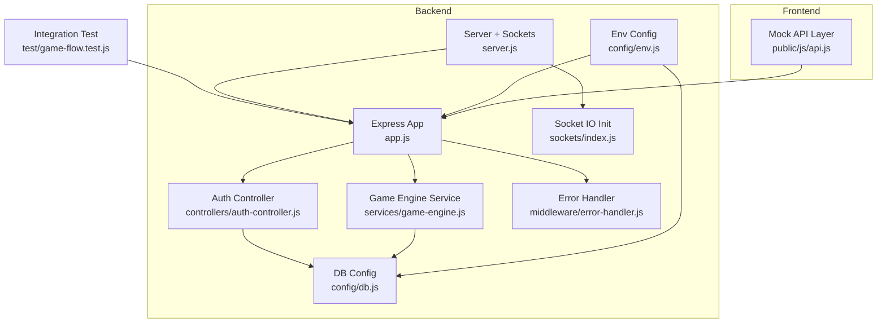
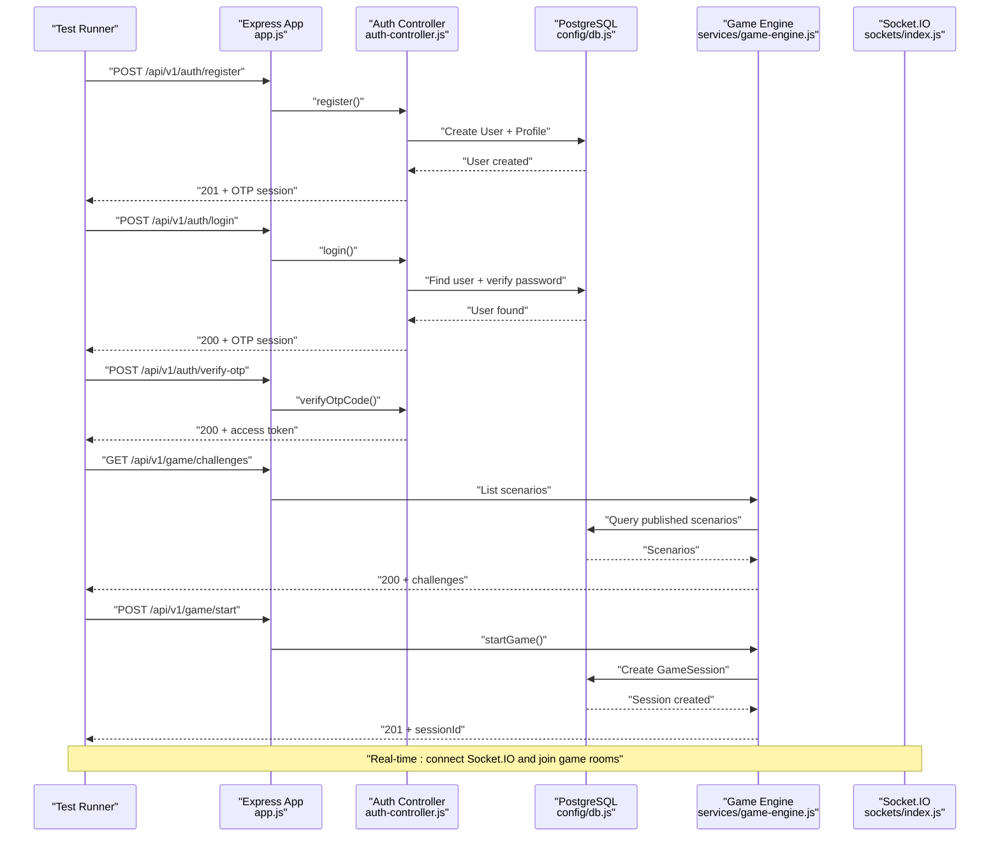
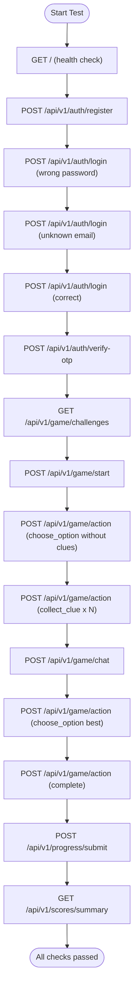
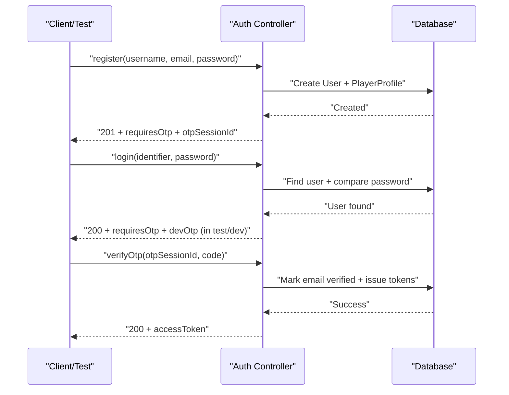
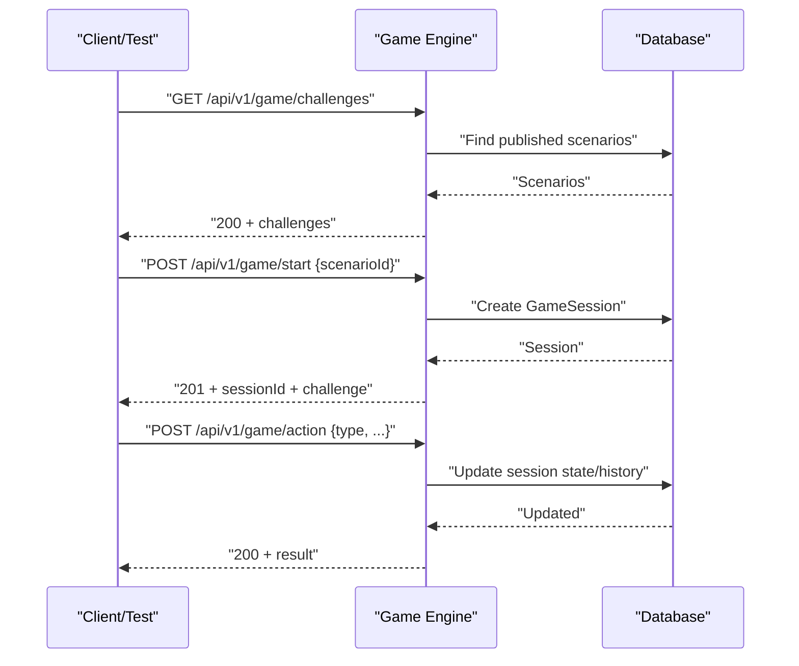
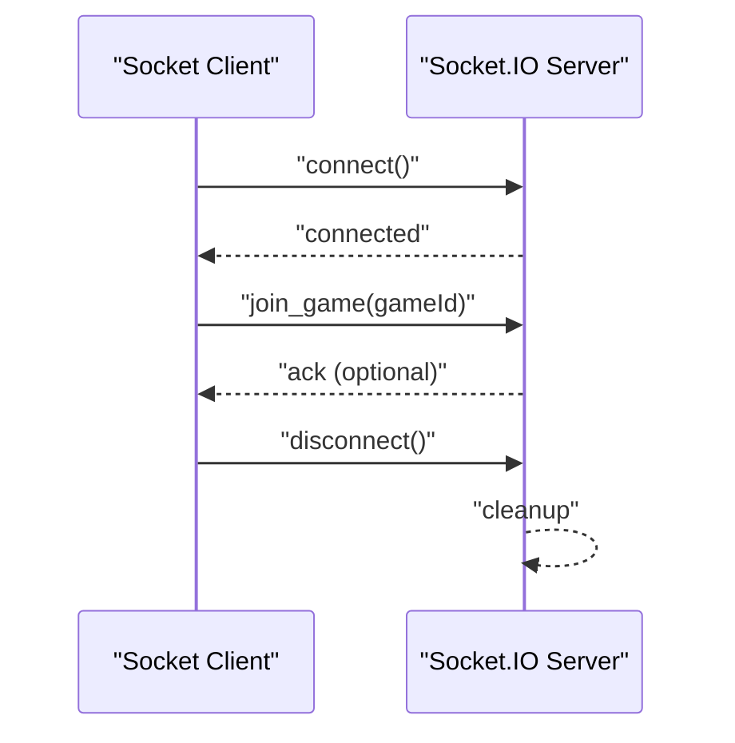
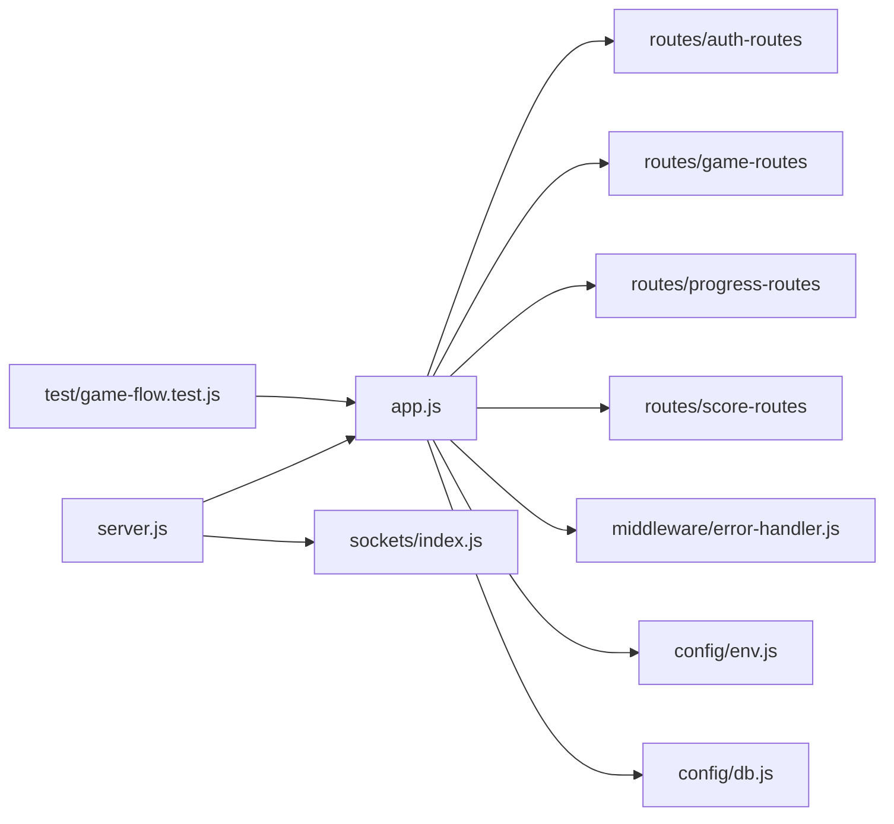

# Testing Strategy & Quality Assurance

<cite>
**Referenced Files in This Document**
- [package.json](file://backend/package.json)
- [game-flow.test.js](file://backend/test/game-flow.test.js)
- [server.js](file://backend/server.js)
- [app.js](file://backend/app.js)
- [env.js](file://backend/config/env.js)
- [db.js](file://backend/config/db.js)
- [error-handler.js](file://backend/middleware/error-handler.js)
- [auth-controller.js](file://backend/controllers/auth-controller.js)
- [game-engine.js](file://backend/services/game-engine.js)
- [index.js](file://backend/sockets/index.js)
- [api.js](file://backend/public/js/api.js)
</cite>

## Table of Contents
1. Introduction
2. Project Structure
3. Core Components
4. Architecture Overview
5. Detailed Component Analysis
6. Dependency Analysis
7. Performance Considerations
8. Troubleshooting Guide
9. Conclusion
10. Appendices

## Introduction
This document defines the testing strategy and quality assurance practices for the project, covering unit tests, integration tests, end-to-end (E2E) strategies, mocking approaches, API and database testing, real-time features, performance and load testing, browser compatibility, coverage requirements, CI automation, and debugging guidance. It also addresses challenges specific to 3D games and real-time applications.

## Project Structure
The backend is an Express application with Socket.IO for real-time communication, PostgreSQL via Sequelize, and a modular controller/service architecture. A single integration smoke test demonstrates end-to-end flows against the running API. The frontend includes a mock API layer for offline or local development.

**Diagram sources**
- [app.js:1-54](file://backend/app.js#L1-L54)
- [server.js:1-46](file://backend/server.js#L1-L46)
- [auth-controller.js:1-154](file://backend/controllers/auth-controller.js#L1-L154)
- [game-engine.js:1-124](file://backend/services/game-engine.js#L1-L124)
- [db.js:1-44](file://backend/config/db.js#L1-L44)
- [env.js:1-40](file://backend/config/env.js#L1-L40)
- [error-handler.js:1-52](file://backend/middleware/error-handler.js#L1-L52)
- [index.js:1-18](file://backend/sockets/index.js#L1-L18)
- [api.js:94-152](file://backend/public/js/api.js#L94-L152)

**Section sources**
- [package.json:1-43](file://backend/package.json#L1-L43)
- [app.js:1-54](file://backend/app.js#L1-L54)
- [server.js:1-46](file://backend/server.js#L1-L46)

## Core Components
- Integration smoke test: Executes a realistic user journey across authentication, OTP verification, game session lifecycle, progress submission, and scoring endpoints.
- Server bootstrap: Initializes HTTP server, mounts Express app, configures CORS, and starts Socket.IO with graceful shutdown handling.
- Environment configuration: Validates environment variables and derives runtime flags such as production mode and allowed CORS origins.
- Database configuration: Establishes PostgreSQL connection, optional auto-sync guardrails, and SQL migration execution.
- Error handling: Centralized error middleware mapping framework errors to consistent JSON responses and logging.
- Authentication controller: Implements registration, login, OTP flow, token issuance, refresh, logout, and guest play support.
- Game engine service: Manages scenario discovery, session creation, chat interactions, and AI decision orchestration.
- Socket.IO initialization: Handles socket connections, room joins, and disconnect events.
- Frontend mock API: Provides deterministic responses for client-side workflows when no backend is available.

**Section sources**
- [game-flow.test.js:1-112](file://backend/test/game-flow.test.js#L1-L112)
- [server.js:1-46](file://backend/server.js#L1-L46)
- [env.js:1-40](file://backend/config/env.js#L1-L40)
- [db.js:1-44](file://backend/config/db.js#L1-L44)
- [error-handler.js:1-52](file://backend/middleware/error-handler.js#L1-L52)
- [auth-controller.js:1-154](file://backend/controllers/auth-controller.js#L1-L154)
- [game-engine.js:1-124](file://backend/services/game-engine.js#L1-L124)
- [index.js:1-18](file://backend/sockets/index.js#L1-L18)
- [api.js:94-152](file://backend/public/js/api.js#L94-L152)

## Architecture Overview
The system exposes REST APIs and WebSocket channels. Tests interact with the live API to validate behavior across auth, game sessions, progress, and scores. Real-time features are initialized on the same HTTP server and can be tested by connecting clients to rooms.

**Diagram sources**
- [game-flow.test.js:1-112](file://backend/test/game-flow.test.js#L1-L112)
- [auth-controller.js:1-154](file://backend/controllers/auth-controller.js#L1-L154)
- [game-engine.js:1-124](file://backend/services/game-engine.js#L1-L124)
- [db.js:1-44](file://backend/config/db.js#L1-L44)
- [index.js:1-18](file://backend/sockets/index.js#L1-L18)

## Detailed Component Analysis

### Integration Smoke Test
- Purpose: Validate critical user journeys including registration, login, OTP verification, challenge retrieval, session start, action enforcement, clue collection, chat, completion, progress submission, and score summary.
- Execution: Uses Node’s built-in fetch and strict assertions; configurable base URL via environment variable.
- Data isolation: Generates unique email per run to avoid collisions.
- Assertions: Enforce status codes, presence of required fields, and absence of sensitive data leakage (e.g., stars).

**Diagram sources**
- [game-flow.test.js:1-112](file://backend/test/game-flow.test.js#L1-L112)

**Section sources**
- [game-flow.test.js:1-112](file://backend/test/game-flow.test.js#L1-L112)

### Authentication Flow
- Registration creates a user and profile, then issues an OTP session.
- Login verifies credentials and returns OTP session; supports both email and username identifiers.
- OTP verification finalizes login and issues JWT tokens via cookies.
- Guest play is supported when enabled by configuration.

**Diagram sources**
- [auth-controller.js:1-154](file://backend/controllers/auth-controller.js#L1-L154)

**Section sources**
- [auth-controller.js:1-154](file://backend/controllers/auth-controller.js#L1-L154)

### Game Session Lifecycle
- Scenario listing retrieves published content.
- Starting a game creates a session with initial state and expiration.
- Actions enforce rules (e.g., collect clues before choosing options).
- Chat integrates with AI decision service and persists interactions.

**Diagram sources**
- [game-engine.js:1-124](file://backend/services/game-engine.js#L1-L124)

**Section sources**
- [game-engine.js:1-124](file://backend/services/game-engine.js#L1-L124)

### Real-Time Features (Socket.IO)
- Connections are logged and rooms are joined for game contexts.
- Disconnections are handled gracefully.
- For testing, connect a client and assert room membership and event flow.

**Diagram sources**
- [index.js:1-18](file://backend/sockets/index.js#L1-L18)

**Section sources**
- [index.js:1-18](file://backend/sockets/index.js#L1-L18)

### Frontend Mock API
- Provides deterministic responses for common endpoints used by the UI during local development or offline testing.
- Useful for isolating UI tests from backend dependencies.

**Section sources**
- [api.js:94-152](file://backend/public/js/api.js#L94-L152)

## Dependency Analysis
- The integration test depends on the running API surface defined by routes mounted in the Express app.
- The server bootstraps the app and attaches Socket.IO.
- Environment and database configurations influence runtime behavior and test stability.
- Error handler centralizes response formatting and logging.

**Diagram sources**
- [app.js:1-54](file://backend/app.js#L1-L54)
- [server.js:1-46](file://backend/server.js#L1-L46)
- [error-handler.js:1-52](file://backend/middleware/error-handler.js#L1-L52)
- [env.js:1-40](file://backend/config/env.js#L1-L40)
- [db.js:1-44](file://backend/config/db.js#L1-L44)
- [index.js:1-18](file://backend/sockets/index.js#L1-L18)
- [game-flow.test.js:1-112](file://backend/test/game-flow.test.js#L1-L112)

**Section sources**
- [app.js:1-54](file://backend/app.js#L1-L54)
- [server.js:1-46](file://backend/server.js#L1-L46)

## Performance Considerations
- Use the existing health endpoints to gate readiness in CI before running tests.
- Configure rate limiting on write-heavy routes to simulate realistic load and protect services.
- For load testing:
  - Use a CLI tool to generate concurrent requests to key endpoints (auth, game actions, progress submissions).
  - Measure p95/p99 latency, error rates, and resource utilization under load.
  - Validate that Socket.IO connections scale and rooms remain stable.
- For database performance:
  - Ensure indexes exist for frequently queried fields (e.g., userId, scenarioId).
  - Monitor query logs and adjust pool settings if needed.
- For 3D game assets:
  - Preload and cache static assets to reduce network contention during tests.
  - Simulate heavy asset loads in controlled environments to detect bottlenecks.

[No sources needed since this section provides general guidance]

## Troubleshooting Guide
- Common failures:
  - Authentication errors: Check credential validation and OTP flow; ensure dev/test modes expose necessary debug info.
  - Not found or internal errors: Inspect centralized error handler responses and request IDs for tracing.
  - Database connectivity: Validate DATABASE_URL, SSL settings, and migrations; confirm AUTO_SYNC is disabled in production.
  - Socket.IO issues: Confirm transports and CORS settings; verify room joins and disconnects.
- Debugging steps:
  - Enable detailed logging for failed requests using request IDs.
  - Reproduce failures locally with the same environment variables.
  - Isolate failing endpoints by calling them directly with curl or a test client.
  - For real-time issues, capture socket events and room memberships.

**Section sources**
- [error-handler.js:1-52](file://backend/middleware/error-handler.js#L1-L52)
- [env.js:1-40](file://backend/config/env.js#L1-L40)
- [db.js:1-44](file://backend/config/db.js#L1-L44)
- [index.js:1-18](file://backend/sockets/index.js#L1-L18)

## Conclusion
The project currently includes a robust integration smoke test that validates core user journeys across authentication, game sessions, progress, and scoring. To strengthen quality assurance, expand unit tests around controllers and services, add dedicated tests for real-time flows, implement performance and load tests, and integrate automated pipelines with coverage thresholds. The existing error handling, environment validation, and database configuration provide a solid foundation for reliable testing.

[No sources needed since this section summarizes without analyzing specific files]

## Appendices

### Testing Framework Setup and Scripts
- Use Node’s built-in test runner and assertion utilities for simple scripts; leverage the existing integration test as a template.
- Add npm scripts for targeted test runs (unit, integration, E2E) and coverage reporting.

**Section sources**
- [package.json:1-43](file://backend/package.json#L1-L43)

### Test Organization
- Unit tests: Place near modules they exercise (e.g., services, utils).
- Integration tests: Group by feature area (auth, game, progress, scores).
- E2E tests: Use the existing smoke test pattern to drive full flows against a live server.

[No sources needed since this section provides general guidance]

### Mocking Strategies
- External services:
  - AI service: Mock HTTP calls or intercept requests to return deterministic decisions.
  - Email/OTP: Stub sending functions and expose test-only OTP values when appropriate.
- Database:
  - Use a test database instance; seed known fixtures; reset state between tests.
- Frontend:
  - Leverage the mock API layer to isolate UI tests from backend changes.

**Section sources**
- [game-engine.js:1-124](file://backend/services/game-engine.js#L1-L124)
- [api.js:94-152](file://backend/public/js/api.js#L94-L152)

### API Endpoint Testing Approach
- Cover happy paths and error cases for each endpoint.
- Assert status codes, response shapes, and security constraints (e.g., no sensitive data leakage).
- Validate authorization and rate limiting behaviors.

**Section sources**
- [game-flow.test.js:1-112](file://backend/test/game-flow.test.js#L1-L112)
- [auth-controller.js:1-154](file://backend/controllers/auth-controller.js#L1-L154)

### Database Operations Testing
- Create, read, update, delete operations for models involved in flows.
- Validate constraints, uniqueness, and cascading behaviors.
- Ensure migrations are applied deterministically in test environments.

**Section sources**
- [db.js:1-44](file://backend/config/db.js#L1-L44)

### Real-Time Features Testing
- Connect clients, join rooms, emit events, and assert server-side reactions.
- Validate reconnection and disconnect handling.
- Measure message throughput and latency under concurrent connections.

**Section sources**
- [index.js:1-18](file://backend/sockets/index.js#L1-L18)

### Performance and Load Testing Methodology
- Define scenarios:
  - Auth storms, rapid game actions, bulk progress submissions.
- Metrics:
  - Latency percentiles, throughput, error rates, memory/CPU usage.
- Tools:
  - Use a load generator to simulate concurrent users and measure system resilience.

[No sources needed since this section provides general guidance]

### Browser Compatibility Testing
- Test UI flows across major browsers and devices.
- Validate WebSocket support and fallback transports.
- Ensure static assets and polyfills work consistently.

[No sources needed since this section provides general guidance]

### Code Coverage Requirements
- Set minimum coverage thresholds for critical paths (auth, game engine, error handling).
- Exclude generated or third-party code; focus on business logic.
- Report coverage in CI and block merges below thresholds.

[No sources needed since this section provides general guidance]

### Continuous Integration and Automated Pipelines
- Stages:
  - Lint and syntax checks.
  - Unit tests with mocked dependencies.
  - Integration tests against a fresh database and service stack.
  - E2E smoke tests against a deployed staging environment.
  - Performance tests on a dedicated runner.
- Artifacts:
  - Test reports, coverage summaries, and logs.

**Section sources**
- [package.json:1-43](file://backend/package.json#L1-L43)

### Guidelines for Writing Effective Tests
- One assertion per test where possible; clear naming describing expected behavior.
- Use deterministic data and clean up after tests.
- Prefer integration tests for cross-cutting concerns; unit tests for isolated logic.
- Keep tests fast; parallelize where safe.

[No sources needed since this section provides general guidance]

### Test Data Management
- Seed minimal datasets required for flows.
- Use unique identifiers per run to avoid conflicts.
- Reset state between tests to ensure isolation.

**Section sources**
- [game-flow.test.js:1-112](file://backend/test/game-flow.test.js#L1-L112)

### Debugging Failed Tests
- Inspect request IDs and logs from the error handler.
- Reproduce with verbose logging enabled.
- Isolate failing components by calling endpoints directly.
- For real-time failures, capture socket traces and room states.

**Section sources**
- [error-handler.js:1-52](file://backend/middleware/error-handler.js#L1-L52)

### 3D Games and Real-Time Applications Challenges
- Asset loading variability: Cache and preload assets; simulate network conditions.
- Frame pacing and rendering: Measure FPS and frame times under load.
- Concurrency: Validate multi-user interactions in shared rooms.
- Determinism: Ensure game logic is reproducible; seed randomness where needed.

[No sources needed since this section provides general guidance]